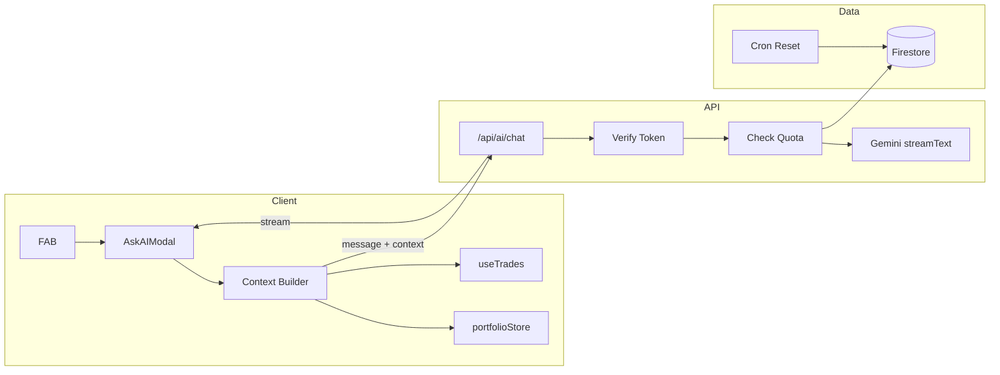

# Pocket Analyst (Ask AI) – End-to-End Execution Plan

## Architecture Overview

---

## Phase 1: Dependencies and shared utilities

### 1.1 Add Gemini and streaming dependencies

- Add **@ai-sdk/google** (Vercel AI SDK Gemini provider) and ensure **@ai-sdk/react** is present for `useChat` streaming on the client.
- In [package.json](package.json): add `"@ai-sdk/google": "^1.x"` and `"@ai-sdk/react": "^2.x"` (or match existing `"ai": "^6.0.49"` / `@ai-sdk/openai` peer range). Run `npm install`.

### 1.2 Environment variable

- **GOOGLE_GENERATIVE_AI_API_KEY** (or **GEMINI_API_KEY** per Google SDK docs): set in `.env.local` and Vercel. Used only in `/api/ai/chat`.

### 1.3 Portfolio context builder (client-side, local-first)

- **New file:** `app/lib/ai/contextBuilder.ts` (or `app/lib/ai/buildPortfolioContext.ts`).
- **Input:** Trades array (from `useTrades`) and optional positions (from `usePortfolioStore` or derived via `calculatePositions` from [app/lib/utils/portfolioCalculations.ts](app/lib/utils/portfolioCalculations.ts)). If positions are not passed, derive from trades (and optionally current prices from existing app logic) for a minimal summary.
- **Output:** A single sanitized string or JSON object (e.g. total P/L, total value, top N holdings by value, sector/risk summary if available). No PII; only aggregate and ticker-level stats. Expose something like `buildPortfolioContext(trades, positions?): string` for the modal to call before sending to the API.
- Reuse types from [app/lib/utils/portfolioCalculations.ts](app/lib/utils/portfolioCalculations.ts) (`Position`, `Trade`) and optionally `calculatePortfolioTotals` / `generatePortfolioReport` for structure, but keep the builder output minimal and safe for the system prompt.

---

## Phase 2: Backend – API route and quota

### 2.1 Firestore schema for AI usage (free-tier quota)

- **Collection:** `aiUsage` (or `userAiUsage`).
- **Document ID:** canonical user identifier (e.g. `uid` from Firebase Auth for consistency with [app/api/user/preferences/route.ts](app/api/user/preferences/route.ts) and other auth flows).
- **Fields (example):**
  - `usageCount: number` (requests in current period)
  - `periodStart: Timestamp` (start of current month or billing period)
  - Optionally `updatedAt: Timestamp`
- **Reset logic:** On each request, if `periodStart` is in a previous month (or older than 30 days), set `usageCount = 0` and `periodStart = now`. Then enforce: free tier max 20 requests per period.

### 2.2 Tier resolution (free vs Founder’s / Corporate)

- Reuse the same pattern as [app/api/api-keys/user/route.ts](app/api/api-keys/user/route.ts): verify Firebase ID token from `Authorization: Bearer <idToken>`, then read **apiKeysByEmail** doc by canonical email.
- **Paid tier:** `tier === 'foundersClub' || tier === 'corporateSponsor'` (align with [app/api/webhooks/stripe/route.ts](app/api/webhooks/stripe/route.ts) and Stripe tier handling). Paid = unlimited requests + allow file attachments (CSV/PDF/IMG text). Free = text-only + 20 requests/month.

### 2.3 POST /api/ai/chat

- **New file:** `app/api/ai/chat/route.ts`.
- **Request body:** `{ message: string, context?: string, attachedContent?: string }`. `context` = portfolio summary from context builder; `attachedContent` = optional pasted/parsed file text (paid only).
- **Steps:**
  1. Require `Authorization: Bearer <idToken>`. Verify with Firebase Admin `getAuth().verifyIdToken(idToken)` (same as [app/api/admin/support/route.ts](app/api/admin/support/route.ts) and [app/api/user/preferences/route.ts](app/api/user/preferences/route.ts)). Get `uid` and email.
  2. Resolve tier from Firestore `apiKeysByEmail` (by email). If no doc or tier not paid, treat as free.
  3. **Free tier:** Read/update `aiUsage/{uid}`: if period expired, reset count and period; if `usageCount >= 20`, return 429 with clear message (e.g. “20 questions per month on free tier”). Reject request if `attachedContent` is present. Increment `usageCount` after successful validation (before calling Gemini).
  4. **Paid tier:** No quota check; allow `attachedContent`.
  5. Build **system prompt** with finance-only guardrail (e.g. “You are the Pocket Portfolio Financial Analyst. Answer only finance, investing, markets, economic data, technology. If the user asks off-topic, politely decline and pivot to portfolio/markets. Use the portfolio context below (JSON/text) to personalize.”). Inject `context` and optional `attachedContent` into the prompt or user message.
  6. Call **Gemini 1.5 Flash** (free) or **Gemini 1.5 Pro** (paid) via `@ai-sdk/google` and `streamText` from the `ai` package (same pattern as [app/agent/outreach.ts](app/agent/outreach.ts) but with `streamText` instead of `generateObject`). Enable Google Search grounding for the model if the SDK supports it (for “Why is NVDA down today?” style questions).
  7. Return streaming response (e.g. `streamText`’s `toDataStreamResponse()` or equivalent so the client can consume with `useChat`).

### 2.4 Monthly quota reset (cron)

- **New file:** `app/api/cron/ai-usage-reset/route.ts`. Optional but recommended: run once per month (e.g. 1st of month 00:00 UTC) to reset all `aiUsage` documents’ `usageCount` and `periodStart`, or simply rely on “if period expired then reset on next request” (no cron required). If you want a dedicated cron, add to [vercel.json](vercel.json): `{"path": "/api/cron/ai-usage-reset", "schedule": "0 0 1 * *"}` and protect the route with `CRON_SECRET` or Vercel cron auth.

---

## Phase 3: Frontend – FAB and Ask AI modal

### 3.1 AskAIModal component

- **New file:** `app/components/ai/AskAIModal.tsx` (or under `app/components/` if you prefer no `ai` folder).
- **Props:** `open: boolean`, `onClose: () => void`, and optionally `user` (for tier/quota display) and a way to get portfolio context (e.g. callback that returns `buildPortfolioContext(...)` result, or pass `trades`/`positions` and call the context builder inside the modal).
- **UI (align with existing design system):**
  - Use **createPortal** for overlay and modal (same as [app/components/dashboard/SupportFormModal.tsx](app/components/dashboard/SupportFormModal.tsx)) to avoid layout issues.
  - Overlay: `position: fixed`, `backdropFilter: 'blur(4px)'`, `backgroundColor: 'rgba(0,0,0,0.6)'`, click-outside to close.
  - Panel: glassmorphism-style panel (e.g. `background: 'hsl(var(--card))'`, `border: '1px solid hsl(var(--border))'`, `borderRadius: '12px'` from [app/styles/tokens.css](app/styles/tokens.css)). Prefer slide-over from right or centered; match existing modal width patterns (e.g. maxWidth ~480px for form, or wider for chat).
  - Header: title “Pocket Analyst” (or “Ask AI”), close button (X icon from lucide-react).
  - **Chat area:** Scrollable message list; user and assistant bubbles (distinct styles). Use **useChat** from `@ai-sdk/react` with `api: '/api/ai/chat'`, and send in the request body: `body: { message, context: buildPortfolioContext(...), attachedContent?: ... }` (see AI SDK docs for custom body with useChat).
  - **Input bar:** Text input; for paid users only, show a “paperclip” attachment control. On attach: for CSV, parse in browser (e.g. PapaParse already used elsewhere or add it), convert to text and pass as `attachedContent` in the next send (no server file upload). Optional: PDF/IMG via client-side extraction or paste-as-text for MVP.
  - **Quota (free):** Small pill/badge in header or near input: “X/20 questions this month” (fetch from a small endpoint or return in chat response headers/metadata; alternatively add GET `/api/ai/usage` that returns `{ used, limit }` after auth).
  - **Accessibility:** `role="dialog"`, `aria-modal="true"`, `aria-labelledby` for title, focus trap when open, restore focus on close. Lock body scroll when open (same as [app/components/modals/ConfirmationModal.tsx](app/components/modals/ConfirmationModal.tsx)).

### 3.2 FAB (Floating Action Button)

- **New file:** `app/components/ai/AskAIFab.tsx` (or inline in layout). Fixed position bottom-right (e.g. `right: 24px`, `bottom: 24px` or above TabBar if needed), z-index above content but below modal. Use Brand Amber: `backgroundColor: 'var(--warning)'` or `#f59e0b` from [app/styles/tokens.css](app/styles/tokens.css) (--warning / --accent-warm). Icon: Sparkles or Brain from lucide-react. On click: open AskAIModal (state can live in a small provider or in layout).

### 3.3 Mounting FAB and modal

- **Option A (recommended):** Add a client wrapper component (e.g. `AskAIProvider` or `PocketAnalystFab`) that renders the FAB and AskAIModal, and mount it in the root layout inside the same `div` as TabBar/GlobalFooter (e.g. after [app/layout.tsx](app/layout.tsx) line 174, before closing `
`). This makes the FAB available app-wide. Ensure the wrapper only renders when the user is authenticated (e.g. use a minimal auth check or render FAB only when `user` exists from a provider) so the FAB does not show on public pages if desired.
- **Option B:** Mount only on dashboard: add the FAB + modal to [app/dashboard/page.tsx](app/dashboard/page.tsx) where [SovereignHeader](app/components/dashboard/SovereignHeader.tsx) and other dashboard UI live. Simpler but feature only on dashboard.

---

## Phase 4: File attachments (paid tier, client-only parsing)

- In AskAIModal, for paid users only:
  - Add file input or drag-and-drop; accept CSV (and optionally PDF/IMG for later).
  - **CSV:** Parse in browser (e.g. PapaParse), convert to plain text or structured summary string, then send as `attachedContent` in the next chat request. No upload to server; data stays transient in the request.
  - Enforce “paid only” in the same modal (hide attachment UI when tier is free) and re-enforce in `/api/ai/chat` by rejecting `attachedContent` for free tier.

---

## Phase 5: Testing and launch

- **Manual:** Log in as free user → send 20 requests → 21st returns 429. Log in as Founder’s/Corporate (or mock tier in Firestore) → unlimited + attachment works.
- **System prompt:** Test off-topic question (e.g. “How do I make pasta?”) and confirm model declines and pivots to finance/portfolio.
- **Context:** Test “What is my exposure to tech?” with a portfolio that has tech holdings; confirm response uses the provided context.
- **Launch:** Enable for Founder’s Club beta first (e.g. feature flag or route allowed only when tier is paid). Document **GOOGLE_GENERATIVE_AI_API_KEY** (or chosen env name) in [docs/VERCEL-ENV-SUPPORT-ADMIN.md](docs/VERCEL-ENV-SUPPORT-ADMIN.md) (or a dedicated env doc) for production.

---

## File and dependency summary

| Item                                 | Action                                                                     |
| ------------------------------------ | -------------------------------------------------------------------------- |
| package.json                         | Add @ai-sdk/google, @ai-sdk/react                                          |
| .env.local / Vercel                  | Add GOOGLE_GENERATIVE_AI_API_KEY (or GEMINI_API_KEY)                       |
| app/lib/ai/contextBuilder.ts         | New: buildPortfolioContext(trades, positions?)                             |
| app/api/ai/chat/route.ts             | New: auth, tier, quota, system prompt, Gemini streamText                   |
| app/api/ai/usage/route.ts            | New (optional): GET returns { used, limit } for current user               |
| app/api/cron/ai-usage-reset/route.ts | New (optional): monthly reset                                              |
| vercel.json                          | Add cron entry for ai-usage-reset if implemented                           |
| app/components/ai/AskAIModal.tsx     | New: modal + useChat + context + quota badge + attachment (paid)           |
| app/components/ai/AskAIFab.tsx       | New: FAB with Brand Amber, opens modal                                     |
| app/layout.tsx (or dashboard)        | Mount FAB + modal (client wrapper with auth check)                         |
| Firestore                            | Collection aiUsage, documents by uid; apiKeysByEmail already used for tier |

---

## Order of implementation

1. Dependencies + env (Phase 1.1–1.2).
2. Context builder (Phase 1.3).
3. Firestore usage schema + /api/ai/chat (Phase 2.1–2.3).
4. Optional GET /api/ai/usage and cron (Phase 2.4).
5. AskAIModal with useChat and quota badge (Phase 3.1).
6. FAB + mount in layout (Phase 3.2–3.3).
7. File attachment (paid) in modal and API (Phase 4).
8. Tests and docs (Phase 5).

This plan keeps data sovereign (context built client-side), uses your existing auth and tier patterns, and delivers a single, end-to-end path from FAB to streamed Gemini responses with quota and tier enforcement.