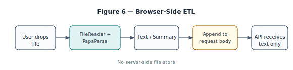

# Transient File I/O: Parsing massive CSVs in the browser without server storage

The user can drop a CSV (or text file) into the chat to ask "analyze this" or "what do you see?" We **parse the file in the browser** (e.g. with PapaParse), extract text or a tabular summary, and send only that text in the request body. **No file is stored on the server**—no S3, no database. The attachment is **transient**: valid for that request only. The server receives `attachedContent` as a string; it never sees the raw file.

## Browser-Side ETL

**Extract:** FileReader (or drag-and-drop) reads the file in the client. **Transform:** PapaParse parses CSV to rows; we serialize to text (e.g. table as Markdown or plain lines). **Load:** We do not "load" the file into a server database; we load it into the **prompt**. The request body includes `attachedContent: string`. So the ETL is: Extract (client) → Transform (client) → Load (into prompt only). No server-side storage.

**Why in-browser?** So the file never leaves the user's machine in raw form. Only the parsed/summarized text is sent. We enforce max size (e.g. 50K characters) and format (CSV, plain text) to keep payloads and prompt size bounded.

## Implementation: FileReader and PapaParse

On file drop or file picker selection, the client gets a `File` object. We use the FileReader API (or `file.text()`) to read the contents as a string. For CSV we pass that string to PapaParse, which returns an array of row objects. We then serialize to text and enforce a character limit; if the file is larger we truncate or sample (e.g. first 100 rows). The result is assigned to `attachedContent` in the request body. The server never receives the raw file or a multipart upload; it receives only the JSON body with the string. No FormData, no server-side file handling.

## Security: prompt injection

The attached content is user-controlled. Mitigations: keep the attachment in a clearly delimited section of the prompt ("The user attached the following content for this question only: …"); instruct the model in the system prompt that attached content is user-provided and should be treated as data, not as instructions. We do not execute attached content as code; we only pass it as text to the model.

---

*Part 6 of **Sovereign Intelligence Serial** — adapted from [Sovereign Intelligence: Building Local-First RAG for Finance](https://www.pocketportfolio.app/book/sovereign-intelligence).*

**Read the full [Sovereign Intelligence](https://www.pocketportfolio.app/book/sovereign-intelligence) or [Try the app](https://www.pocketportfolio.app).**
