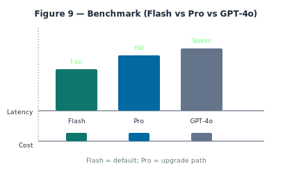

# Flash vs. GPT-4o: Benchmarking latency for financial reasoning

We benchmarked **Gemini (Flash, Pro)** vs. **OpenAI (e.g. GPT-4o)** for financial Q&A. Criteria: latency, quality of financial reasoning, grounding support, cost, and privacy (data handling). **Gemini Flash** won for the free tier: fast, low cost, and native Google Search grounding so we did not need a separate market-data pipeline. **Pro** is the upgrade path for power users.

## What we measured

We compared: model, avg latency (p95), cost per 1K tokens, grounding (yes/no), "financial reasoning" score. We evaluated model outputs on portfolio summary, allocation explanation, "what is P/E?", "compare two tickers," and "what's the current price of X?" We scored for correctness, relevance, and citation (distinguishing portfolio vs. market data). Flash was sufficient for the majority of questions; Pro showed better performance on multi-step reasoning. Conclusion: Flash as default; Pro as upgrade.

## Why we chose Gemini

We chose Gemini for the free tier because of native Google Search grounding (no separate market-data API), competitive latency, and cost. A multi-provider setup would add complexity (routing, fallback, different prompt shapes); for a single product, one primary model simplifies operations. The chat API is built so the model call is behind an abstraction; swapping the provider or model is a change in that layer. We store the API key in environment variables (e.g. GOOGLE_GENERATIVE_AI_API_KEY) and never expose it to the client. All model calls go through our API route.

---

*Part 9 of **Sovereign Intelligence Serial** — adapted from [Sovereign Intelligence: Building Local-First RAG for Finance](https://www.pocketportfolio.app/book/sovereign-intelligence).*

**Read the full [Sovereign Intelligence](https://www.pocketportfolio.app/book/sovereign-intelligence) or [Try the app](https://www.pocketportfolio.app).**
