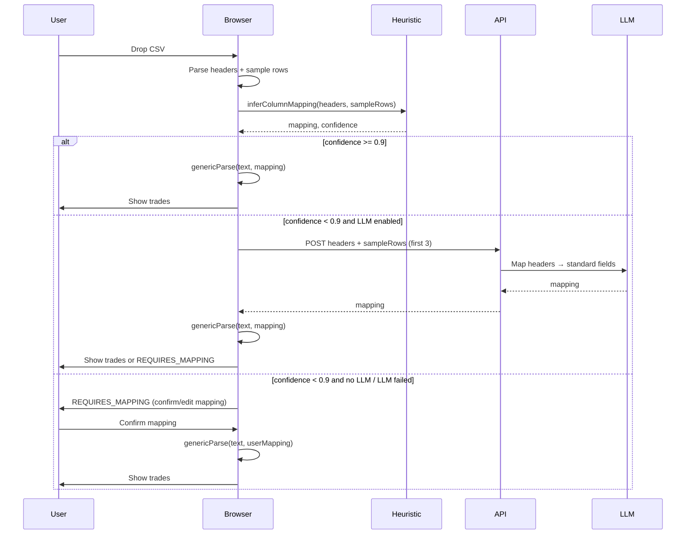
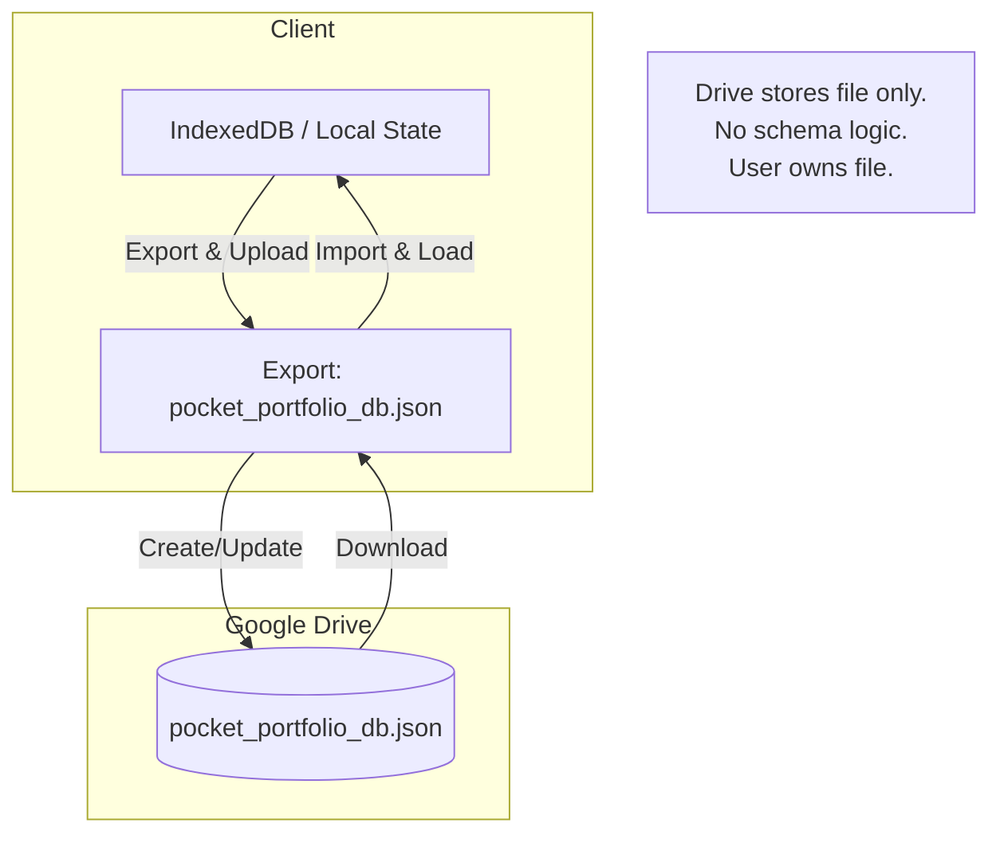

# Universal LLM Import (CSV): Technical Reference Series
**Pocket Portfolio Beta — Canonical Technical Reference**

---

## Chapter 1 — What Is Universal LLM Import (CSV)?

### The problem

Traditional CSV import is **broker-specific**: each broker gets a dedicated parser. New brokers or format changes mean new code, regression risk, and a never-ending compatibility list. Users with exports from "unsupported" brokers hit a wall.

**Universal LLM Import (CSV)** inverts this: instead of "we support broker X," the system supports **any** CSV that carries the semantic content of trades (date, ticker, action, quantity, price). Recognition is **schema inference** (what column means what), not a fixed list of formats.

### Why CSV is still the lingua franca

- Every broker and bank can export CSV. No API, no partnership, no approval.
- CSV is human-readable and tool-friendly (Excel, scripts, archives).
- Regulators and accountants expect CSV/Excel; it's the common denominator.
- Users already have these files; the product doesn't need to "pull" data.

So the bet is: **CSV is the sovereign format**. The hard part is interpreting messy, inconsistent headers and locales. That's where structure (heuristics) and semantics (LLM) come in.

### How "LLMs interpret" messy data

The system does **column mapping**, not free-form parsing. Given headers and a few sample rows, it answers: *which column is date? ticker? buy/sell? quantity? price?*  

LLMs help when headers are non-standard ("Deal Date," "Epic," "No. of shares," "Open Rate") or when multiple columns could match. They map **user vocabulary** to a fixed **normalized schema** (e.g. `date`, `ticker`, `action`, `quantity`, `price`). Parsing itself stays deterministic (numbers, dates, tickers); only the mapping step can be probabilistic and then confirmed by the user.

```
┌─────────────────────────────────────────────────────────────────┐
│  User's CSV (messy headers)                                      │
│  "Deal Date", "Epic", "Buy/Sell", "No. of shares", "Deal Price"  │
└──────────────────────────────┬──────────────────────────────────┘
                               │
                               ▼
┌─────────────────────────────────────────────────────────────────┐
│  Schema inference (heuristics + optional LLM)                    │
│  → date, ticker, action, quantity, price                         │
└──────────────────────────────┬──────────────────────────────────┘
                               │
                               ▼
┌─────────────────────────────────────────────────────────────────┐
│  Deterministic parse: toISO(), toNumber(), toTicker()            │
│  → NormalizedTrade[]                                             │
└─────────────────────────────────────────────────────────────────┘
```

**Key takeaways**

- Universal Import = "any CSV with trade-like columns," not "we support broker X."
- CSV remains the universal export; the innovation is robust **schema inference** plus deterministic normalization.
- LLMs are used as **interpreters** of column meaning; actual parsing is rule-based and locale-aware.

---

## Chapter 2 — Why CSV Over APIs: The Strategic Bet

### Fragility of financial APIs

Broker/bank APIs are **permissioned, versioned, and revocable**. They break for many reasons: OAuth changes, rate limits, schema updates, deprecations, or the provider simply shutting the integration down. Every integration is a long-term liability.

### Vendor lock-in and permissioned data

With Plaid-style or broker APIs, **you don't own the pipe**. The provider can restrict use, change pricing, or require compliance that small products can't meet. Data lives in their graph; export is at their discretion. That's the opposite of sovereign: the user's data is only as portable as the vendor allows.

### CSV as sovereign, user-owned format

CSV is **user-owned**. The user exports from their broker or bank and holds the file. No ongoing API key, no re-auth, no vendor in the loop. The product only needs to **interpret** the file. That aligns with local-first and data sovereignty: the canonical copy is the user's file; the app assists locally.

**Key takeaways**

- APIs are powerful but fragile and permissioned; CSV is fragile in format but sovereign in ownership.
- The strategic bet: optimize for **ownership and longevity** over convenience of live sync.
- Universal Import makes CSV a first-class path instead of a fallback.

---

## Chapter 3 — Local-First Architecture & System Design

### End-to-end local execution model

Import is designed so that **heavy work runs in the client**. File reading, CSV parsing, heuristic mapping, and (when used) the decision to call an LLM are all in the browser. Only when LLM is enabled and heuristics are low-confidence does the app send **headers + a small number of sample rows** to an API that returns a suggested mapping. The full CSV content is not sent; parsing of the full file stays local.

### Browser as compute boundary

The browser holds the file, runs the importer package (`@pocket-portfolio/importer`), and maintains portfolio state (e.g. IndexedDB / local state). The server is optional (LLM mapping endpoint) and stateless. No CSV is stored server-side; no broker credentials; no persistent server copy of trades.

### Data never leaving the client (by default)

- **Default path:** Heuristic mapping only. Headers and sample rows stay in the client; no network call for mapping.
- **Optional LLM path:** Only headers and a few sample rows (e.g. first 3 rows) are sent to `/api/ai/map-csv`; the response is a mapping object. The full CSV never leaves the client.
- **Parsing:** Always local. `genericParse(rawCsvText, mapping, locale)` runs in the client.

So "data never leaving the client" holds for the full CSV; the only exception is minimal, user-configurable LLM input (headers + a tiny sample) when that feature is on.

### Flow: CSV → inference → normalized schema

```mermaid
flowchart LR
  A[CSV File] --> B[Read in Browser]
  B --> C[Parse Headers + Sample Rows]
  C --> D{Heuristic Confidence >= 0.9?}
  D -->|Yes| E[Use Heuristic Mapping]
  D -->|No| F{LLM Enabled?}
  F -->|Yes| G[POST /api/ai/map-csv]
  G --> H[LLM Returns Mapping]
  F -->|No| E
  H --> I[Apply Mapping]
  E --> I
  I --> J[genericParse full CSV locally]
  J --> K[NormalizedTrade[]]
```

**Key takeaways**

- Local-first: file and full parse stay in the browser; server is optional and minimal.
- Only mapping can touch the network (and only when LLM is enabled and heuristics fail).
- The pipeline is: **CSV → infer mapping (heuristic ± LLM) → deterministic parse → normalized trades**.

---

## Chapter 4 — Universal LLM Import Pipeline (Deep Dive)

### Prompt design for schema inference

The goal of the mapping step is to return a **key-value map** from standard field names to the CSV column names (headers). Standard fields are fixed: `date`, `ticker`, `action`, `quantity`, `price`, and optionally `currency`, `fees`. The prompt (or heuristic) must map from the user's headers to these. In the codebase, the API receives `headers` and `sampleRows` (e.g. first 3 rows); the response is `{ mapping: UniversalMapping }`. Prompt design should be explicit: "Given these headers and optional sample rows, return a JSON object mapping each of date, ticker, action, quantity, price to exactly one header name." One-shot, structured output (e.g. JSON only, no prose) keeps it reliable.

### Deterministic vs probabilistic parsing

- **Probabilistic:** Mapping inference. Heuristics (synonym tables, optional numeric validation) and/or LLM produce a proposed mapping. Confidence is computed (e.g. fraction of required fields mapped).
- **Deterministic:** Once a mapping is chosen (by high confidence or user confirmation), `genericRowToTrade` and `genericParse` are pure functions: same CSV + same mapping + locale ⇒ same `NormalizedTrade[]`. Dates via `toISO()`, numbers via `toNumber()` (locale-aware), tickers via `toTicker()`. No randomness.

So: **inference is probabilistic; application of the mapping is deterministic.**

### Error handling, confidence scoring, retries

- **Confidence:** Required fields are `date`, `ticker`, `action`, `quantity`, `price`. Confidence = (number of required fields mapped) / (total required). Heuristic threshold (e.g. 0.9) decides whether to trust the mapping or ask the user.
- **Low confidence:** Pipeline returns `RequiresMappingResult`: headers, sample rows, proposed mapping, confidence, and raw CSV text. UI shows a mapping editor; user confirms or corrects; then `genericParse(rawCsvText, userMapping, locale)` runs locally.
- **Errors:** Row-level parse failures (bad date, non-numeric quantity) produce warnings and skip that row; they don't crash the run. LLM endpoint failures fall back to heuristic mapping so the flow can continue without LLM.

### LLM-assisted ingestion lifecycle



**Key takeaways**

- Mapping is the only probabilistic step; parsing is deterministic and locale-aware.
- Confidence threshold gates "auto-apply" vs "show mapping UI"; REQUIRES_MAPPING keeps the user in control.
- Failures (LLM or parse) degrade gracefully: fallback to heuristics and/or user-confirmed mapping.

---

## Chapter 5 — Tech Stack & Model Choices

### Frontend stack

- **Next.js** for the app; import UI lives in components such as `CSVImporter`.
- **@pocket-portfolio/importer** (and alias `universal-csv-importer`): `parseUniversal`, `inferMapping`, `genericParse`, `genericRowToTrade`, plus types `UniversalMapping`, `RequiresMappingResult`, `StandardField`. Runs in the browser (and in Node for tests).
- **CSV parsing:** Lightweight parser in `io/csvFrom`; no heavy server round-trip for the file.
- **State:** Portfolio/trades in client state and/or IndexedDB; Google Drive is optional sync storage (see Sovereign Sync).

### LLM selection criteria

For the mapping endpoint, criteria are:

- **Latency:** Single short request (headers + few rows); response should be fast so the UI doesn't feel stuck.
- **Determinism:** Prefer low temperature and structured output (JSON mapping only) for reproducible behavior.
- **Cost:** One call per unknown-format file; cost per user is small.
- **Privacy:** Only headers and a few sample rows are sent; no account numbers or full history. Optionally, a self-hosted or privacy-preserving model can be used.

The current route (`/api/ai/map-csv`) is built to accept an optional OpenAI (or other) call; when `ENABLE_LLM_IMPORT` is false or the call is omitted, only heuristics run.

### Why no fine-tuning is required

The task is **narrow**: "given a list of header strings (and optionally a few row samples), return a mapping to five standard fields." That's in-distribution for a general model with a clear prompt. A synonym table already covers many brokers; the LLM handles the long tail of naming. Fine-tuning would add operational cost for limited gain; good prompt design and structured output are enough.

### One-shot reliable prompts

Prompts should:

- List the exact standard field names and allow only those keys in the output.
- Request JSON only (no explanation).
- Optionally include 2–3 example header sets and their expected mapping.
- State that each standard field must map to exactly one header name from the input list.

That keeps the model on-task and the response parseable and stable.

**Key takeaways**

- Stack is Next.js + importer package in the browser; CSV and full parse stay client-side.
- LLM is optional and used only for mapping; choice of model can optimize for latency, cost, and privacy.
- No fine-tuning; reliability comes from scope (mapping only), structured output, and fallback to heuristics + user confirmation.

---

## Chapter 6 — Sovereign Data & Google Drive Sync

### Drive as "dumb storage," not a backend

Google Drive is used as **file storage** for a single export file (`pocket_portfolio_db.json`). The app creates/updates that file and can read it back. Drive does **not** run business logic, validation, or schema; it doesn't host the app. It's "a folder in the cloud" for the user's own data.

### User-owned files, user-owned schema

The file format is the same as the app's export: trades + metadata (version, lastUpdated, etc.). The user can copy the file, open it elsewhere, or move it. The schema is documented and owned by the product; the user owns the file and the data in it. Sync is **optional** and can be gated (e.g. Founder's Club) without changing the local-first model.

### Encryption boundaries and trust model

- **Today:** Data is stored in Drive as JSON; OAuth scope is minimal (e.g. `drive.file`: only app-created files). Tokens are client-managed.
- **Trust:** The client trusts the Drive API for persistence and availability; the app does not trust Drive with interpretation of the schema—that stays in the app. Future work may add client-side encryption before upload so that Drive sees ciphertext only.

### Diagram: Local Device ↔ Drive ↔ Restore



**Key takeaways**

- Drive is dumb storage for one JSON file; no backend logic in the cloud.
- User owns the file and the data; schema is defined by the app, not by Drive.
- Sync is optional; encryption can be added at the client→Drive boundary.

---

## Chapter 7 — Benefits of Universal LLM Import (CSV)

### Technical

- **Robustness:** Heuristics + optional LLM + user confirmation handle many formats without a new parser per broker.
- **Adaptability:** New brokers or export changes often need no code change—synonyms or LLM cover new headers.
- **Offline tolerance:** Full parse is local; only optional mapping step uses the network when LLM is on.
- **Single pipeline:** One code path (`parseUniversal` → `genericParse`) instead of N broker adapters for "unknown" sources.

### Philosophical

- **Data sovereignty:** User brings the file; the app doesn't pull data from a third party on their behalf.
- **Local-first:** Default is local parse; server is an optional aid for mapping.
- **Interpretation over oracles:** LLM suggests "which column is what"; the user can override; the app doesn't "decide" the user's data.

### Financial

- **Cost:** No per-broker API fees; optional LLM cost is small (one request per file).
- **Zero API dependency:** No Plaid or broker API keys or compliance for import.
- **Longevity:** As long as brokers export CSV, the importer stays useful; no dependency on a vendor keeping an API alive.

**Key takeaways**

- Benefits are technical (fewer parsers, offline-friendly), philosophical (sovereign, local-first), and financial (low cost, no API lock-in, long-lived).

---

## Chapter 8 — Universal LLM Import (CSV) vs API Integrations

### Comparison

| Dimension              | Universal LLM Import (CSV)     | Plaid / Broker APIs        |
|------------------------|--------------------------------|-----------------------------|
| Data ownership         | User holds CSV                 | Provider holds data graph   |
| Integration surface    | File upload + mapping          | OAuth, APIs, webhooks       |
| New "integration"      | Often zero code (heuristic/LLM)| New adapter + maintenance  |
| Offline                | Parse works offline            | Needs network               |
| Failure mode           | Bad mapping → user corrects    | API down → no data          |
| Maintenance            | Synonym/LLM updates            | API versions, deprecations  |
| Cost                   | Optional LLM per file          | Per-API or per-call fees    |
| Compliance             | No broker API ToS in the path  | Provider ToS, data use      |

### Failure modes

- **APIs:** Auth expiry, rate limits, schema changes, sunset. Mitigation is more integration code and monitoring.
- **CSV:** Wrong mapping, locale/format quirks. Mitigation is confidence threshold, mapping UI, and deterministic parse with warnings. No dependency on a third party being up.

### Long-term maintenance

- **APIs:** Every provider is a long-term dependency; changes require code and testing.
- **CSV:** Maintenance is synonym lists, prompt tweaks, and normalization edge cases. No per-broker API lifecycle to track.

**Key takeaways**

- CSV import trades some convenience (no live sync) for ownership, simplicity, and maintainability.
- Failure modes and maintenance load favor CSV + smart mapping for a small team and long-lived product.

---

## Chapter 9 — Security, Privacy & Threat Modeling

### What is never transmitted (by design)

- **Full CSV:** Never sent to the server in the standard design. Only headers and a small sample (e.g. 3 rows) are sent when LLM is enabled.
- **Portfolio state:** Lives in the client (and optionally in the user's Drive file). Not stored on Pocket Portfolio servers for import.
- **Broker credentials:** Not used; user exports CSV themselves.

### What the LLM sees (when enabled)

- **Sent:** Header names and a few sample rows (e.g. first 3). No account IDs, no full history, no PII beyond what's in those cells.
- **Not sent:** Full file, filename (unless included in headers), user id, session.

Minimizing sample size and stripping unnecessary columns in the request reduces exposure. For maximum privacy, the LLM path can be disabled and only heuristics + user mapping used.

### Attack surfaces and mitigations

- **Malicious CSV:** Parsing is strict (dates, numbers); no eval or code execution. Large files can be bounded (row limit) to avoid DoS.
- **Mapping API:** Authenticated and rate-limited; input validated (headers array, optional sample rows). No storage of request/response required.
- **Drive:** OAuth and scope limitation (`drive.file`); token handling and optional future encryption.

### GDPR and "by design"

- No server-side processing of full trade history; no "processing" of personal data on the server beyond optional minimal mapping input.
- User initiates export and upload; no profiling or automated decision-making based on server-held data. Data minimization and purpose limitation are straightforward to document. When LLM is off, even header/sample data need not leave the client.

**Key takeaways**

- Full CSV and full portfolio don't need to leave the client; LLM sees only headers and a tiny sample when enabled.
- Threat model is small (file parsing, optional API, optional Drive); mitigations are standard (validation, rate limit, minimal scope).
- Architecture supports GDPR-friendly data minimization and user control.

---

## Chapter 10 — Use Cases & Extension Paths

### Brokers, banks, crypto exchanges

Any source that can export CSV can be supported: traditional brokers (US/UK/EU), banks (current/transaction exports), crypto exchanges, and tax tools (e.g. Koinly, TurboTax). The same pipeline applies; only the header vocabulary and locale may differ. Known brokers can keep dedicated adapters for speed and branding; "unknown" or new brokers go through Universal Import.

### Non-financial CSV ingestion (generalized future)

The pattern "headers + sample → mapping → deterministic parse" is generic. Other domains (inventory, time tracking, CRM exports) could use the same idea: a small normalized schema, synonym/LLM mapping, then deterministic row conversion. The importer package could be generalized or forked for other verticals.

### Community-built adapters and prompts

- **Adapters:** New broker adapters can be added to the registry (detect + parse) for first-class "known broker" UX; Universal Import remains the fallback.
- **Synonyms:** Community can suggest header synonyms for new brokers; they're just data.
- **Prompts:** If the mapping endpoint uses an LLM, prompt improvements (examples, edge cases) can be shared without code changes to the core parse logic.

**Key takeaways**

- Universal Import covers any CSV that semantically has trade-like columns, across brokers, banks, and crypto.
- The same architecture can be reused for other CSV-to-schema use cases.
- Extensions are adapters, synonym lists, and prompt design; core pipeline stays stable.

---

## Chapter 11 — Why This Matters for the Future of Finance

### From SaaS rent-seeking to user-owned systems

Many fintech products lock data in their own APIs and dashboards. Universal Import is a step toward **user-owned data**: the user exports, holds, and imports; the app is a tool that runs on their data. Subscription value can sit in analysis, UX, and sync—not in exclusive access to the user's own history.

### LLMs as interpreters, not oracles

LLMs here don't "decide" what the user's trades are. They suggest a mapping; the user can confirm or correct. The system then runs a deterministic parse. That keeps the model in a **supporting role** (interpretation of messy headers) and keeps control and auditability with the user and the code.

### Pocket Portfolio's long-term vision

- **Evidence-first investing:** Decisions based on the user's own data, not black-box feeds.
- **Universal data:** "Any broker, bank, or spreadsheet" via one import path.
- **Sovereignty:** Local-first import, optional Drive sync, no server-side trade storage for import.
- **Longevity:** CSV and open formats reduce dependency on vendor APIs and keep the product useful for years.

Universal LLM Import (CSV) is the technical expression of that: one pipeline, optional LLM assist, user-confirmed mapping, deterministic parse, and data that stays in the user's hands.

**Key takeaways**

- The direction is user-owned data and tooling that interprets it, rather than SaaS that holds it.
- LLMs are used as interpreters with human-in-the-loop; parsing remains deterministic and transparent.
- Pocket Portfolio positions Universal Import as the durable, sovereign way to get "any" financial CSV into an evidence-first, local-first product.
