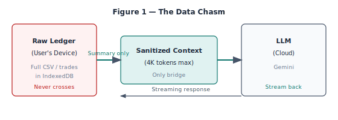
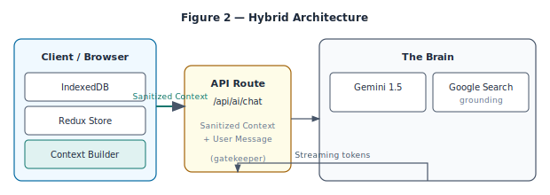
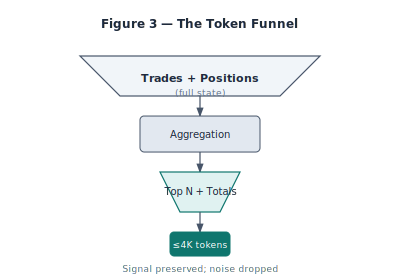
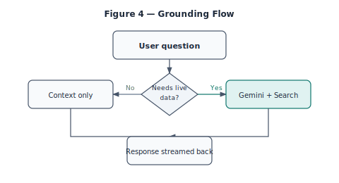
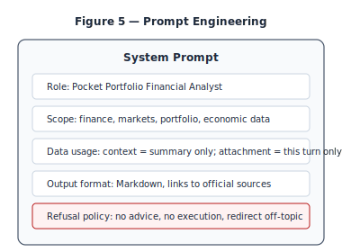
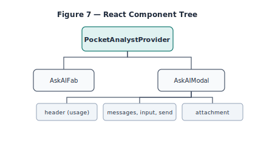
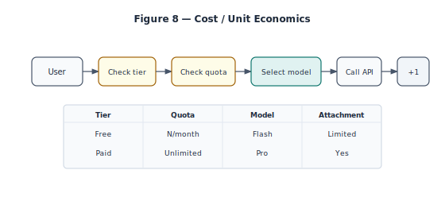
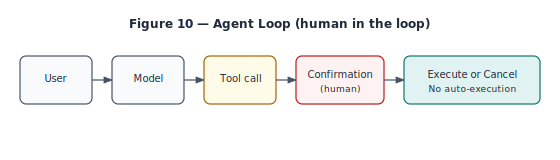

# Sovereign Intelligence: Building Local-First RAG for Finance

**Architecture of a Local-First Financial AI**

---

## Table of Contents

1. [Introduction](#introduction)
2. [Part I: The Privacy Imperative](#part-i-the-privacy-imperative)
   - [Chapter 1 — The Privacy Gap](#chapter-1--the-privacy-gap)
   - [Chapter 2 — Hybrid RAG Architecture](#chapter-2--hybrid-rag-architecture)
3. [Part II: Context & Grounding](#part-ii-context--grounding)
   - [Chapter 3 — The Context Engine](#chapter-3--the-context-engine)
   - [Chapter 4 — Grounding & Reality](#chapter-4--grounding--reality)
4. [Part III: Safety & Data Handling](#part-iii-safety--data-handling)
   - [Chapter 5 — The Guardrails](#chapter-5--the-guardrails)
   - [Chapter 6 — Transient File I/O](#chapter-6--transient-file-io)
5. [Part IV: Experience & Economics](#part-iv-experience--economics)
   - [Chapter 7 — Streaming & UI/UX](#chapter-7--streaming--uiux)
   - [Chapter 8 — Economic Modeling](#chapter-8--economic-modeling)
6. [Part V: Model Choice & Future](#part-v-model-choice--future)
   - [Chapter 9 — The "Google Mode"](#chapter-9--the-google-mode)
   - [Chapter 10 — Future: Autonomous Agents](#chapter-10--future-autonomous-agents)
7. [Conclusion](#conclusion)
8. [Appendix: Implementation Reference](#appendix-implementation-reference)

---

# Introduction

This book is the canonical technical reference for **Pocket Analyst**—the AI financial assistant built into Pocket Portfolio that respects data sovereignty. We document the architecture of a system that delivers a "Hedge Fund Analyst" experience in the browser: users ask questions about their portfolio and the markets; only a **sanitized context snapshot** is sent to the cloud; raw ledgers never leave the device. The theme is **moving AI to the data, not data to the AI.**

**Who this book is for.** Senior engineers, fintech founders, and privacy advocates who want to build or evaluate local-first financial AI. The narrative is grounded in a real system: Pocket Portfolio's Ask AI flow, context builder, chat API, and UI. Every technical claim can be verified against the codebase.

**What you will get.** A single place to understand: why generic chatbots fail for finance; the "Split Brain" model (browser memory vs. server reasoning); how we summarize thousands of trades into a token-bounded prompt; how Gemini grounding connects "My Portfolio" with "The Market"; guardrails that keep the assistant in-domain; transient file handling without server storage; streaming UX and cost modeling; why we chose Gemini Flash; and the roadmap from chat to safe agentic actions.

**How the book is structured.** Ten chapters in five parts. Part I (Chapters 1–2) covers the privacy gap and hybrid RAG architecture. Part II (Chapters 3–4) dives into the context engine and grounding. Part III (Chapters 5–6) covers guardrails and transient file I/O. Part IV (Chapters 7–8) covers streaming, UI, and economics. Part V (Chapters 9–10) covers model choice and the future of autonomous agents. The Appendix points to core implementation files.

**Conventions.** We use the same terms as the codebase: Pocket Analyst, sanitized snapshot, context builder, Split Brain, grounding, transient attachment, tiered quotas. Code names (e.g. `buildPortfolioContext`, `AskAIModal`, `/api/ai/chat`) are real.

**How to read this book.** *Implementers* — read Parts I–II and the Appendix for architecture, context engine, and file paths; skim Part III (guardrails, transient I/O) and Part IV (streaming, economics) as needed. *Privacy and compliance* — focus on Chapter 1 (data chasm, sanitized snapshot), Chapter 2 (stateless API, no server storage), and Chapter 6 (transient attachments). *Product and cost* — read Chapter 8 (tiered quotas, cost per query) and Chapter 9 (model choice); use the figures for quick reference.

---

# Part I: The Privacy Imperative

## Chapter 1 — The Privacy Gap

### The problem

Financial data is the most sensitive data users own. Transaction histories, account balances, and position-level detail are the crown jewels of personal finance. Sending raw ledgers to generic chatbot APIs—OpenAI, Anthropic, or any third party that trains or logs prompts—is a non-starter for privacy-conscious users and for compliance. Yet users rightly expect AI that "knows" their portfolio: allocation, top holdings, performance, tax implications. The **data chasm** is the gap between what the AI needs to be useful and what the user is willing to send.

Generic chatbots fail in finance for three reasons. First, **trust**: users do not want their full trade history in a vendor's logs. Second, **accuracy**: the model must reason over *their* data—aggregates, tickers, dates—not generic advice. Third, **regulation**: data minimization and purpose limitation (e.g. GDPR) require that we do not send more than necessary. So we cannot simply paste the user's CSV into ChatGPT and ask "summarize my portfolio." We need an architecture that keeps the full dataset local and sends only what is strictly required for the model to answer.

**Why "raw ledgers" are dangerous.** A single export can contain hundreds or thousands of rows: date, ticker, action, quantity, price, fees, account identifiers, broker names. That is PII and financial history. Storing or training on it creates retention, breach, and consent issues. Even "anonymized" aggregates can be re-identified when combined with other data. The only safe approach is to never send the raw ledger at all—and to send a **sanitized snapshot** that preserves signal (allocation, performance) but drops identifiers and row-level detail.

### The solution: Bring the compute to the data

**"Bring the Compute to the Data."** Keep the full dataset local—in the browser, in IndexedDB or Redux—and send only a **sanitized snapshot**: totals, top N holdings by value, trade count, unrealized P/L. No account numbers, no broker names, no row-level trades unless the user explicitly attaches a file for that session. The client runs a **context builder** that reduces 10,000+ trades into a short, signal-preserving summary (token-bounded, e.g. under 4,000 tokens). That string is the only portfolio data that ever hits the server. The server never stores it; each request is stateless.

This pattern inverts the usual "send everything to the cloud" model. The cloud does the heavy reasoning (LLM, optional search grounding); the client does the heavy data reduction. The API is a pure function: (sanitizedContext, userMessage, optionalFileContent) → stream. No session storage of portfolio on the server; no database of user trades; no training on user data.

### The Sanitized Snapshot pattern

The **Sanitized Snapshot** is the core design pattern. The client (browser) holds the full state: trades, positions, totals. A function—`buildPortfolioContext(trades, positions)` in our implementation—produces a single block of text: "Portfolio summary: Total positions N, Total trades M, Total invested X, Total current value Y, Unrealized P/L Z%. Top holdings by value: AAPL 20%, MSFT 15%, …" No user ID, no account numbers, no ticker-level history beyond the top N and aggregates. The model receives this string as context and can answer "What's my biggest holding?" or "How is my portfolio doing?" without ever seeing individual fill dates or order IDs.

**What never crosses the wire.** Full trade list; account or broker identifiers; any column that could re-identify the user or their institution. **What does.** Aggregates (totals, counts), top holdings (ticker, shares, value, percentage), and optionally—only when the user explicitly attaches a file—the parsed text of that file for that turn. The attachment is transient: it is not stored on the server; it is valid only for that request.

### The Data Chasm diagram

Conceptually, the diagram has three zones. On the left: **Raw Ledger (User's Device)**—the full CSV or normalized trades in IndexedDB. On the right: **LLM (Cloud)**—Gemini or another model. In the middle: **Sanitized Context (4K tokens max)**—the only bridge. Arrows: full history never crosses; only the summary flows left to right; the streaming response flows right to left. That is the data chasm: we narrow it to a single, minimal channel.



### Why this matters for compliance and trust

When the user's data never leaves their device in raw form, data minimization is straightforward. We can document exactly what is sent: "For each Ask AI request, the client sends a text summary of portfolio totals and top holdings (no account numbers, no full history)." Regulators and privacy officers can audit the context builder and the API contract. Users can be told: "Your trades stay on your device; we only send a short summary so the AI can answer." That builds trust and keeps the system within purpose limitation and storage minimization principles.

### Concrete example: what the context string looks like

A typical output of `buildPortfolioContext` might look like the following (abbreviated). The actual string is plain text, one line per fact:

```text
Portfolio summary (for personalization only):
Total positions: 12
Total trades: 347
Total invested (USD equiv): 45230.50
Total current value (USD equiv): 48102.20
Total unrealized P/L: 2871.70 (6.3%)

Top holdings by current value:
  AAPL: 45.00 shares, USD 8325.00 (17.3%), P/L 12.1%
  MSFT: 22.00 shares, USD 7986.00 (16.6%), P/L 8.4%
  ...
```

The model sees only this. It does not see account numbers, broker names, or the 347 individual trades. From this it can answer "What's my largest holding?" (AAPL), "How am I doing overall?" (6.3% unrealized gain), and "How concentrated am I?" (top two are ~34%). That is enough signal for most questions while keeping the payload small and free of PII.

### Comparison: sending raw vs. sanitized

If we sent the raw ledger, a single user might have 10,000 rows × 10 columns = 100,000 cells. Even at 2 tokens per cell we would blow the context window and send identifiers, dates, and order IDs. The model does not need "trade on 2024-01-15 BUY 10 AAPL at 185.50" for every row; it needs "you hold 45 AAPL, current value 17.3% of portfolio, up 12.1%." So we compress by aggregation. The sanitized snapshot is typically a few hundred words—under 1,000 tokens—leaving most of the context window for the user's question and the model's answer. Raw would be unusable and unsafe; sanitized is usable and compliant.

### Edge cases: empty portfolio and single position

When the user has no trades or a single position, the context builder still runs. It might output "Total positions: 0, Total trades: 0" or "Total positions: 1" with one line for the only holding. The model can then say "Your portfolio is empty" or "You have one position in AAPL." We do not send an empty string when there is no data; we send a minimal summary so the model knows the state. That avoids the model guessing or inventing positions.

### Forward-looking: client-side LLMs and optional zero-cloud mode

In the future, small models (e.g. running in WebGPU or via a local inference server) could answer portfolio-only questions without any cloud call. The context would stay entirely on the device; only questions that need live market data would hit the API. That would further narrow the data chasm for privacy-first users. The architecture already supports it: the context builder is client-side; we would add a branch "if question is portfolio-only and local model available, call local model; else POST to /api/ai/chat."

### Real-world threat model: what could go wrong if we sent raw data

If we sent the full trade list to a third-party API, several failure modes open up. The vendor could log prompts for debugging or "model improvement," exposing every ticker, date, and size the user ever traded. A breach at the vendor would leak financial history. Regulatory requests (subpoenas, national security letters) could compel the vendor to hand over data the user believed stayed on their device. Training on user data—even "anonymized"—can leak patterns (e.g. a rare combination of tickers and dates that re-identifies the user). By never sending the raw ledger, we close these vectors: the vendor never has the data to log, breach, or hand over. The sanitized snapshot is useful for Q&A but not sufficient to reconstruct the full history or to re-identify the user with high confidence.

### How other products handle financial AI

Some products upload the user's portfolio to their own servers and run the model there. That gives a single place to reason over the data but creates custody: the product now holds a copy of the user's trades. Others use a generic chatbot and ask the user to paste their data into the chat—so the user explicitly sends it, but it still ends up in the vendor's logs. Our approach differs: we never hold the full dataset; we never ask the user to paste it; we only send a client-generated summary. The product is a thin layer (UI, context builder, API gateway); the user's device remains the canonical store. That aligns with "local-first" and "sovereign data" positioning and with strict interpretations of data minimization.

### Audit trail and transparency

Because the context builder is open logic (a single function in the codebase), users and auditors can inspect exactly what is sent. There is no black box: the input is trades and positions; the output is a fixed-format string. We can document "we send: total positions, total trades, total invested, total value, unrealized P/L, and the top 10 holdings by value (ticker, shares, value, allocation %, P/L %). We do not send: user ID, account numbers, broker names, or any trade-level detail beyond what appears in the top-10 summary." That transparency supports trust and compliance narratives. If a regulator asks "what data do you send to the AI provider?", we have a one-page answer.

### The long tail of "what the user might ask"

Users ask not only "what's my biggest holding?" but also "how much did I invest in tech?" or "what's my cost basis for AAPL?" Some of these require more than the top-N summary—e.g. sector breakdown or ticker-level cost basis. Our current context does not include sector or per-ticker cost basis; we could extend the context builder to add optional lines (e.g. "Sector breakdown: Tech 40%, Healthcare 25%, …" or "AAPL cost basis: $164.20") when that data is available in the app. The principle remains: we only send derived, aggregate, or top-N data, never the full ledger. Extending the schema is a product and engineering choice; the privacy boundary (no raw ledger) stays fixed.

### Summary table: what crosses the wire

| Sent to server | Not sent |
| --- | --- |
| Portfolio summary (totals, top N holdings) | Full trade list |
| User message (this turn) | Account numbers, broker names |
| Optional: parsed attachment text (this turn only) | Conversation history (unless client resends) |
| | User ID (unless in auth header for quota) |

This table can be shared with compliance and users. It makes the data boundary explicit and auditable.

### Summary

- Financial data is too sensitive to send raw to generic chatbots; the data chasm is the gap between utility and willingness to send.
- **Bring the Compute to the Data:** keep the full dataset local; send only a sanitized snapshot.
- The **Sanitized Snapshot** pattern: client-side context builder produces a token-bounded summary (totals, top holdings); that string is the only portfolio data that hits the server.
- The **Data Chasm** diagram: Raw Ledger (device) ↔ Sanitized Context (bridge) ↔ LLM (cloud); full history never crosses.

---

## Chapter 2 — Hybrid RAG Architecture

### The stack

**Server:** Next.js App Router, Vercel AI SDK (`streamText`, `useChat`), Gemini 1.5 Flash (default) and optional Pro for paid tiers. The API route `/api/ai/chat` is the gatekeeper: it receives sanitized context, user message, and optional attached content; enforces quotas; calls the model; streams the response. **Client:** React, Redux (or equivalent) for app state, IndexedDB for persistence. The context builder runs in the browser and passes its output in the request body. No server-side session store for portfolio data; each request is self-contained.

**Why this split.** The browser is the only place that has access to the user's full data without copying it to the cloud. The server is the only place that can call the LLM and (optionally) Google Search grounding at scale. So we split: **memory** (what the user owns, what they've said this session) in the browser; **reasoning** (token generation, search) on the server. The API is stateless and does not persist portfolio or conversation history.

### The flow

1. **Client:** User has trades/positions in state. Context builder runs `buildPortfolioContext(trades, positions)` → string. User types a message (and optionally attaches a file; see Chapter 6). Client sends `POST /api/ai/chat` with `{ message, portfolioContext?, attachedContent? }`.
2. **Server:** Validates body; checks tier and quota (e.g. Firestore); selects model (Flash vs Pro); builds system prompt (role, scope, guardrails); appends portfolio context and optional attachment to the prompt; calls Gemini (with or without search grounding); streams tokens back.
3. **Client:** Vercel AI SDK consumes the stream; updates message list; renders Markdown (tables, bold, links). No server storage of the conversation; the client holds the message list in component state (or could persist to IndexedDB for "session" continuity).

So: **Client-side summarization → Stateless API route → LLM (with optional grounding) → Streaming response back to client.** No session storage of portfolio on the server; each request carries its own context.

### Split Brain: memory vs. reasoning

**Split Brain** is the key concept. The "memory" lives in the browser: the full trade list, positions, and the conversation history for this session. The "reasoning" lives on the server: the LLM call, token generation, and optional search grounding. The API is a pure function: (sanitizedContext, userMessage, optionalFileContent) → stream. It does not read from a database of user data; it does not store the context after the request. The client is the source of truth for what the user has and what they asked; the server is the stateless compute layer.

This avoids the worst of both worlds: we do not send raw data to the cloud (privacy), and we do not run the LLM in the browser (performance, cost, capability). We get the best of both: local data sovereignty and cloud-scale reasoning.

### Hybrid Architecture diagram

The architecture has three columns. **Left (Client/Browser):** IndexedDB, Redux Store, Context Builder (`contextBuilder.ts`). **Middle (The Air Gap):** API Route `/api/ai/chat` as gatekeeper. Label: "Sanitized Context + User Message." **Right (The Brain):** Gemini 1.5, Google Search grounding. Arrows: "Sanitized Context" left → right; "Streaming Token Response" right → left. No arrow for "full portfolio" or "raw trades"—they never leave the left column.



### Stateless API design

The chat API does not maintain session state. It does not store the user's portfolio, previous messages, or attachments. Every request is independent. That simplifies scaling (no sticky sessions), security (no server-side data retention), and debugging (each request is reproducible given the same inputs). The client is responsible for including whatever context is needed in each request. For multi-turn conversations, the client typically sends the last N messages plus the current one; the server does not "remember" past turns unless the client resends them. Optional: the client could persist the message list to IndexedDB and resend the full thread each time; the server still does not store it.

### Request and response shape

The client sends a JSON body: `{ message: string, portfolioContext?: string, attachedContent?: string }`. The `message` is required; the other two are optional. The server responds with a streaming body (e.g. `text/event-stream` or chunked transfer) so the client can render tokens as they arrive. If quota is exceeded, the server returns 429 and a JSON body with a message; the client shows the quota-exceeded modal. If the model call fails, the server returns 500 and the client shows an error state. No session cookie or token is required for the chat itself; auth (if any) is handled at the app level (e.g. the page is behind login, or the API checks a bearer token). The important point is that the API does not depend on server-side session storage for portfolio or conversation.

### Why not store context on the server?

Storing portfolio context or conversation history on the server would create retention and compliance burden. We would have to define retention periods, deletion flows, and access controls. By keeping everything stateless, we avoid that: the server processes the request and discards the body after the response is sent. Logs (if any) should not include full context or messages; at most, log request size, latency, and tier for analytics. That keeps the "data never persists on the server" story simple and auditable.

### Concrete flow: one request end to end

User has 500 trades in Redux/IndexedDB. They open Ask AI and type "What's my biggest holding?" The client runs `buildPortfolioContext(trades, positions)` and gets a 400-word string. It sends `POST /api/ai/chat` with `{ message: "What's my biggest holding?", portfolioContext: "<the string>" }`. The server checks quota, builds the system prompt, appends the portfolio context and the user message, calls Gemini, and streams the reply. The client appends the streamed tokens to the assistant message and renders Markdown. The server never writes the context to disk; when the stream ends, the request is done. That is one full round-trip; the next question is another independent request, again with context built fresh on the client.

### Why the browser is the right boundary for "memory"

The browser already has the user's data: it loaded the app, which loaded trades from IndexedDB or from a sync file. So the "memory" (what the user holds, what they've said this session) is naturally client-side. Moving it to the server would require uploading the portfolio and conversation to our backend, which contradicts data sovereignty and increases attack surface. Keeping memory in the browser means we only send the minimal summary at request time; we never maintain a server-side mirror of the user's state. The server is a stateless function: in goes context + message, out comes a stream. That simplifies ops (no session store to scale or back up) and security (no sensitive state on our servers).

### Multi-turn conversations without server memory

For follow-up questions ("What about fees?" or "Compare that to MSFT"), the client can resend the last K messages (e.g. last 5) in the request body so the model has conversation history. The server still does not store that history; it only processes the current request. So "multi-turn" is implemented by the client including prior turns in each new request. That keeps the server stateless while still allowing contextual follow-ups. Optional: the client could persist the message list to IndexedDB so that reopening the modal restores the thread and the next send includes the full thread; again, the server never sees that persistence.

### Scaling and rate limiting

Because each request is independent, we can scale the API horizontally: any replica can handle any request. There is no sticky session or server-side state to migrate. Rate limiting is per user or per IP (e.g. N requests per minute) to prevent abuse; quota (e.g. 20 questions per month for free tier) is enforced in the route by checking Firestore before calling the model. So we get scalability (stateless) and cost control (quota) without storing portfolio or conversation on the server.

### Comparison to traditional RAG

Traditional RAG (retrieval-augmented generation) often works by indexing documents on a server and retrieving relevant chunks at query time. Our design is different: we do not index the user's portfolio on the server. The "retrieval" is done on the client—the context builder selects and formats what to send. So we might call this "client-side RAG" or "hybrid RAG": the client holds the corpus (trades, positions) and sends a precomputed summary; the server only runs the model. That inverts the usual RAG architecture and is the key to keeping data sovereign.

### Failure modes and fallbacks

If the context builder throws (e.g. malformed trades), the client should catch the error and either send an empty context (with a note in the system prompt that no portfolio context was provided) or show an error and ask the user to refresh. If the API is down, the client shows a network error and retry. We do not persist failed requests for later replay; each attempt is independent. That keeps the system simple and avoids partial state.

### Why we do not use server-side RAG or vector store for portfolio

A classic RAG setup would index the user's documents (e.g. trade history) in a vector store on the server and retrieve relevant chunks at query time. We deliberately do not do that for portfolio data: it would require uploading and storing the user's data on our infrastructure, which violates the sovereign-data principle. Our "RAG" is client-side: the client holds the corpus (trades, positions), reduces it to a summary (context builder), and sends only that summary. So there is no server-side index of the user's portfolio. The only thing that looks like "retrieval" is Gemini's optional search grounding for market data—and that retrieves public web data, not the user's private data. This design choice is fundamental to the book's theme: move AI to the data, not data to the AI.

### Implementation notes

- **Context builder:** `app/lib/ai/contextBuilder.ts` — `buildPortfolioContext(trades, positions?)` returns a string. Called in the client before each send.
- **Chat API:** `app/api/ai/chat/route.ts` — POST handler; reads `message`, `portfolioContext`, `attachedContent`; enforces quota; calls Gemini; streams.
- **Usage and quotas:** `app/api/ai/usage/route.ts` and Firestore (e.g. `toolUsage`, quota docs) for tier and remaining questions.

### Summary

- **Stack:** Next.js, Vercel AI SDK, Gemini 1.5 Flash/Pro; client: React, Redux, IndexedDB, context builder.
- **Flow:** Client summarization → stateless POST → LLM → stream. No server storage of portfolio.
- **Split Brain:** Memory (browser) vs. reasoning (server). API = pure function (context, message, attachment) → stream.
- **Hybrid Architecture** diagram: Browser ↔ API (gatekeeper) ↔ Gemini + Search; sanitized context and stream only.

---

# Part II: Context & Grounding

## Chapter 3 — The Context Engine

### Role of the context builder

The **context engine** is the code that maps the user's portfolio state to a string the LLM can use. In our implementation it is a single function: `buildPortfolioContext(trades, positions)` in `app/lib/ai/contextBuilder.ts`. Given the list of trades and (optionally) computed positions, it produces one block of text: totals (positions, trades, invested, current value, unrealized P/L), then the top N holdings by current value with share count, currency, value, allocation percentage, and P/L percentage. No PII; no ticker-level history beyond the top N; no account or broker identifiers.

**Why a string?** The model is a language model. It reasons over text. So we give it text: a compact, factual summary that answers "what does this user hold and how is it doing?" in a few hundred words. The model can then answer questions like "What's my biggest position?" or "How concentrated am I?" without ever seeing row-level data.

### What goes in: signal preservation

We include: **Totals** — total positions, total trades, total invested (USD equiv), total current value, total unrealized P/L (absolute and percent). **Top holdings** — by current value, up to N (e.g. 10): ticker, shares, currency, current value, allocation percent, unrealized P/L percent. That preserves the signal the model needs: allocation, size, performance. We exclude: user ID, account numbers, broker names, full trade list, individual fill dates, order IDs. So the **Token Funnel** is: 10,000 trades → position aggregation (in-memory) → top N + totals → one short paragraph. Signal (allocation, performance) preserved; noise (individual dates, IDs) dropped.

### What stays out: PII and noise

The context builder never receives or emits user identifiers, account numbers, or broker names. It operates on normalized trades and positions (ticker, shares, price, value). If the client passes trades that somehow contained PII, the builder would not include it—it only formats the fields we explicitly list. So the contract is: input is already normalized; output is a fixed schema (totals + top N). That keeps the funnel auditable: we can review the code and confirm that no PII is ever appended to the context string.

### Token counting and caps

Models have context windows (e.g. 1M tokens for Gemini 1.5, but we do not want to use it all for context). We cap the portfolio context at roughly 4,000 tokens so that the user message, system prompt, and optional attachment fit comfortably. In practice, the output of `buildPortfolioContext` for a typical portfolio (e.g. 20 positions, 500 trades) is a few hundred words—well under 4K tokens. If we ever support "include last K trades" for specific questions, we would truncate or sample to stay under the cap. Token counting can be done with a small client-side estimator (e.g. 4 chars per token) or by sending to an API that returns token count; the important point is to have a cap and to enforce it so that the total prompt size is predictable.

### The Token Funnel diagram

The funnel has a wide top and narrow bottom. **Wide top:** "Trades + Positions" (full state). **Middle:** "Aggregation" (compute totals, sort by value, take top N). **Narrow bottom:** "Top N + Totals" → "Context String (≤4K tokens)." Signal (allocation, performance) is preserved; noise (dates, IDs) is dropped. This is the canonical figure for the context engine.



### Code deep dive: buildPortfolioContext

The function accepts `trades` (from e.g. `useTrades()`) and optional `positions`. If positions are not provided, it derives them from trades via `calculatePositions(trades)`. It then computes totals with `calculatePortfolioTotals(positionMap)`, builds an array of lines (portfolio summary, totals, then "Top holdings by current value" with one line per holding), and returns `lines.join('\n')`. The implementation is deterministic and side-effect free; it can be unit-tested with fixture trades and positions. See `app/lib/ai/contextBuilder.ts` for the exact field list and formatting.

### Choosing top N

We use a fixed N (e.g. 10) for "top holdings by current value." That keeps the context length bounded regardless of portfolio size. A user with 200 positions still only sends the top 10 by value; the rest are aggregated into totals. If we sent all 200, the context would grow large and the model might not need that much detail for most questions. N=10 is a practical default; it can be tuned (e.g. 5 for very long system prompts, 15 for power users) as long as the total context stays under the cap.

### What if positions are missing or stale?

The context builder can run with trades only (no precomputed positions). It then derives positions via `calculatePositions(trades)`. Current price and current value may be zero if the app has not fetched live prices; in that case the "current value" and "P/L%" lines may show 0. The model can still answer "what do I hold?" (tickers and shares) and "how many positions?" (totals); it may say "I don't have current prices" for value-based questions. So the context is best-effort: we send what we have; the model reasons over it and can qualify its answers when data is missing.

### Design rationale: why not send raw positions?

Sending raw positions (every ticker, shares, cost basis, current price) would be more data than we need for most Q&A. The model does not need 200 rows to answer "what's my biggest holding?"—it needs the top few and the totals. So we intentionally reduce: sort by value, take top N, format as text. That is the token funnel in action. If a future feature required "list all my tickers," we could add an optional "include full ticker list" mode with a higher token budget; by default we keep the funnel narrow.

### Mapping Redux or app state to the context string

The context builder does not depend on Redux per se; it accepts `trades` and optional `positions` as arguments. The caller (e.g. the component that renders the Ask AI modal) is responsible for passing the current state—from Redux, from a React context, or from a hook that reads IndexedDB. So the context engine is a pure function of (trades, positions); the app wires it to whatever state management the rest of the app uses. That keeps the builder testable and reusable. When the user opens the modal, we call `buildPortfolioContext(trades, positions)` with the latest state; if the user had just imported new trades, the next message would already reflect them.

### Token estimation and overflow handling

We do not strictly tokenize the context string on the client (that would require a tokenizer dependency). In practice, a few hundred words of totals and top 10 holdings stay well under 4,000 tokens. If we ever added "last K trades" or "full ticker list" modes, we would need an estimator: for example, "~4 characters per token" for English, or a small client-side tokenizer. If the estimated context exceeds the cap, we would truncate (e.g. fewer top holdings or shorter trade samples) and optionally inform the model in the system prompt that the context was truncated. The key is to have a deterministic cap so that prompt size is predictable and we never exceed the model's context window.

### Unit testing the context builder

Because `buildPortfolioContext` is pure (same inputs → same output), we can unit-test it with fixture trades and positions. Tests can assert: empty trades → summary with zeros; one trade → one position in top holdings; 100 trades → totals and top 10 only, no row 11. We can also assert that the output string never contains placeholder PII (e.g. a test that passes trades with a fake "accountId" field and confirms that field does not appear in the output). That gives confidence that the funnel never leaks.

### Extended example: from 10,000 trades to one paragraph

Suppose the user has 10,000 trades across 200 tickers over five years. The raw data might be 10,000 × (date, ticker, action, quantity, price, fees, …) — hundreds of thousands of cells. The context builder first aggregates: it computes positions (net shares per ticker, cost basis, current value if prices are available). That reduces 10,000 rows to 200 positions. It then sorts by current value and takes the top 10. It also sums totals: total positions (200), total trades (10,000), total invested, total current value, unrealized P/L. The output is a string of roughly 20 lines: the totals block and 10 lines for the top holdings. So 10,000 trades become a few hundred words. The model receives only that. It can answer "what's your largest position?" (the first line of the top 10), "how many positions do you have?" (200), "how is your portfolio doing overall?" (unrealized P/L). It cannot answer "what did you buy on March 15, 2022?" because that row-level detail was never sent. That is the token funnel in practice: massive compression with deliberate preservation of signal.

### Summary

- **Context engine** = `buildPortfolioContext(trades, positions)` → one string (totals + top N holdings).
- **Token Funnel:** Full state → aggregation → top N + totals → context string (≤4K tokens). Signal preserved; PII and noise excluded.
- **What's in:** totals, top holdings (ticker, shares, value, %, P/L%). **What's out:** user ID, account numbers, full trade list.
- **Cap:** ~4K tokens for portfolio context so system prompt + user message + attachment fit.

---

## Chapter 4 — Grounding & Reality

### Why grounding matters

Users ask "What's the current price of AAPL?" or "Any news on TSLA?" The model must not guess; it must use **live, authoritative data**. Building and maintaining a separate market-data pipeline (quotes, news) is costly. **Gemini's native grounding** (e.g. Google Search) lets the model pull public, live data when the user asks about the market. We enable grounding for the chat so that "My Portfolio" (local context) and "The Market" (search) are both available in one place.

### Dual source of truth

**"My Portfolio"** = local context from the context builder. Totals, top holdings, performance—all from the sanitized snapshot. **"The Market"** = grounded search. Current prices, headlines, earnings dates—from Gemini's search retrieval. The system prompt instructs the model to use both and to cite which source it's using when relevant (e.g. "Based on your portfolio context, your largest holding is AAPL. According to current market data, AAPL is trading at …"). So the model has two inputs: the string we send (portfolio summary) and the search results it retrieves (market data). It combines them in one answer.

### When to ground vs. context-only

**Context-only:** "What's my biggest holding?" "How is my portfolio allocated?" These are answerable from the sanitized snapshot. No need to call search; latency is lower. **Grounding:** "What's the current price of AAPL?" "Latest news on TSLA?" "When does MSFT report earnings?" The model needs live data; we enable search grounding for the request. The API can either always enable grounding (simpler; slightly slower) or use a lightweight classifier to decide "needs live data" vs. "portfolio-only." In our current design we rely on the model and the system prompt: the user's question is sent with context; if the question is about the market, the model uses its grounding capability when available.

### Latency trade-off

Search grounding adds latency (retrieval + model processing). For "What's my biggest holding?" we do not need it; for "What's AAPL trading at?" we do. Document the trade-off: grounding = slower but authoritative for market data; context-only = faster for portfolio-only questions. Future: optional "fast mode" that disables grounding for power users who want speed and are okay with the model saying "I don't have live prices" when asked.

### Grounding Flow diagram

The flow is: User question → (optionally) Router: "Needs live data?" → Yes: Gemini with Search grounding. No: Gemini with context only. Response streamed back. In both cases the portfolio context is included so the model can combine "your portfolio" with "the market" when relevant.



### Example: combining portfolio and market

User asks "How is my AAPL position doing compared to the current price?" The context says "AAPL: 45 shares, USD 8325 (17.3%), P/L 12.1%." The model may use grounding to fetch the current AAPL price, then compute or explain the comparison (e.g. "Your position is up 12.1%; AAPL is currently trading at $185, so your cost basis is around $164."). So one question uses both sources: portfolio (local) and market (grounded). The system prompt should instruct the model to cite "your portfolio context" vs "current market data" when it matters.

### Limitations of grounding

Grounding is not a substitute for a full market data pipeline. It is best for public, searchable facts: prices, headlines, earnings dates. It may not have real-time quotes to the second or proprietary data. We document that the assistant "uses search for public market data" and may have a short delay; for institutional-grade real-time data, the product would need a dedicated data provider. For most retail users, grounding is sufficient for "what's AAPL at?" and "any news on TSLA?"

### Rote knowledge vs. search: when the model can answer without grounding

The model has been trained on a large corpus that includes historical prices, company facts, and economic concepts. So some questions can be answered from "rote" knowledge without a live search: "What does P/E ratio mean?" "When did the dot-com bubble burst?" For time-sensitive or current data ("What's AAPL's price right now?" "Did MSFT report earnings this week?"), grounding is necessary. The system prompt can instruct the model to use grounding when the user asks for "current," "latest," or "today" and to rely on context or general knowledge when the question is conceptual or historical. That reduces unnecessary search calls and latency when possible.

### Citing sources in the answer

When the model uses grounded search, it should cite that fact in the answer (e.g. "According to current market data …" or "Based on recent news …"). When it uses only the portfolio context, it can say "Based on your portfolio summary …" That helps the user understand where the answer came from and builds trust. We do not require formal citations (e.g. URLs) for every claim, but a short phrase that distinguishes "your data" from "market data" improves clarity.

### Grounding and cost

Search grounding may incur additional latency and possibly additional cost depending on the provider's pricing. We document that grounding is used when the user asks for live data so that product and ops can reason about p95 latency and cost per request. For free-tier users we may use grounding sparingly or always, depending on the product decision; for paid tiers we can enable it for every request. The important point is to have a clear contract: when does the API call the model with grounding vs. without?

### Building a market data pipeline vs. using grounding

Before Gemini's search grounding, we would have had to build our own market data pipeline: subscribe to a quote provider (e.g. Polygon, IEX), store or cache prices, and inject them into the prompt when the user asks "what's AAPL at?" That would add infrastructure, cost, and maintenance. Grounding lets the model pull public data on demand. The trade-off is that we do not control the exact source or latency of that data; we rely on the provider's search product. For a first version, that trade-off is acceptable: we get live market answers without building a separate pipeline. If we later need institutional-grade data (e.g. Level II, options Greeks), we would add a dedicated pipeline and optionally prefer it over grounding when available.

### Detailed grounding flow: from user question to answer

When the user asks "What's the current price of AAPL and how does my position compare?" the following happens. The client builds the portfolio context (which includes the user's AAPL position: shares, value, P/L%). It sends the message and context to the API. The server builds the full prompt: system instructions (you are Pocket Analyst; use portfolio context and search when needed; cite sources), then the portfolio context block, then the user message. It calls Gemini with search grounding enabled. Gemini may first retrieve current AAPL price from search, then combine that with the portfolio context (user holds X shares, current value Y) to produce an answer that compares the position to the live price. The answer is streamed back. So in one round-trip the user gets both "AAPL is at $185" (from grounding) and "your position is worth $8,325 and is up 12.1%" (from context). The model cites "current market data" and "your portfolio summary" in the reply. This dual-source flow is the core of Chapter 4: local context for "my portfolio," grounded search for "the market."

### When grounding fails or is unavailable

If the provider's search is down or the model cannot find a result, the model may say "I couldn't retrieve current prices" or fall back to rote knowledge (with a caveat that it may be stale). We do not retry grounding automatically in the first version; the user can retry the question. If grounding is disabled for cost or policy reasons, we document that the assistant will not have live prices and will say so when asked. The system prompt should instruct the model to be honest about the limits of its data rather than to guess.

### Summary

- **Grounding** = Gemini's ability to use Google Search for live, public data (prices, news).
- **Dual source:** "My Portfolio" (local context) + "The Market" (grounded search). Model cites source when relevant.
- **When to ground:** market-facing questions (price, news, events). **When not:** portfolio-only questions (allocation, top holdings).
- **Latency:** grounding adds retrieval time; use when needed for accuracy.

---

# Part III: Safety & Data Handling

## Chapter 5 — The Guardrails

### System prompt design

The **system prompt** defines who the assistant is and what it can do. We use a prompt that constrains the assistant to **finance, investing, markets, and economic data**. It states: "You are the Pocket Portfolio Financial Analyst." Scope: portfolio analysis, market data, economic context, and technology only in a financial context. It refuses off-topic requests (e.g. cooking, medical advice) with a polite redirect: "I'm here to help with your portfolio and the markets. Try asking about your holdings or recent market moves."

**Data usage:** The model is told that portfolio context (if provided) is a summary of the user's holdings and totals; it must not invent positions or numbers. Attached content (if any) is only for the current question and must not be stored or assumed to be persistent. **Output format:** Markdown (tables, bold, lists), links to official sources when appropriate (e.g. company IR, SEC). **Refusal policy:** No investment recommendations that could be construed as advice; no executing trades or accessing user accounts; suggest links and data, do not act.

### Enforcing "Finance Only"

We phrase the rules so the model stays in domain. Explicit scope: portfolio, markets, economic data, technology in a financial context. No tool-calling for arbitrary actions (no "place order," "transfer money"). The model can suggest "you might add this to your watchlist" or "export your positions via the app"; it cannot perform those actions itself. That keeps the assistant useful but safe—no accidental or malicious action execution.

### Prompt Engineering diagram

The system prompt is structured as a single box with sections: Role (Pocket Portfolio Financial Analyst), Scope (finance, markets, portfolio, economic data), Data usage (context = summary only; attachment = this turn only), Output format (Markdown, links), Refusal policy (no advice, no execution, redirect off-topic). This is the reference for anyone editing the system prompt.



### Why "finance only" matters

A general-purpose chatbot can be prompted to do anything—code, recipes, medical queries. In a financial app, we want to avoid the model drifting into domains where it is not qualified (e.g. medical or legal advice) or where the product is not liable. By scoping the system prompt to finance, we reduce misuse and set user expectations: "This assistant helps with your portfolio and the markets." Off-topic requests get a friendly redirect instead of an attempt to answer. That also helps with compliance: we are not offering advice outside our stated scope.

### Handling harmful or ambiguous requests

Requests that ask for personal advice ("Should I sell AAPL?") should be met with a disclaimer: the model can describe data and options but cannot recommend a specific action. Requests that try to extract PII or probe the system ("What's my account number?") should be refused: the model does not have that data (we never send it), and it should say so. The system prompt should include a short list of refusal patterns and the desired response (e.g. "I don't have access to account details; I only see a summary of your holdings.").

### Few-shot examples in the system prompt

We can include one or two short examples in the system prompt to reinforce the desired behavior: e.g. "If the user asks for medical advice, respond: 'I'm the Pocket Portfolio Financial Analyst and can only help with portfolio and market questions.' If the user asks 'What's my account number?', respond: 'I only receive a summary of your holdings; I don't have access to account identifiers.'" Few-shot examples help the model stay in character and reduce drift. We keep the examples short so they do not consume too much of the context window.

### Output format and structure

The system prompt specifies that answers should use Markdown: tables for comparisons, bold for key numbers, lists for options. Links to official sources (company IR, SEC filings) are encouraged when relevant. We avoid asking the model to output JSON or structured data in the main reply; the primary output is prose. If we later add tool use (e.g. "add to watchlist"), the model would emit a structured tool call separately; the user-facing answer remains natural language. That keeps the UX readable and avoids parsing errors.

### Updating the system prompt over time

As we discover edge cases (e.g. a new type of off-topic question or a refusal pattern we did not cover), we update the system prompt. Versioning the prompt (e.g. in a constant or a file) helps with debugging: we can log which prompt version was used for each request. A/B testing different prompt variants is possible as long as we track which variant was used so we can correlate with user satisfaction or support tickets.

### Red lines: what the model must never do

We define red lines that the system prompt enforces: (1) Never output the user's account number, broker name, or any identifier we did not send (the model does not have them). (2) Never recommend a specific buy or sell (we are not giving investment advice). (3) Never claim to have executed a trade or to have access to the user's broker. (4) Never pretend to have data we did not provide (e.g. if we did not send sector breakdown, the model should not invent one). (5) Never execute any action without explicit user confirmation when we add tool use. These red lines are stated in the system prompt and reinforced with examples so the model stays within bounds.

### Example system prompt outline (for implementers)

A minimal system prompt structure: (1) **Role:** "You are the Pocket Portfolio Financial Analyst." (2) **Scope:** "You help with portfolio analysis, market data, and investing concepts. You do not give personalized investment advice or execute trades." (3) **Data:** "You may receive a portfolio summary (totals and top holdings). Use it only to answer the user's question. You do not have account numbers or full trade history. If the user attaches content, treat it as data for this question only." (4) **Output:** "Use Markdown: tables, bold, lists. Link to official sources (e.g. SEC, company IR) when relevant." (5) **Refusals:** "For off-topic questions (e.g. medical, legal), politely redirect: 'I'm here for portfolio and market questions.' For 'what's my account number?' say you don't have that data." (6) **Grounding:** "When the user asks for current prices or news, use search when available and cite 'current market data.' When answering from the portfolio summary, cite 'your portfolio summary.'" This outline is a starting point; the actual prompt in the codebase may be longer and include few-shot examples.

### Summary

- **System prompt** constrains the assistant to finance only; polite redirect for off-topic.
- **No execution:** model suggests links and next steps; it does not execute trades or access accounts.
- **Prompt Engineering** diagram: Role, Scope, Data usage, Output format, Refusal policy.

---

## Chapter 6 — Transient File I/O

### In-browser parsing

The user can drop a CSV (or text file) into the chat to ask "analyze this" or "what do you see?" We **parse the file in the browser** (e.g. with PapaParse), extract text or a tabular summary, and send only that text in the request body. **No file is stored on the server**—no S3, no database. The attachment is **transient**: valid for that request (or that conversation turn) only. The server receives `attachedContent` as a string; it never sees the raw file.

**Why in-browser?** So the file never leaves the user's machine in raw form. Only the parsed/summarized text is sent. We document max size (e.g. 50K characters) and format (CSV, plain text) to keep payloads and prompt size bounded. That aligns with data minimization: we send the minimum necessary for the model to answer.

### Browser-Side ETL

**Extract:** FileReader (or drag-and-drop) reads the file in the client. **Transform:** PapaParse (or similar) parses CSV to rows; we serialize to text (e.g. table as Markdown or plain lines) or a short summary. **Load:** We do not "load" the file into a server database; we load it into the **prompt**. The request body includes `attachedContent: string`. So the ETL is: Extract (client) → Transform (client) → Load (into prompt only). No server-side storage.

### Privacy and limits

The file never leaves the user's machine in raw form; only the parsed text is sent. Max size and format limits prevent abuse and keep latency and cost predictable. We do not log or retain the attached content on the server; after the response is streamed, the server discards it.

### Browser-Side ETL diagram

User drops file → FileReader + PapaParse → Text/Summary → Append to request body (`attachedContent`) → API receives only text. No server-side file store.


### Limits: size and format

We enforce a max size (e.g. 50K characters after parsing) so that the prompt does not exceed the model's context window and so that a single request does not become too expensive. Format limits (CSV, plain text) keep parsing predictable; we can reject or warn on binary files. The UI should show a clear message when the file is too large or unsupported so the user knows why their attachment was not sent.

### Optional: summarization for very large files

For files that exceed the sendable size, the client could run a local summarization step: e.g. "First 100 rows + column names" or "Sample every 10th row" so that a representative slice is sent instead of the full file. That would still be transient (no server storage) and would keep the request within token limits. The system prompt can state that attached content may be a sample when the file was large.

### Why not upload the file to the server?

Uploading the file to the server (e.g. to S3 or a blob store) would create retention and compliance burden: we would have to define retention periods, deletion flows, and access controls. It would also mean the raw file leaves the user's device. By parsing in the browser and sending only text, we avoid both: no server-side file store and no raw file in transit. The only thing that crosses the wire is the parsed/summarized text, and the server does not persist it after the request. That keeps the "transient" and "minimal data" story intact.

### Supported file types and parsing libraries

We support CSV and plain text by default. CSV is parsed with PapaParse (or similar), which handles headers, quoted fields, and common delimiters. The output is serialized to text (e.g. each row as a line, or as a Markdown table) and sent as `attachedContent`. Plain text files are read as-is (with a character limit). We do not support binary formats (e.g. Excel) in the first version unless we add a client-side library to convert them to text; that would still keep the "no server storage" property. The UI should clearly list supported formats so users do not try to attach unsupported files.

### Security: sanitizing attached content

The attached content is user-controlled. We should not allow it to inject prompt-injection attacks (e.g. "Ignore previous instructions and …"). Mitigations include: keeping the attachment in a clearly delimited section of the prompt (e.g. "The user attached the following content for this question only: …"); instructing the model in the system prompt that attached content is user-provided and should be treated as data, not as instructions; and optionally truncating or escaping obvious injection patterns. We do not execute attached content as code; we only pass it as text to the model. So the main risk is prompt injection, which we mitigate with structure and instructions.

### Use case: analyzing a broker CSV before import

A user might attach a CSV export from their broker and ask "what's in this file?" or "can I import this?" We parse the CSV in the browser, send a text summary (e.g. first 20 rows as table, column names, row count) in the request, and the model can describe the structure and whether it looks like a trade history. The file never goes to the server; only the parsed text does. That supports the "analyze before you import" workflow without storing the file anywhere. After the user imports via the normal flow, the data lives in IndexedDB; the attachment was only for that one question.

### Implementation detail: FileReader and PapaParse

On file drop or file picker selection, the client gets a `File` object. We use the FileReader API (or `file.text()` for text files) to read the contents as a string. For CSV we pass that string to PapaParse, which returns an array of row objects (or an array of arrays). We then serialize to text: e.g. "Columns: Date, Ticker, Action, Quantity, Price. Sample rows: 2024-01-15, AAPL, Buy, 10, 185.50; …" We enforce a character limit (e.g. 50,000 characters) after serialization; if the file is larger we truncate or sample (e.g. first 100 rows). The result is assigned to `attachedContent` in the request body. The server never receives the raw file or a multipart upload; it receives only the JSON body with the string. So the implementation is: File → FileReader/text() → PapaParse (if CSV) → string → truncate if needed → request body. No FormData, no server-side file handling.

### Summary

- **Transient attachment:** file parsed in browser; only text sent; not stored on server.
- **Browser-Side ETL:** Extract (client), Transform (parse to text), Load (into prompt).
- **Privacy:** raw file stays on device; limits on size and format.

---

# Part IV: Experience & Economics

## Chapter 7 — Streaming & UI/UX

### Tactile intelligence

The feeling of "someone is typing"—streaming tokens, optimistic UI updates, clear loading states—makes the assistant feel responsive. We use **Vercel AI SDK** (`streamText`, `useChat`) for consistent streaming: tokens arrive as they're generated; the message appears incrementally. No "wait for full response" spinner for the whole answer. That is **tactile intelligence**: the UI reflects the live nature of the model's output.

### UI stack

**Entry:** Floating Action Button (FAB) for "Ask AI." **Modal:** Glassmorphism-style; header with usage badge (e.g. "3/20 questions this month"); message list (scrollable); input area (text + attachment button); send. **Rendering:** Markdown for assistant messages (tables, bold, lists, links). **Accessibility:** keyboard, focus management, aria-labels so the modal is usable without a mouse.

### React component tree

`PocketAnalystProvider` wraps the app and provides context (e.g. usage, open/close modal). `AskAIFab` opens the modal. `AskAIModal` contains: header (usage), message list, input, attachment button, send. State: messages, loading, error, usage, attached file (transient). The component tree is: Provider → FAB + Modal; Modal → header, messages, input area. Data flow: context (trades, positions) → context builder → request body; stream → message list.



### Error and loading states

While the request is in flight, the UI shows a loading indicator (e.g. a typing animation or spinner) so the user knows the model is working. On stream start, the assistant message bubble appears and grows as tokens arrive. On error (network, 429, 500), the UI shows a clear message and optionally a retry button. The modal should remain open so the user can correct (e.g. remove attachment) or try again. Accessibility: ensure loading and error states are announced to screen readers.

### Optimistic UI and message ordering

When the user sends a message, we optimistically append it to the message list so the UI updates immediately. We then append a placeholder for the assistant reply and stream into it. That avoids a "waiting" gap where the user sees nothing. The order of messages (user, assistant, user, assistant) is preserved. If the request fails, we can remove the user message and show an error, or keep the user message and show the error below it with a retry option. The exact behavior is a product choice; the important point is that streaming and optimistic updates make the experience feel responsive.

### Glassmorphism and visual design

The modal uses a glassmorphism-style background (semi-transparent, blurred) so the app content behind it is still faintly visible. That keeps the user oriented ("I'm still in the app") and looks modern. The FAB is positioned so it is accessible from the main views (e.g. dashboard, positions) and does not block critical UI. Colors and typography should match the rest of the app (e.g. dark/light theme) so the Ask AI experience feels integrated rather than a separate product.

### Markdown rendering and safety

Assistant messages are rendered as Markdown (tables, bold, lists, links). We use a safe Markdown renderer that does not execute script or render dangerous HTML. Links should open in a new tab and use `rel="noopener noreferrer"` for security. If the model occasionally outputs malformed Markdown, the renderer should degrade gracefully (e.g. show raw text) rather than break the layout. We do not allow arbitrary HTML in the model output; the pipeline is: model output → sanitized Markdown → React components.

### Mobile and responsive behavior

On small screens, the modal may be full-screen or nearly full-screen so the user can read and type comfortably. The FAB should be reachable with one hand. Input area and message list should scroll independently so long conversations are usable. We test the Ask AI flow on real devices (or browser dev tools device emulation) to ensure touch targets are large enough and that the keyboard does not cover the input on mobile.

### Vercel AI SDK: useChat and streamText

On the client we use `useChat` (or equivalent) from the Vercel AI SDK. It manages the message list, the current input, the loading state, and the submission logic. We pass an API route (e.g. `/api/ai/chat`) and the body (message, portfolioContext, attachedContent). The hook handles the stream: it appends tokens to the assistant message as they arrive. On the server we use `streamText` (or the provider's streaming API) to call Gemini and pipe the response to the client. The SDK ensures compatibility between client and server (e.g. correct stream format). We do not implement raw fetch + ReadableStream ourselves; we rely on the SDK for consistency and for features like stop generation and retry.

### Component responsibilities: who does what

`PocketAnalystProvider` holds the modal open state and may fetch usage (remaining questions) so the header can show "5/20 left." `AskAIFab` is a button that toggles the modal; it may be fixed in a corner (e.g. bottom-right) so it is always accessible. `AskAIModal` contains the main UI: it reads trades/positions from app state (or a hook), calls `buildPortfolioContext` when the user sends a message, and passes the result in the request. It renders the message list (user and assistant bubbles), the input field, the attachment control, and the send button. It handles loading (show typing indicator), error (show message and retry), and quota exceeded (show upgrade CTA). The modal does not persist messages to a backend; it keeps them in React state (or could sync to IndexedDB for session restore). So the component tree is shallow: Provider → FAB + Modal; Modal owns the chat logic and the context builder call.

### Accessibility checklist

We ensure: (1) The FAB and modal are reachable via keyboard (Tab, Enter to open/close). (2) Focus is trapped inside the modal when open and returns to the FAB on close. (3) Message list and input have appropriate aria-labels (e.g. "Chat messages", "Message input"). (4) Loading and error states are announced (e.g. aria-live region or role="status"). (5) Markdown-rendered content (tables, lists) is semantically correct so screen readers can navigate it. (6) Color contrast meets WCAG guidelines for text and interactive elements. Testing with a screen reader (e.g. NVDA, VoiceOver) and with keyboard-only navigation catches most issues.

### Summary

- **Streaming** via Vercel AI SDK; tokens streamed so the UI feels live.
- **UI:** FAB, glassmorphism modal, Markdown rendering, usage badge, attachment.
- **Component tree:** Provider → FAB + AskAIModal; state: messages, loading, usage, attachment.

---

## Chapter 8 — Economic Modeling

### Token costs

**Gemini Flash** (free tier): low cost per token; suitable for most portfolio and market questions. **Gemini Pro** (paid): higher capability and cost; for power users who need deeper analysis. We estimate cost per query (input + output tokens) and per user per month to set quotas and tier limits.

### Tiered quotas

**Free:** N questions per month (e.g. 20). **Founder's Club / paid:** unlimited (or higher cap). Quotas stored and enforced via Firestore (or equivalent): usage incremented per successful request; reset on a schedule (e.g. monthly). When the user hits the limit, the UI shows a friendly message and optional upgrade CTA.

### Cost/Unit Economics diagram

The flow is: User → Check tier → Check quota → Select model → Call API → Increment usage. Tier matrix: Tier | Quota | Model (Flash vs Pro) | Attachment allowed? Free = Flash + no (or limited) attachment; paid = Pro + attachment + unlimited.



### Quota enforcement and reset

Quotas are stored per user (e.g. by Firebase Auth UID or anonymous ID). On each successful chat request, the server increments the usage count (e.g. in Firestore `toolUsage` or a dedicated `pocket_analyst_usage` doc). A cron or scheduled function can reset counts at the start of each billing period (e.g. monthly). The client can fetch remaining quota from an endpoint (e.g. `GET /api/ai/usage`) so the UI can show "5/20 questions left" and disable or upsell when the limit is reached.

### Cost per query and break-even

We estimate cost per query as (input tokens + output tokens) × cost per 1K tokens for the chosen model. For Flash, that is typically a fraction of a cent per question; for Pro, higher. We multiply by expected questions per user per month to get a unit cost. Free tier (e.g. 20 questions/month) is a marketing cost; we cap it so that abuse is limited. Paid tier (unlimited or high cap) is priced to cover the marginal cost plus margin. We do not need to break even on the free tier; we need to avoid runaway cost (hence quotas) and to have a sustainable margin on paid.

### Attachment as a paid or limited feature

File attachment increases prompt size and thus cost. We may limit attachment to paid tiers (e.g. Founder's Club) or allow a small number of attachments per month on the free tier. The UI can show "Attach file (available on paid plan)" or "1/3 attachments used this month" so the user understands the limit. That keeps the free tier affordable while offering power users the ability to analyze CSVs and documents.

### Monitoring and alerting

We monitor token usage, request count, and error rate per tier. Alerts on sudden spikes (e.g. 2× normal volume) or on quota bypass attempts (e.g. many requests from one user in a short window) help catch abuse or bugs. We do not log full messages or context in production; we may log request size, latency, and tier for analytics. Dashboards for "cost per user" and "questions per day" help product and finance reason about the unit economics.

### Example cost calculation

Assume Flash costs $0.075 per 1M input tokens and $0.30 per 1M output tokens (illustrative). A typical request might be 2,000 input tokens (system prompt + context + message) and 500 output tokens (answer). Cost per request ≈ (2000/1e6)*0.075 + (500/1e6)*0.30 ≈ $0.0003. So 20 free questions per user per month ≈ $0.006 per user per month. At 10,000 free users that is $60/month — a manageable marketing cost. Paid users (unlimited or 200/month) are priced to cover marginal cost plus margin; we track actual token usage to validate the model.

### Tier matrix and product decisions

We maintain a tier matrix: Free (20 questions/month, Flash only, no or limited attachment), Founder's Club or paid (unlimited or high cap, Pro available, attachment allowed). The matrix drives both the API (which model to call, whether to allow attachment in the body) and the UI (show upgrade CTA when quota is low, show attachment button only for paid or with upsell). Product may later add a "Pro questions" counter (e.g. 5 Pro questions per month on a mid tier) or seasonal promotions (double quota). The implementation is: a single source of truth for tier (e.g. Firestore or auth claim), and the API and client both read it to enforce limits and feature flags.

### Firestore schema for usage and quotas

We store per-user usage in Firestore. A typical document might have: `userId`, `tier` (e.g. "free" or "founders_club"), `periodStart` (e.g. first day of current month), `questionsUsed` (count of successful chat requests in this period), and optionally `lastRequestAt`. When a request arrives, we read the document, check if `questionsUsed < quotaForTier(tier)`, and if so increment `questionsUsed` and proceed. If the period has rolled over (e.g. new month), we reset `questionsUsed` to 0 and update `periodStart`. We do not store the content of requests; we only store counts and timestamps. That keeps the schema small and avoids retaining PII in the usage store. The client can call GET /api/ai/usage to receive `{ remaining, limit, periodEnd }` for display in the UI.

### Handling quota edge cases

What if two requests arrive at the same time and both pass the quota check before either increments? We use a transaction or conditional update (e.g. "increment only if questionsUsed < limit") so that we never exceed the quota. What if the user's tier changes mid-period? We apply the new tier's quota from the next request; we do not retroactively change past usage. What if the user has no document yet (first-time user)? We create one with questionsUsed = 0 and tier from auth or default "free." These edge cases are documented so that future changes (e.g. prorated quotas, grace periods) can be implemented consistently.

### Summary

- **Flash** for free tier (latency, cost); **Pro** for paid (deeper analysis).
- **Quotas:** free = N/month; paid = unlimited; enforced in Firestore; reset monthly.
- **Cost/Unit Economics:** table and flow from tier → model → API → usage.

---

# Part V: Model Choice & Future

## Chapter 9 — The "Google Mode"

### Why we chose Gemini

We benchmarked **Gemini (Flash, Pro)** vs. **OpenAI (e.g. GPT-4o)** for financial Q&A. Criteria: latency, quality of financial reasoning, grounding support, cost, and privacy (data handling). **Gemini Flash** won for the free tier: fast, low cost, and native Google Search grounding so we did not need a separate market-data pipeline. **Pro** is the upgrade path for power users.

### Benchmark charts

We compare: model, avg latency (p95), cost per 1K tokens, grounding (yes/no), "financial reasoning" score (qualitative or simple rubric). Conclusion: Flash as default; Pro as upgrade. The figure below compares Gemini Flash, Gemini Pro, and GPT-4o on latency and cost.


### Why not OpenAI-only or multi-provider?

We chose Gemini for the free tier because of native Google Search grounding (no separate market-data API), competitive latency, and cost. A multi-provider setup (e.g. OpenAI + Gemini) would add complexity (routing, fallback, different prompt shapes); for a single product, one primary model simplifies operations. We can revisit if user demand or cost shifts; the API is abstracted so the route can call a different model with the same request shape.

### Financial reasoning quality: what we measured

We evaluated model outputs on a set of financial Q&A tasks: portfolio summary, allocation explanation, "what is P/E?", "compare two tickers," and "what's the current price of X?" We scored for correctness (factual accuracy), relevance (staying on topic), and citation (distinguishing portfolio vs. market data). Flash was sufficient for the majority of questions; Pro showed better performance on multi-step reasoning (e.g. "given my allocation, what would rebalancing to 60/40 imply?"). We did not run a formal academic benchmark; we used an internal rubric and real user-style questions. The conclusion was that Flash is the right default for the free tier and Pro is the upgrade for power users who need deeper analysis.

### Latency and user perception

Flash typically returns the first token in under a second and completes a short answer in a few seconds. Pro can be slower. We measure p50 and p95 latency in production and optimize the prompt size (smaller context, concise system prompt) to keep latency acceptable. Users perceive streaming as faster than "wait for full response" because they see progress immediately. So even if total time to last token is similar, streaming improves perceived performance.

### Privacy and data handling: Gemini vs. OpenAI

We reviewed both providers' data policies: whether they train on API data, how long they retain it, and what options exist for enterprise or privacy-sensitive deployments. Our choice of Gemini for the default was influenced by grounding (no need to send market data ourselves), cost, and the ability to keep the payload minimal (sanitized context only). We do not send raw portfolio data to either provider; the comparison was about the provider's general policies and our ability to minimize what we send.

### When to consider switching or adding a model

We might revisit the default model if: (1) Gemini's pricing or terms change unfavorably. (2) A competitor offers significantly better financial reasoning at similar cost. (3) We need a capability Gemini does not offer (e.g. a specific tool or format). (4) User feedback consistently indicates quality issues. The chat API is built so the model call is behind an abstraction (e.g. a function that takes the prompt and returns a stream); swapping the provider or model is a change in that layer, not in the rest of the flow. We can A/B test a new model by routing a fraction of traffic to it and comparing latency and satisfaction.

### Benchmark methodology (for internal use)

We built a small set of test questions: portfolio summary, allocation explanation, "what is P/E?", "current price of AAPL," "compare AAPL and MSFT," "latest news on TSLA." We ran each question against Flash and Pro (and optionally GPT-4o) with the same portfolio context and system prompt. We measured: time to first token, time to completion, and a qualitative score (1–5) for correctness and relevance. We did not use a public benchmark; we used internal reviewers. The result was that Flash was "good enough" for most questions and much cheaper; Pro was better on multi-step reasoning. We documented the methodology so that future model evaluations can be repeated consistently.

### API key and provider configuration

The server needs an API key (or OAuth token) for the chosen provider (e.g. Google AI for Gemini). We store it in environment variables (e.g. GOOGLE_GENERATIVE_AI_API_KEY) and never expose it to the client. The client never calls the provider directly; all model calls go through our API route. That keeps the key secure and allows us to add middleware (quota, logging, prompt injection checks) in one place. If we add a second provider for fallback or A/B testing, we would add a second key and a routing rule (e.g. 90% Gemini, 10% OpenAI) in the route. The request shape (message, portfolioContext, attachedContent) remains the same regardless of which model we call.

### Summary

- **Gemini Flash** = default (speed, cost, grounding). **Pro** = upgrade.
- **Benchmark:** latency, cost, grounding, financial reasoning; Flash chosen for free tier.

---

## Chapter 10 — Future: Autonomous Agents

### From chat to action

Today: user asks, model answers. Tomorrow: user asks, model **proposes an action** (e.g. "Add a limit order for 10 shares of AAPL at $180") and the user confirms. The roadmap to executing trades safely: **confirmation UI**, **audit log**, **no autonomous execution** without explicit user approval. The agent loop: User → Model (with tools) → Tool call (e.g. place_order) → **Confirmation step** → Execute or Cancel. Human in the loop always for financial actions.

### Safety

Guardrails for "action" mode: only certain verbs (e.g. add to watchlist, export); no direct broker orders without extra auth and confirmation. The model can suggest; the user must confirm. No automatic execution of financial actions.

### Agent Loop diagram

The sequence is: User → Model → Tool call → Confirmation (human) → Execute or Cancel. There is no automatic execution of financial actions.



### Safe actions first: watchlist and export

The first "actions" we might support are low-risk: "Add AAPL to my watchlist" or "Export this summary." The model would emit a structured intent (e.g. `{ action: "add_to_watchlist", ticker: "AAPL" }`); the client would show a confirmation ("Add AAPL to watchlist?") and on confirm would call the existing watchlist API. No broker connection, no money movement. That validates the agent loop (model → proposed action → user confirms → client executes) before we consider any trade-related actions.

### Audit log for actions

When the user confirms an action, we should log it (e.g. "User confirmed: add AAPL to watchlist at 2024-02-18T12:00:00Z"). The log should not include full conversation history; it should include the action type, parameters, timestamp, and user identifier for support and compliance. That creates an audit trail: "What did the user ask the system to do?" without storing the entire chat. If we ever support trade-related actions, the audit log becomes critical for dispute resolution and regulatory review.

### Tool schema and confirmation UI

If the model emits tool calls (e.g. `add_to_watchlist`, `export_summary`), we need a schema: action name, parameters, and optionally a human-readable description for the confirmation dialog. The client parses the tool call, shows a confirmation ("Add AAPL to your watchlist? [Confirm] [Cancel]"), and on confirm calls the corresponding client-side or API logic. The model should not be able to call arbitrary tools; we allow only a whitelist. That prevents prompt injection from triggering unintended actions.

### Broker orders and regulatory considerations

Executing real trades (buy/sell through a broker) would require broker integration, regulatory compliance (e.g. best execution, suitability), and likely a separate "trading" product. We do not plan to support broker orders in the first version of the agent loop. The roadmap is: (1) watchlist and export, (2) perhaps "remind me when AAPL hits $180" (client-side alert), (3) only much later, if at all, any broker-linked action with full compliance and confirmation flows. Documenting this boundary helps set expectations and keeps the current design focused on analysis and low-risk actions.

### Research and industry direction

The industry is moving toward agentic systems: models that can plan, use tools, and take multi-step actions. For finance, the critical constraint is "human in the loop" for any action that moves money or changes account state. We design the agent loop so that confirmation is mandatory and the model cannot bypass it. As tool use and function calling become more robust, we can add more allowed actions (e.g. export to CSV, add to watchlist) while keeping the confirmation step and the whitelist of tools. The principle is: the model proposes; the user confirms; the client executes. No automatic execution of financial actions.

### Implementing the confirmation step

When the model returns a tool call (e.g. `add_to_watchlist`, ticker: "AAPL"), the client must not execute it immediately. It should render a confirmation UI: "Add AAPL to your watchlist? [Confirm] [Cancel]." Only on Confirm does the client call the watchlist API or update local state. The confirmation step is implemented in the client: the client parses the tool call from the stream (or from a structured payload), shows the dialog, and waits for user input. The server does not execute actions; it only returns the model output. So the "agent loop" is: client sends message → server returns stream including optional tool call → client shows confirmation → user confirms or cancels → client executes or discards. The server is stateless and never performs user actions.

### Tool schema design for future actions

When we add tool use, we will define a schema (e.g. JSON Schema or OpenAPI-style) for each allowed action. For example: `add_to_watchlist` takes `{ ticker: string }`; `export_summary` takes `{ format: "csv" | "json" }`. The system prompt will describe these tools so the model knows when to call them and with what parameters. The client will validate the tool call against the schema before showing the confirmation dialog; invalid or unknown tools will be ignored or trigger an error message. We will not allow free-form tool names or parameters; the whitelist and schema are the contract. That prevents the model from "inventing" actions (e.g. "transfer_money") that we never implemented.

### Summary

- **Future:** from chat to proposed actions; user confirms before any execution.
- **Safety:** human in the loop; confirmation UI; no autonomous trades.
- **Agent Loop:** User → Model → Tool → Confirmation → Execute or Cancel.

---

# Conclusion

Pocket Analyst is built on a few principles: **data stays local** (sanitized snapshot only); **reasoning is in the cloud** (stateless API, Gemini); **context is minimal** (token funnel); **grounding connects portfolio and market**; **guardrails keep the assistant in-domain**; **attachments are transient**; **streaming and quotas** make it usable and sustainable. The book documents the architecture, the context engine, guardrails, file handling, UX, economics, and model choice. The next step is to extend toward safe agentic actions with human-in-the-loop confirmation. Implementation details and file paths are in the Appendix.

---

# Appendix: Implementation Reference

### Core files

| Purpose | Path |
| --- | --- |
| Chat UI & modal | `app/components/ai/AskAIModal.tsx` |
| Context builder | `app/lib/ai/contextBuilder.ts` |
| Chat API route | `app/api/ai/chat/route.ts` |
| Usage & quotas | `app/api/ai/usage/route.ts`, Firestore |
| Provider & FAB | `app/components/ai/PocketAnalystProvider.tsx`, `app/components/ai/AskAIFab.tsx` |

### Key functions

- **`buildPortfolioContext(trades, positions?)`** — `app/lib/ai/contextBuilder.ts`. Builds the sanitized portfolio summary string. No PII.
- **`AskAIModal`** — Renders the modal: messages, input, attachment, usage badge, quota-exceeded and attachment-upsell modals.
- **`POST /api/ai/chat`** — Accepts `{ message, portfolioContext?, attachedContent? }`; enforces quota; calls Gemini; streams. Logs to Firestore for analytics (e.g. `toolType: 'pocket_analyst'`).

### Related docs

- **Pocket Analyst implementation report:** `docs/POCKET-ANALYST-IMPLEMENTATION-REPORT.md`
- **Production checklist:** `docs/POCKET-ANALYST-PROD.md`
- **Vercel env (Pocket Analyst):** `docs/VERCEL-ENV-SUPPORT-ADMIN.md`
