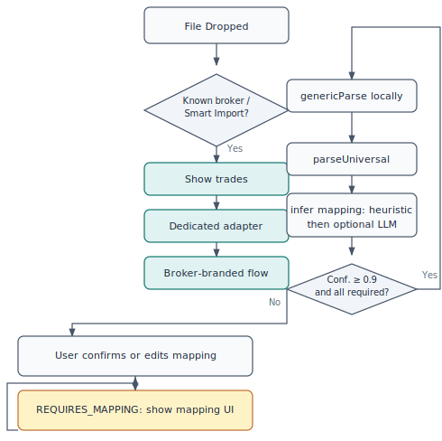
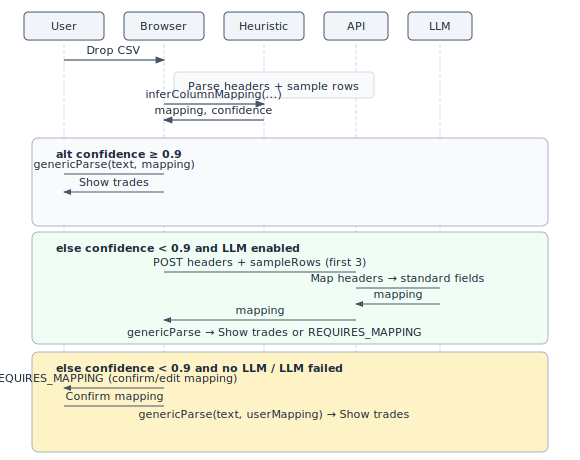

# Universal LLM Import: Building Local-First, Sovereign CSV Ingestion

**The definitive technical guide to schema inference, confidence thresholds, and sovereign data in financial CSV import**

---

## Table of Contents

1. [Introduction](#introduction)
2. [Part I: The Case for Universal Import](#part-i-the-case-for-universal-import)
   - [Chapter 1 — What Is Universal LLM Import (CSV)?](#chapter-1--what-is-universal-llm-import-csv)
   - [Chapter 2 — Why CSV Over APIs: The Strategic Bet](#chapter-2--why-csv-over-apis-the-strategic-bet)
3. [Part II: Architecture & Pipeline](#part-ii-architecture--pipeline)
   - [Chapter 3 — Local-First Architecture & System Design](#chapter-3--local-first-architecture--system-design)
   - [Chapter 4 — Universal LLM Import Pipeline (Deep Dive)](#chapter-4--universal-llm-import-pipeline-deep-dive)
   - [Chapter 5 — Tech Stack & Model Choices](#chapter-5--tech-stack--model-choices)
4. [Part III: Sovereign Data & Benefits](#part-iii-sovereign-data--benefits)
   - [Chapter 6 — Sovereign Data & Google Drive Sync](#chapter-6--sovereign-data--google-drive-sync)
   - [Chapter 7 — Benefits of Universal LLM Import (CSV)](#chapter-7--benefits-of-universal-llm-import-csv)
5. [Part IV: Comparison, Security & Extensions](#part-iv-comparison-security--extensions)
   - [Chapter 8 — Universal LLM Import (CSV) vs API Integrations](#chapter-8--universal-llm-import-csv-vs-api-integrations)
   - [Chapter 9 — Security, Privacy & Threat Modeling](#chapter-9--security-privacy--threat-modeling)
   - [Chapter 10 — Use Cases & Extension Paths](#chapter-10--use-cases--extension-paths)
6. [Part V: Vision](#part-v-vision)
   - [Chapter 11 — Why This Matters for the Future of Finance](#chapter-11--why-this-matters-for-the-future-of-finance)
7. [Conclusion](#conclusion)
8. [Appendices](#appendices)
   - [Appendix A: Standard field reference](#appendix-a-standard-field-reference)
   - [Appendix B: Glossary](#appendix-b-glossary)
   - [Appendix C: Further reading and running locally](#appendix-c-further-reading-and-running-locally)
   - [Appendix D: Extended examples and case studies](#appendix-d-extended-examples-and-case-studies)
   - [Appendix E: References and related reading](#appendix-e-references-and-related-reading)
   - [Appendix F: Design alternatives considered](#appendix-f-design-alternatives-considered)

---

# Introduction

This book is the canonical technical reference for **Universal LLM Import (CSV)**—a design and implementation approach that treats CSV as sovereign, user-owned data and uses schema inference (heuristics plus optional LLM) to map any trade-like CSV into a normalized pipeline without a dedicated parser per broker.

**Who this book is for.** Senior engineers, tech leads, indie hackers, and fintech builders who care about data ownership, local-first design, and maintainable integration strategies. Product and compliance readers interested in “why CSV over APIs” and GDPR-friendly architecture will also find it useful.

**What you will get.** A single place to understand: why CSV is the bet; how local-first architecture keeps the full file and parse in the browser; how column mapping (heuristic and LLM) works; why the confidence threshold is 0.9; what REQUIRES_MAPPING is and when it appears; how Sovereign Sync (Google Drive as dumb storage) fits the trust model; and how to reason about security, extensions, and the long-term vision. The narrative is grounded in a real system: Pocket Portfolio’s importer package, API route, and UI touchpoints. Every technical claim can be verified against the series and the codebase.

**How to read it.** The eleven chapters map 1:1 to the Universal LLM Import Technical Reference Series. Parts group them into: the case for universal import (Chapters 1–2); architecture and pipeline (Chapters 3–5); sovereign data and benefits (Chapters 6–7); comparison, security, and extensions (Chapters 8–10); and vision (Chapter 11). You can read sequentially for the full story, or jump to a chapter for a specific topic. Each chapter ends with a **Summary** (key takeaways plus optional ties to the rest of the book). Appendices provide a standard field reference, a glossary, and further reading with instructions for running the importer locally.

**How the book is structured.** Part I (Chapters 1–2) answers “what and why”: what Universal LLM Import is and why CSV over APIs. Part II (Chapters 3–5) is the “how”: local-first architecture, the pipeline deep dive, and tech stack. Part III (Chapters 6–7) covers sovereign data (Drive as dumb storage) and the benefits of the approach. Part IV (Chapters 8–10) compares CSV to API integrations, covers security and threat modeling, and outlines use cases and extension paths. Part V (Chapter 11) ties the design to a broader vision for user-owned finance. The Conclusion recaps the six design decisions and points to next steps. Appendices A–F are reference material: standard fields, glossary, running locally, case studies, references and FAQ, and design alternatives.

**Prerequisites.** The reader is assumed to have basic familiarity with web apps (browser, APIs, CSV), and with concepts such as OAuth, REST, and JSON. No prior experience with LLMs or schema inference is required; both are introduced in context. Implementers will benefit from access to the codebase or the technical series for line-level detail.

**Why this book exists.** Pocket Portfolio ships Universal LLM Import (CSV) as a production feature: users can drag and drop any broker CSV and either get auto-detection (for known brokers) or Smart Mapping (for unknown or custom formats). The design choices—local-first execution, confidence threshold 0.9, headers plus three sample rows for the LLM, REQUIRES_MAPPING for user confirmation—are intentional and documented in the codebase and in the technical series. This book turns that series and the implementation into a single, canonical reference so that engineers, architects, and product builders can understand not only what the system does but why it was built this way and how to extend or replicate it.

**Design decisions at a glance.** The following choices are explained in depth in the chapters but are worth stating up front. (1) **Mapping, not free-form parse:** The LLM only suggests which header maps to which standard field; all value parsing (dates, numbers, tickers) is done by deterministic, locale-aware code. That keeps the system auditable and avoids the model inventing values. (2) **Heuristic first, LLM optional:** The client always runs the synonym-based heuristic; the LLM is called only when confidence is below 0.9 and the feature is enabled. So the default path is zero network and zero cost. (3) **Headers plus three rows for the LLM:** The mapping task needs column names and a hint of value shapes; three sample rows are enough to disambiguate without exposing the user's full history. (4) **Confidence 0.9:** Only when all five required fields are mapped with high confidence does the pipeline auto-apply; otherwise the user sees the mapping UI and confirms or corrects. (5) **No fine-tuning:** The mapping task is narrow and in-distribution for a general model; structured output and a clear prompt are sufficient. (6) **Drive as dumb storage:** The sync file is a single JSON blob; Drive does not interpret it. The client owns all sync and conflict logic. These six decisions form the backbone of the architecture and are referenced throughout the book.

**Scope and limitations.** This book covers the Universal LLM Import (CSV) pipeline as implemented in Pocket Portfolio: schema inference (heuristic and optional LLM), confidence threshold, REQUIRES_MAPPING, deterministic parse, and Sovereign Sync (Drive as dumb storage). It does not cover the dedicated broker adapters in detail (they are mentioned only to contrast with the Universal path). It does not cover the full UI implementation (e.g. drag-and-drop, modal styling) except where relevant to the flow (e.g. when the UI calls parseUniversal and handles RequiresMappingResult). It does not prescribe a specific LLM provider or prompt template; the API contract (headers and sample rows in, mapping out) is stable, but the implementation of the mapping endpoint may vary. The book assumes the reader has access to the codebase or the technical series for full detail; it is a reference and a design document, not a line-by-line code walkthrough. Limitations of the current design include: very large files may require chunking or a row limit; the mapping UI is shown per file (no persisted mapping keyed by broker yet); and the LLM path requires a server-side endpoint (no in-browser LLM in the current design).

**Conventions.** We use the same terms as the series and codebase: Universal LLM Import (CSV), schema inference, column mapping, heuristic vs LLM, confidence threshold, REQUIRES_MAPPING, Smart Import, Sovereign Sync, dumb storage, evidence-first, local-first, data sovereignty. They are defined on first use and used consistently. Code and API names (e.g. `parseUniversal`, `inferMapping`, `genericParse`, `RequiresMappingResult`, `UniversalMapping`, `ENABLE_LLM_IMPORT`, `/api/ai/map-csv`) are real; snippets are short and illustrative.

---

# Part I: The Case for Universal Import

## Chapter 1 — What Is Universal LLM Import (CSV)?


### The problem

Traditional CSV import is **broker-specific**: each broker gets a dedicated parser. New brokers or format changes mean new code, regression risk, and a never-ending compatibility list. Users with exports from “unsupported” brokers hit a wall. The product is stuck between “we support broker X” and “we don’t support broker Y,” with no principled way to handle the long tail.

**Universal LLM Import (CSV)** inverts this. Instead of “we support broker X,” the system supports **any** CSV that carries the semantic content of trades: date, ticker, action, quantity, price. Recognition is **schema inference**—figuring out which column means what—not a fixed list of formats. The pipeline is one: infer a mapping from the user’s headers to a normalized schema, then parse deterministically. No new parser per broker.

### Why CSV is still the lingua franca

- **Every broker and bank can export CSV.** No API, no partnership, no approval. The user exports a file and brings it to the app.
- **CSV is human-readable and tool-friendly.** Excel, scripts, archives, and regulators all understand it. It’s the common denominator for financial data export.
- **Users already have these files.** The product doesn’t need to “pull” data; it only needs to interpret what the user provides.

So the bet is: **CSV is the sovereign format.** The hard part is interpreting messy, inconsistent headers and locales. That’s where structure (heuristics) and semantics (LLM) come in.

### How “LLMs interpret” messy data

The system does **column mapping**, not free-form parsing. Given headers and a few sample rows, it answers: *which column is date? ticker? buy/sell? quantity? price?* LLMs help when headers are non-standard—“Deal Date,” “Epic,” “No. of shares,” “Open Rate”—or when multiple columns could match. They map **user vocabulary** to a fixed **normalized schema** (e.g. `date`, `ticker`, `action`, `quantity`, `price`). Parsing itself stays deterministic: numbers, dates, tickers are handled by rule-based, locale-aware functions (`toISO`, `toNumber`, `toTicker`). Only the mapping step can be probabilistic; the user can confirm or correct it before the final parse.

**Example: before and after mapping.** A broker might export:

```text
Deal Date,Epic,Buy/Sell,No. of shares,Deal Price
15/01/2024,AAPL,Buy,10,185.50
16/01/2024,MSFT,Sell,5,398.20
```

Schema inference (heuristic or LLM) produces a mapping such as: `date → "Deal Date"`, `ticker → "Epic"`, `action → "Buy/Sell"`, `quantity → "No. of shares"`, `price → "Deal Price"`. The deterministic parser then reads each row using that mapping: `toISO("15/01/2024", "en-GB")`, `toTicker("AAPL")`, `toNumber("10", locale)`, and so on. The output is a list of `NormalizedTrade` objects; the mapping is the only bridge between the user’s vocabulary and the internal schema. Rows that are not trades (e.g. "DIVIDEND" in the action column) are skipped by `genericRowToTrade` and reported as warnings.

**Figure 1 — CSV → inference → normalized schema.** The three-layer flow from the user’s CSV (messy headers) through schema inference to deterministic parse. Keep this diagram in monospace for print; it is the canonical ASCII figure for the pipeline.

<div class="figure-hero ascii-pipeline" aria-label="Figure 1: CSV to inference to normalized schema pipeline">

```
┌─────────────────────────────────────────────────────────────────┐
│  User's CSV (messy headers)                                      │
│  "Deal Date", "Epic", "Buy/Sell", "No. of shares", "Deal Price"  │
└──────────────────────────────┬──────────────────────────────────┘
                               │
                               ▼
┌─────────────────────────────────────────────────────────────────┐
│  Schema inference (heuristics + optional LLM)                    │
│  → date, ticker, action, quantity, price                         │
└──────────────────────────────┬──────────────────────────────────┘
                               │
                               ▼
┌─────────────────────────────────────────────────────────────────┐
│  Deterministic parse: toISO(), toNumber(), toTicker()            │
│  → NormalizedTrade[]                                             │
└─────────────────────────────────────────────────────────────────┘
```

</div>

<div class="callout callout-rationale">**Design rationale: why mapping, not free-form parsing?** Mapping keeps the LLM’s role narrow and auditable. The model only suggests which header corresponds to which standard field; it does not invent values or interpret cell contents. All interpretation of values (dates, numbers, tickers) is done by the same code path regardless of whether the mapping came from heuristics or the LLM. That keeps the system predictable and debuggable.</div>

### Summary

- **Universal Import** means “any CSV with trade-like columns,” not “we support broker X.”
- CSV remains the universal export; the innovation is robust **schema inference** plus deterministic normalization.
- LLMs are used as **interpreters** of column meaning; actual parsing is rule-based and locale-aware.
- The pipeline is: headers + sample rows → mapping → deterministic parse → `NormalizedTrade[]`. This structure is reused throughout the book.

### Concrete example: real header sets

**Broker A (UK):** Headers might be `Deal Date`, `Epic`, `Buy/Sell`, `No. of shares`, `Deal Price`. The synonym list already includes "Deal Date," "Epic," "Buy/Sell," "No. of shares," and "Deal Price" (or close variants), so the heuristic maps them to `date`, `ticker`, `action`, `quantity`, `price` with high confidence. A full sample might look like:

```text
Deal Date,Epic,Buy/Sell,No. of shares,Deal Price,Currency
15/01/2024,AAPL,Buy,10,185.50,GBP
16/01/2024,MSFT,Sell,5,398.20,GBP
```

The heuristic matches each header to a standard field; `toISO("15/01/2024", "en-GB")` yields an ISO date; `toNumber("10", "en-GB")` and `toNumber("185.50", "en-GB")` yield numeric quantity and price. The result is two `NormalizedTrade` objects (BUY AAPL, SELL MSFT) with no user intervention.

**Broker B (crypto):** Headers might be `Koinly Date`, `Details`, `Transaction Kind`, `Quantity Transacted`, `Spot Price at Transaction`. Again, synonyms cover these; the heuristic or LLM produces a valid mapping. The same deterministic parse applies: dates and numbers are normalized by locale; "Transaction Kind" values like "Buy" or "Sell" are classified by the parser into BUY/SELL.

**Broker C (US, different locale):** Headers might be `Trade Date`, `Symbol`, `Type`, `Quantity`, `Price`. With US locale, a date like `01/15/2024` is interpreted as month/day/year; the synonym list matches "Trade Date," "Symbol," "Type," "Quantity," "Price" to the five required fields. So the same pipeline handles both UK (day-first) and US (month-first) exports; only the `locale` argument to `genericParse` changes.

**Edge case:** Truly novel headers (e.g. "Txn Dt," "Sym," "Side," "Qty," "Px") can be mapped by the LLM when enabled (the model infers that "Txn Dt" is date, "Sym" is ticker, etc.), or the user sees REQUIRES_MAPPING and assigns columns manually. The pipeline does not fail; it degrades gracefully to the mapping UI.

### Locale edge cases: dd/mm vs mm/dd

Financial CSVs from different regions use different date and number formats. UK and EU brokers often use day/month/year (e.g. `15/01/2024`); US brokers often use month/day/year (e.g. `01/15/2024`). The importer’s `toISO` function is locale-aware: for locales such as `en-GB`, `de-DE`, `fr-FR`, `es-ES` it treats the first number in a dd/mm/yyyy pattern as the day; for `en-US` it treats it as the month. That avoids mis-parsing: `03/04/2024` in en-GB is 4 March 2024; in en-US it is 3 April 2024. Numbers are similarly locale-aware: `toNumber` handles decimal comma vs point (e.g. `1 234,56` vs `1,234.56`) and thousands separators. So the same CSV file can be parsed correctly for different locales; the mapping step is independent of locale, but the parse step takes a `locale` argument (default `'en-US'`). This is critical for international brokers and tax exports (e.g. Koinly, EU brokers) where date and number formats vary by region.

### Universal vs dedicated adapter

Known brokers keep **dedicated adapters** (detect by filename or content sample, then broker-specific parser). **Universal Import** is the fallback: when no adapter matches or the user explicitly chooses "Smart Import," the pipeline uses `parseUniversal` → inference → `genericParse`. So there are two paths: **dedicated** (N adapters, one per known broker) and **universal** (one pipeline for any trade-like CSV). The dedicated path offers speed and broker-branded UX (e.g. "Trading212 detected"); the universal path offers coverage without new code. In the codebase, the registry of adapters is tried first (e.g. `detectBroker(sampleCsvHead)`); if the result is `'unknown'` or the user clicks "Smart Import," the app calls `parseUniversal(file, locale)`. No merging or dropping of the universal path is required when adding a new adapter; the universal path scales to "any" CSV.

### CSV vs traditional parser (comparison)

Traditional CSV import is **format-specific**: the parser expects fixed column names and order (e.g. "Date" in column 1, "Symbol" in column 2). If the broker renames "Date" to "Trade Date" or reorders columns, the parser breaks. Universal Import is **schema-based**: the system infers which column *means* date, which means ticker, and so on. So "Trade Date," "Deal Date," "Execution Date" all map to the same standard field `date`; the parser does not depend on exact header strings. That is why heuristics (synonym table) plus optional LLM work: they translate user vocabulary into a fixed schema, and the rest is deterministic.

### Forward-looking

- Community-contributed synonyms for new brokers can extend heuristic coverage without code changes; the synonym list is data.
- The same "headers + sample → mapping → parse" pattern could be applied to non-trade CSV (e.g. dividends, corporate actions) with an extended schema and optional user confirmation.

**The long tail and the zero-code ideal.** In the ideal case, a user exports a CSV from a broker the product has never seen. The headers might be in a foreign language or use abbreviations. With Universal Import, the heuristic may match known synonyms (e.g. "Date" in many languages or "Qty" for quantity). If not, and if the LLM is enabled, the model infers the mapping from the header names and the first few rows. If neither heuristic nor LLM is confident, the user sees the mapping UI and assigns columns once. The next time they import from the same broker, the format is usually unchanged, so the same mapping could be reused (a possible future enhancement). The point is that the pipeline never says "we don't support this broker"; it says "we need to map your columns" and then proceeds. That is the zero-code ideal: no new parser, no release, no regression risk for the long tail.

---

## Chapter 2 — Why CSV Over APIs: The Strategic Bet


### Fragility of financial APIs

Broker and bank APIs are **permissioned, versioned, and revocable.** They break for many reasons: OAuth changes, rate limits, schema updates, deprecations, or the provider shutting the integration down. Every integration is a long-term liability. A small team cannot realistically maintain dozens of broker APIs and stay ahead of changes. In practice, API integrations fail in predictable ways: OAuth tokens expire and require re-auth flows; rate limits kick in during peak usage; providers deprecate API versions and give limited migration windows; and sometimes the provider simply discontinues the integration. Each of these events requires engineering time, user communication, and often a fallback (e.g. "please export CSV instead"). With CSV, the only dependency is that the user can export a file from their broker; the product does not depend on any third-party API being up or compliant.

### Vendor lock-in and permissioned data

With Plaid-style or broker APIs, **you don’t own the pipe.** The provider holds the data graph; export is at their discretion. They can restrict use, change pricing, or require compliance that small products can’t meet. The user’s data is only as portable as the vendor allows—the opposite of sovereign.

### CSV as sovereign, user-owned format

CSV is **user-owned.** The user exports from their broker or bank and holds the file. No ongoing API key, no re-auth, no vendor in the loop. The product only needs to **interpret** the file. That aligns with local-first and data sovereignty: the canonical copy is the user’s file; the app assists locally. Universal Import makes CSV a first-class path instead of a fallback.

**Trade-off.** We give up live sync and automatic refresh. In return we get ownership, longevity, and no dependency on a third party keeping an API alive. For evidence-first investing and long-lived portfolios, that trade-off is intentional.

### Why “sovereign” matters for compliance and trust

When the user holds the file, data minimization is straightforward: the app never receives the full history unless the user explicitly uploads it (and in our design, even then the full CSV stays in the browser). There is no ongoing data pipeline from a third party; no need to document “we pull from broker X every day.” Regulators and privacy-conscious users can see a clear boundary: the user’s device and their chosen storage (e.g. Drive), not the vendor’s servers holding a copy of their trades. That simplifies GDPR-style “purpose limitation” and “data minimization” narratives. APIs also fail in predictable ways (auth expiry, rate limits, schema changes, deprecations, shutdown); with CSV, the only dependency is that the user can export a file. As long as brokers offer CSV/Excel export, the Universal pipeline stays useful with minimal maintenance.

### CSV vs API: a quick comparison

APIs give real-time data and automatic sync but at the cost of fragility (OAuth, rate limits, deprecations) and vendor control. CSV gives user-owned, portable data and a stable integration surface (the file format) but requires the user to export and upload. Universal Import optimizes for the CSV side: we make CSV ingestion so robust (schema inference, mapping UI, locale-aware parse) that the lack of live sync is an acceptable trade for sovereignty and maintainability. Chapter 8 goes deeper with a full comparison table.

### Why CSV is resurging

For years, fintech leaned on APIs and aggregators (e.g. Plaid, broker APIs) for “seamless” connectivity. As those integrations proved brittle—OAuth changes, rate limits, deprecations, and vendor lock-in—teams and users began to revalue the humble CSV. Regulators and privacy-conscious users started asking who holds the data and for how long; “export your data” became a compliance and trust requirement. CSV is the format every broker and bank can produce without a partnership. Universal Import does not replace APIs everywhere; it makes CSV a first-class, robust path so that products can support “any broker” without maintaining N API integrations. The bet is that CSV will remain the universal export format for the long tail, and that interpretability (schema inference, mapping UI) is the right layer to invest in.

### Forward-looking

- As more brokers offer "export to CSV" as the primary export option, the Universal path becomes more valuable without any change to the pipeline.
- Optional future: allow users to store preferred mappings per "broker name" or file pattern so that repeat imports from the same source skip the mapping UI.

### Summary

- APIs are powerful but fragile and permissioned; CSV is fragile in format but sovereign in ownership.
- The strategic bet: optimize for **ownership and longevity** over convenience of live sync.
- Universal Import makes CSV a first-class path and keeps the product useful as long as brokers export CSV.

**Part I summary.** Chapters 1 and 2 establish the problem (broker-specific parsers do not scale) and the bet (CSV as sovereign format). Universal Import inverts the model: any trade-like CSV is supported via schema inference and deterministic parse. CSV is user-owned, portable, and long-lived; APIs are powerful but fragile and permissioned. The trade-off is intentional: we give up live sync for ownership and maintainability.

---

# Part II: Architecture & Pipeline

## Chapter 3 — Local-First Architecture & System Design


### End-to-end local execution model

Import is designed so that **heavy work runs in the client.** File reading, CSV parsing, heuristic mapping, and (when used) the decision to call an LLM are all in the browser. Only when LLM is enabled and heuristics are low-confidence does the app send **headers and a small number of sample rows** (e.g. first 3 rows) to an API that returns a suggested mapping. The full CSV content is not sent; parsing of the full file stays local.

**Why “headers + 3 rows”?** The mapping task only needs to know column names and a hint of value shapes (e.g. that the quantity column looks numeric). Three rows are enough for the LLM to disambiguate columns without exposing the user’s full history. The codebase sends `sampleRows.slice(0, 3)` in the request to `/api/ai/map-csv`; the client keeps the full file and runs `genericParse(rawCsvText, mapping, locale)` locally.

### Browser as compute boundary

The browser holds the file, runs the importer package (`@pocket-portfolio/importer`), and maintains portfolio state (e.g. IndexedDB or local state). The server is optional (LLM mapping endpoint) and stateless. No CSV is stored server-side; no broker credentials; no persistent server copy of trades. The mapping API receives a single request and returns a mapping object; it does not log or persist the payload by design.

**Why the browser as compute boundary.** Choosing the browser (rather than a server-side import service) has several consequences. First, the full CSV never needs to be uploaded to the server; only metadata (headers and a few rows) may be sent when the LLM path is used. Second, the user's data stays on the user's device until they explicitly choose to sync it (e.g. to Drive). Third, the product can work offline for the core import flow: if the user has already obtained a mapping (from a previous run or from the heuristic), they can parse new files without network. Fourth, there is no server-side storage or retention of trade data for import, which simplifies compliance and privacy narratives. The downside is that very large files (e.g. hundreds of thousands of rows) are limited by browser memory and main-thread responsiveness; future work could move parsing to a Web Worker or chunk the file. For typical broker exports (hundreds to low thousands of rows), the browser is sufficient.

### Data never leaving the client (by default)

- **Default path:** Heuristic mapping only. Headers and sample rows stay in the client; no network call for mapping.
- **Optional LLM path:** Only headers and a few sample rows (e.g. first 3) are sent to `/api/ai/map-csv`; the response is a mapping object. The full CSV never leaves the client.
- **Parsing:** Always local. `genericParse(rawCsvText, mapping, locale)` runs in the client.

So “data never leaving the client” holds for the full CSV; the only exception is minimal, user-configurable LLM input when that feature is on. For maximum privacy, the LLM path can be disabled and only heuristics plus user-confirmed mapping used.

### Flow: CSV → inference → normalized schema

The following diagram matches the implemented flow: heuristic confidence threshold 0.9, optional LLM when enabled and confidence below threshold, then apply mapping and parse locally.

**Figure 2 — Local-first flow (Mermaid).** From CSV file to NormalizedTrade[]; all heavy work in the browser; only mapping may touch the network when LLM is enabled and confidence &lt; 0.9. Render this Mermaid block to a flowchart image for print/PDF.

![Figure 2 — Local-first flow. CSV file to NormalizedTrade[]; browser does the work; only mapping may touch the network when LLM is enabled and confidence &lt; 0.9.](figures/figure-02-local-first-flow.svg)

**Figure 5 — Known vs unknown broker decision tree.** The product first tries to detect a known broker; if that fails or the user chooses Smart Import, the Universal path runs. Render the Mermaid below as a flowchart for print.



So: two paths—dedicated (N adapters) and universal (one pipeline). Known brokers get speed and branding; unknown or chosen Smart Import uses `parseUniversal` and may show the mapping UI when confidence is below the threshold.

**Decision tree: known vs unknown broker (narrative).** File dropped → try known broker detection (e.g. by filename or content) → match? → use dedicated adapter and show broker-branded flow; no match or user chooses Smart Import → `parseUniversal` → infer mapping (heuristic, then optional LLM if confidence &lt; 0.9) → confidence ≥ 0.9 and all required mapped? → `genericParse` and show trades; else → REQUIRES_MAPPING (mapping UI) → user confirms → `genericParse` and show trades.

**Figure 6 — Data boundaries (what lives where).** Client holds the file and runs the full parse; server is optional and stateless; Drive is dumb storage only.

| Boundary | Contents |
| --- | --- |
| **Client** | File, full CSV text, headers + sample rows, heuristic inference, full parse (`genericParse`), portfolio state (IndexedDB/local), optional Drive token |
| **Server** | Optional: receives headers + first 3 rows, returns mapping; no storage of CSV or trades |
| **Drive** | Optional: single file `pocket_portfolio_db.json` (export format); no schema logic |

So the full CSV and all parsing stay in the client; the server is stateless and minimal; Drive is dumb storage.

**Known vs unknown broker.** In the full product, a file is first tested against known broker adapters (e.g. by filename or content). If no adapter matches or the user chooses “Smart Import,” the Universal path is used: `parseUniversal(file, locale)`. So the “CSV → inference → parse” flow is the Universal path; known brokers can still use dedicated adapters for speed and branding.

### Implementation notes: where things run

- **File read:** `csvFrom(file)` in the importer package reads the file in the browser (or Node in tests) and returns raw text. No server involved.
- **Parse to rows:** `csvParse(text)` produces an array of row objects keyed by header; this runs in the client. Headers and `rows.slice(0, 10)` are passed to `inferMapping`.
- **Inference:** `inferMapping({ headers, sampleRows })` runs in the client. It calls `inferColumnMapping` (heuristic) first; if confidence &lt; 0.9 and `ENABLE_LLM_IMPORT` (or `NEXT_PUBLIC_ENABLE_LLM_IMPORT`) is true, it calls `fetchLLMMapping(headers, sampleRows.slice(0, 3))`, which POSTs to `/api/ai/map-csv`. The API returns `{ mapping }`; the client never sends the full CSV.
- **Final parse:** `genericParse(rawCsvText, mapping, locale)` runs entirely in the client. It uses `csvParse`, then for each row `genericRowToTrade(row, mapping, locale)`, which uses `toISO`, `toNumber`, `toTicker` from `normalize.ts`. So the heavy lifting—reading the file, parsing every row, normalizing dates and numbers—is local.

**Where the code lives (file-level).** The universal pipeline lives under `packages/importer/src/universal/`: `inference.ts` (orchestrates heuristic vs LLM, threshold check, `fetchLLMMapping`), `inferColumnMapping.ts` (synonym-based heuristic, confidence = requiredMapped/5), `genericAdapter.ts` (`genericRowToTrade`, `genericParse`), `types.ts` (`UniversalMapping`, `RequiresMappingResult`, `REQUIRED_FIELDS`), `synonyms.ts` (header synonyms per standard field). The main entry `index.ts` exports `parseUniversal`, which calls `inferMapping` and then either `genericParse` or returns a `RequiresMappingResult`. The API route is `app/api/ai/map-csv/route.ts`; it checks `ENABLE_LLM_IMPORT` and validates the request body. The UI component `CSVImporter` uses `parseUniversal` in the Smart Import path and shows the column mapping modal when the result has `type: 'REQUIRES_MAPPING'`; on confirm it calls `genericParse(rawCsvText, userMapping, locale)`.

### Forward-looking

- A future build could run the heuristic (and optionally a local/small model) in a Web Worker so that the main thread stays responsive for very large files.
- The data-boundaries table (Figure 6) could be extended to include "optional local encryption" if client-side encryption before Drive upload is added.

### Summary

- Local-first: file and full parse stay in the browser; server is optional and minimal.
- Only mapping can touch the network, and only when LLM is enabled and heuristics fail (confidence &lt; 0.9).
- The pipeline is: **CSV → infer mapping (heuristic ± LLM) → deterministic parse → normalized trades.** This is the spine of the next chapter.

---

## Chapter 4 — Universal LLM Import Pipeline (Deep Dive)


### Prompt design for schema inference

The goal of the mapping step is to return a **key-value map** from standard field names to the CSV column names (headers). Standard fields are fixed: `date`, `ticker`, `action`, `quantity`, `price`, and optionally `currency`, `fees`. The prompt (or heuristic) must map from the user’s headers to these. In the codebase, the API receives `headers` and `sampleRows` (e.g. first 3 rows); the response is `{ mapping: UniversalMapping }`.

**Prompt design principles.** Prompts should: list the exact standard field names and allow only those keys in the output; request JSON only (no prose); optionally include two or three example header sets and their expected mapping; state that each standard field must map to exactly one header name from the input list. One-shot, structured output keeps the response parseable and stable. The current route (`/api/ai/map-csv`) can call an LLM when `ENABLE_LLM_IMPORT` is true; when disabled or when the call is omitted, it falls back to the same heuristic mapping used in the client, so the API remains usable for testing without an LLM. A typical prompt would state the task (map headers to date, ticker, action, quantity, price; optionally currency, fees), list the headers and optional sample rows, require JSON-only output, and constrain each standard field to at most one header from the input.

### Heuristic vs LLM: when each runs

**Heuristic** runs first, in the client. It uses a synonym dictionary (`SYNONYMS` in `synonyms.ts`): for each standard field, it looks for a header that matches one of the synonyms (case-normalized, with optional substring matching via `headerMatchesSynonym`). When sample rows are present, it can validate that quantity and price columns have numeric-looking values (using `toNumber` with a fixed locale for validation); if the mapped column has non-numeric samples, it may try another synonym for that field. Confidence is (number of required fields mapped) / 5. No network call. The same header is never mapped to two different standard fields (first match wins; already-used headers are skipped).

**LLM** runs only when confidence &lt; 0.9 and `ENABLE_LLM_IMPORT` (or `NEXT_PUBLIC_ENABLE_LLM_IMPORT`) is true. The client sends `headers` and `sampleRows.slice(0, 3)` to `/api/ai/map-csv`; the API returns `{ mapping }`. If the LLM call fails or returns empty, the pipeline falls back to the heuristic mapping (possibly low confidence), and the user may see REQUIRES_MAPPING. So: heuristic is always used as the first attempt and as fallback; LLM is an optional boost for the long tail of header names.

### Deterministic vs probabilistic parsing

- **Probabilistic:** Mapping inference. Heuristics (synonym tables, optional numeric validation) and/or LLM produce a proposed mapping. Confidence is computed as (number of required fields mapped) / (total required fields)—so 5/5 = 1.0, 4/5 = 0.8. Required fields are `date`, `ticker`, `action`, `quantity`, `price` (see `REQUIRED_FIELDS` in the importer types).
- **Deterministic:** Once a mapping is chosen (by high confidence or user confirmation), `genericRowToTrade` and `genericParse` are pure functions: same CSV + same mapping + locale ⇒ same `NormalizedTrade[]`. Dates via `toISO()`, numbers via `toNumber()` (locale-aware), tickers via `toTicker()`. No randomness.

So: **inference is probabilistic; application of the mapping is deterministic.**

### Confidence threshold and REQUIRES_MAPPING

**Why 0.9?** The heuristic confidence threshold (e.g. `UNIVERSAL_CONFIDENCE_THRESHOLD = 0.9` in the universal index) gates “auto-apply” vs “show mapping UI.” If confidence ≥ 0.9 and all required fields are mapped, the pipeline runs `genericParse` immediately and returns a `ParseResult`. Otherwise it returns a `RequiresMappingResult`: headers, sample rows, proposed mapping, confidence, and raw CSV text. The UI (e.g. `ColumnMappingModal`) shows the mapping editor; the user confirms or corrects; then `genericParse(rawCsvText, userMapping, locale)` runs locally. The threshold 0.9 means “only auto-apply when we’re very sure”; one missing or ambiguous required field (e.g. 4/5) keeps the user in the loop. That avoids silent mis-mapping while still allowing zero-click import when the heuristic or LLM is confident.

**RequiresMappingResult** is the type that carries the “please confirm or edit mapping” state. It includes `type: 'REQUIRES_MAPPING'`, `headers`, `sampleRows`, `proposedMapping`, `confidence`, and `rawCsvText`. The UI uses it to render the column mapper and, on confirm, to call `genericParse` with the user’s mapping.

### Validation and sanitization

Before mapping and parsing, the pipeline relies on a few invariants. **Headers** must be non-empty strings after trim; duplicate header names in the same CSV can cause ambiguity (the parser typically uses the last occurrence or first, depending on implementation—check the csvParse contract). **Sample rows** sent to the LLM should be sanitized: no raw PII beyond what’s necessary (e.g. strip account IDs if they appear as a column). **Mapping output** from the API should be validated: keys must be in the allowed set of standard fields, values must be exact header strings from the request. Invalid or unknown keys are dropped so the client always receives a valid `UniversalMapping` (possibly partial). The deterministic parser then only reads columns that are present in the mapping; extra columns in the CSV are ignored. This keeps the attack surface small and avoids the parser interpreting unmapped columns as data.

### Error handling, confidence scoring, retries

- **Low confidence:** Pipeline returns `RequiresMappingResult`; user confirms or corrects; then parse runs locally.
- **Row-level parse failures:** Bad date, non-numeric quantity, or skip conditions (e.g. dividend/transfer rows) produce warnings and skip that row; they don’t crash the run. `genericParse` aggregates warnings and returns them in the result.
- **LLM endpoint failures:** The inference layer catches errors and falls back to heuristic mapping, so the flow can continue without the LLM. The user may still get a low-confidence result and the mapping UI.

### LLM-assisted ingestion lifecycle

The sequence diagram below captures the full lifecycle: user drops CSV, browser parses headers and sample rows, runs `inferColumnMapping` (heuristic); if confidence ≥ 0.9, parse locally and show trades; else if LLM enabled, POST to `/api/ai/map-csv`, get mapping, then parse and show trades or REQUIRES_MAPPING; else show REQUIRES_MAPPING and let the user confirm before parsing.

**Figure 3 — LLM-assisted ingestion lifecycle (Mermaid sequence).** Render this Mermaid block to a sequence diagram for print/PDF.



### Locale edge cases

Deterministic parsing is locale-aware. For example, `toISO` uses locale to decide day-first vs month-first (e.g. `en-GB` vs `en-US`) for formats like `15/01/2024`. In the codebase, `ddmmyyLocales` includes `en-GB`, `de-DE`, `fr-FR`, `es-ES`; for these, the first number in a dd/mm/yyyy pattern is treated as day. `toNumber` handles decimal comma vs point and thousands separators (e.g. "1 234,56" vs "1,234.56"). So the same CSV can be parsed correctly for different locales; the mapping is independent of locale, but the parse step takes a `locale` argument (default `'en-US'`). This is important for international brokers and tax exports (e.g. Koinly, EU brokers) where date and number formats vary.

**Concrete locale example: dd/mm vs mm/dd.** Suppose a CSV has a date column with values `03/04/2024`, `15/06/2024`. With locale `en-GB`, the first is 3 April 2024 and the second is 15 June 2024 (day/month/year). With locale `en-US`, the first is 4 March 2024 and the second is 15 June 2024 (month/day/year). The parser does not guess; it uses the locale parameter. So the UI or the importer caller must pass the correct locale (e.g. from user settings or broker region). Mis-specifying locale can swap day and month and produce incorrect trade dates—hence the design choice to make locale explicit and to document it in the standard field reference (Appendix A).

**Concrete before/after mapping example.** Input CSV snippet (UK broker):

```text
Deal Date,Epic,Buy/Sell,No. of shares,Deal Price
15/01/2024,AAPL,Buy,10,185.50
16/01/2024,MSFT,Sell,5,398.20
```

Inferred mapping (heuristic or LLM): `{ date: "Deal Date", ticker: "Epic", action: "Buy/Sell", quantity: "No. of shares", price: "Deal Price" }`. After deterministic parse with locale `en-GB`, the first row becomes: `{ date: "2024-01-15T00:00:00.000Z", ticker: "AAPL", type: "BUY", qty: 10, price: 185.5, currency: "USD", fees: 0, source: "generic", rawHash: "…" }`. The second row becomes a SELL of MSFT. Rows that contain "DIVIDEND" or "TRANSFER" in the action column are skipped by `genericRowToTrade` and do not appear in the trades array; they are noted in warnings so the user knows they were omitted.

### Design rationale: why “headers + 3 rows” for the LLM

The mapping task only needs to know column names and a hint of value shapes. Sending the first three rows (after the header) gives the model enough context to disambiguate (e.g. which column is quantity vs price) without exposing the user’s full history. The code explicitly sends `sampleRows.slice(0, 3)` in the request body. More rows would increase privacy risk and token cost with little gain for mapping accuracy; fewer might make ambiguous cases harder. Three is a practical default.

### Design rationale: why REQUIRES_MAPPING exists

Without a “please confirm mapping” path, the system would either auto-apply low-confidence mappings (risk of wrong column assignment and wrong trades) or refuse to import (bad UX). REQUIRES_MAPPING gives a third option: show the proposed mapping and let the user confirm or correct before any parse. That keeps the user in control and avoids silent mis-mapping while still allowing the heuristic or LLM to propose a starting point. The UI stores the result in state (e.g. `pendingUniversal`) and opens `ColumnMappingModal`; on confirm, it calls `genericParse(rawCsvText, userMapping, locale)` with the (possibly edited) mapping.

### Common pitfalls and troubleshooting

- **Wrong date interpretation:** If trades show incorrect dates (e.g. day and month swapped), the locale passed to `genericParse` is likely wrong for the CSV. UK/EU exports often use day/month/year; US exports use month/day/year. Ensure the UI or caller passes the correct locale (e.g. from user settings or broker region).
- **Zero trades from a large file:** If the file has many rows but genericParse returns zero trades, check that the action column is not being interpreted as non-trade (e.g. every row contains "DIVIDEND" or "TRANSFER"). Also verify that quantity and price columns contain positive numbers; rows with zero or negative values are skipped. Inspect the warnings array in the parse result for per-row skip reasons.
- **Heuristic always wins:** If the LLM is enabled but the mapping never seems to come from the LLM, check that heuristic confidence is not already at or above 0.9. The LLM is only called when confidence is below the threshold. For headers that are already in the synonym list, the heuristic will map them and confidence will be high. To test the LLM path, use a CSV with novel header names that are not in the synonym table.
- **API returns 403:** The mapping API returns 403 when ENABLE_LLM_IMPORT is not set to 'true'. Ensure the environment variable is set in the environment that runs the Next.js server (or use NEXT_PUBLIC_* for client-visible feature flags).
- **Duplicate or missing columns in mapping:** The heuristic ensures each header maps to at most one standard field (first match wins). If the CSV has two columns that could match the same synonym (e.g. "Price" and "Unit Price"), only one will be used. The user can correct this in the mapping UI when REQUIRES_MAPPING is shown.
- **Empty or malformed sample rows:** If the first few rows are empty or contain only headers/footers, the LLM or heuristic may have little signal. The parser skips empty rows; if every data row is empty, the result will be zero trades. Ensure the CSV has at least one data row with non-empty values in the mapped columns. Some brokers put summary rows at the top; if detection fails, the user can trim the file or use the mapping UI to assign the correct columns.
- **Encoding and BOM:** CSVs exported from Excel or regional tools may use UTF-8 with BOM or other encodings (e.g. Windows-1252). The client’s file reader should normalize to UTF-8 so that header names and values are compared correctly. Mismatched encoding can cause the heuristic to fail to match headers (e.g. "Date" with a BOM prefix) or to misparse characters in ticker or action columns.

### Design rationale: why confidence 0.9 (recap)

The threshold 0.9 means "only auto-apply when we have mapped at least 4.5 of 5 required fields"—in practice, all five. So 4/5 (0.8) is below threshold and triggers REQUIRES_MAPPING. That avoids auto-applying when one critical field (e.g. date or quantity) is ambiguous or missing. A lower threshold (e.g. 0.6) would risk wrong column assignment (e.g. mapping "Fees" to quantity); a higher threshold (e.g. 1.0 only) would force the mapping UI even when the heuristic is confident. 0.9 is a conservative default that keeps the user in the loop when there is any real ambiguity.

### Forward-looking

- Confidence could be refined with per-field scores (e.g. "date 0.95, ticker 0.9, quantity 0.7") so the UI could highlight only the low-confidence mappings for user review.
- Optional: persist the user-confirmed mapping keyed by a hash of the header list so that the same file (or same broker format) re-imported later can skip the mapping step.

### Summary

- Mapping is the only probabilistic step; parsing is deterministic and locale-aware.
- Confidence threshold (0.9) gates auto-apply vs mapping UI; REQUIRES_MAPPING keeps the user in control.
- Failures (LLM or parse) degrade gracefully: fallback to heuristics and/or user-confirmed mapping.
- Row-level errors become warnings; the run continues and reports them.

---

## Chapter 5 — Tech Stack & Model Choices


### Frontend stack

- **Next.js** for the app; import UI lives in components such as `CSVImporter`.
- **@pocket-portfolio/importer** (and alias `universal-csv-importer`): exports `parseUniversal`, `inferMapping`, `genericParse`, `genericRowToTrade`, and types `UniversalMapping`, `RequiresMappingResult`, `StandardField`, `InferMappingInput`, `InferMappingOutput`. Runs in the browser (and in Node for tests).
- **CSV parsing:** Lightweight parser in `io/csvFrom`; no heavy server round-trip for the file.
- **State:** Portfolio/trades in client state and/or IndexedDB; Google Drive is optional sync storage (Sovereign Sync).

**Where things live.** The universal pipeline lives under `packages/importer/src/universal/`: `inference.ts` (heuristic vs LLM, threshold, `fetchLLMMapping`), `inferColumnMapping.ts` (synonym-based heuristic, confidence = requiredMapped/required), `genericAdapter.ts` (`genericRowToTrade`, `genericParse`), `types.ts` (UniversalMapping, RequiresMappingResult, REQUIRED_FIELDS), `synonyms.ts` (header synonyms per standard field). The API route is `app/api/ai/map-csv/route.ts`; it checks `ENABLE_LLM_IMPORT` and validates `headers` (and optional `sampleRows`). The UI uses `parseUniversal` in the Smart Import path and shows `ColumnMappingModal` when the result is `RequiresMappingResult`; confirmation calls `genericParse` with the user’s mapping.

### LLM selection criteria

For the mapping endpoint, criteria are:

- **Latency:** Single short request (headers + few rows); response should be fast so the UI doesn’t feel stuck.
- **Determinism:** Prefer low temperature and structured output (JSON mapping only) for reproducible behavior.
- **Cost:** One call per unknown-format file; cost per user is small.
- **Privacy:** Only headers and a few sample rows are sent; no account numbers or full history. A self-hosted or privacy-preserving model can be used if desired.

The current route is built to accept an optional OpenAI (or other) call; when `ENABLE_LLM_IMPORT` is false or the call is omitted, the route can still return heuristic mapping so the client flow is unchanged.

### Monitoring and observability for the mapping API

In production, the mapping endpoint should be monitored like any other API: latency, error rate, and (if applicable) LLM token usage. Because the payload is small (headers + three rows), request volume per user is low—one call per unknown-format file. Metrics to track include: number of requests per day, p50/p95 latency, 4xx/5xx rates, and fallback rate (when the API returns an error and the client falls back to heuristic). Do not log full request or response bodies; if you log at all, log only header names (or a hash) and perhaps response key count, with short retention. Alerts on sustained 5xx or latency spikes help catch provider or deployment issues. Rate limiting per user or per IP prevents abuse without affecting normal use.

### Alternative stacks and ports

The design is not tied to Next.js. The importer package runs in any browser or Node environment; the only server dependency is an HTTP endpoint that accepts `{ headers, sampleRows }` and returns `{ mapping }`. A React SPA, Vue app, or Electron desktop app can use the same client flow. The API can be implemented in Node, Python, Go, or any language that can call an LLM and return JSON. The contract is stable: same request/response shape, same confidence threshold and REQUIRES_MAPPING behavior on the client. Porting to another framework is mostly a matter of wiring the file drop to `parseUniversal` and the mapping modal to `genericParse` with the user’s mapping.

### Why no fine-tuning is required

The task is **narrow**: given a list of header strings (and optionally a few row samples), return a mapping to five standard fields. That’s in-distribution for a general model with a clear prompt. A synonym table already covers many brokers; the LLM handles the long tail of naming. Fine-tuning would add operational cost (dataset curation, training pipeline, versioning) for limited gain; good prompt design and structured output are enough. The output space is small and enumerable (each standard field maps to exactly one header from the input list), so the model does not need domain-specific training. If a new broker uses headers that neither synonyms nor the general model handle well, the fallback is always REQUIRES_MAPPING: the user assigns columns manually.

### One-shot reliable prompts

Prompts should: list the exact standard field names and allow only those keys in the output; request JSON only (no explanation); optionally include two or three example header sets and their expected mapping; state that each standard field must map to exactly one header name from the input list. That keeps the model on-task and the response parseable and stable.

**Example prompt (illustrative).** "You are a CSV column mapper. Given an array of CSV column headers and optionally a few sample rows, return a JSON object that maps each of the following standard fields to exactly one header from the input: date, ticker, action, quantity, price. Optional fields: currency, fees. Use only the exact header strings from the input. Output valid JSON only, no explanation. If a field cannot be determined, omit it. Headers: [list]. Sample rows (optional): [first 3 rows]." The API then parses the response and validates that keys are in the allowed set and values are in the headers list; invalid entries are dropped so the client always receives a valid `UniversalMapping` (possibly partial).

### Implementation notes: where each piece lives

- **Universal pipeline:** `packages/importer/src/universal/` — `index.ts` (parseUniversal), `inference.ts` (inferMapping, fetchLLMMapping), `inferColumnMapping.ts` (heuristic), `genericAdapter.ts` (genericParse, genericRowToTrade), `types.ts`, `synonyms.ts`.
- **Normalization:** `packages/importer/src/normalize.ts` — toISO, toNumber, toTicker, inferCurrency, hashRow; used by genericAdapter.
- **API route:** `app/api/ai/map-csv/route.ts` — POST handler, checks ENABLE_LLM_IMPORT, validates headers (and optional sampleRows), returns { mapping }. When LLM is disabled the route can still return heuristic mapping so the client flow is unchanged.
- **UI:** `app/components/CSVImporter.tsx` — Smart Import path calls parseUniversal; when result type is REQUIRES_MAPPING, shows column mapping modal; on confirm calls genericParse(rawCsvText, userMapping, locale).

### Forward-looking

- A self-hosted or local model (e.g. running in a worker or on a user-owned server) could satisfy teams that want zero data sent to a third-party LLM; the API contract (headers + sample rows in, mapping out) remains the same.
- Prompt templates could be versioned and A/B tested without changing the client or the parse logic.

### Summary

- Stack is Next.js + importer package in the browser; CSV and full parse stay client-side.
- LLM is optional and used only for mapping; choice of model can optimize for latency, cost, and privacy.
- No fine-tuning; reliability comes from scope (mapping only), structured output, and fallback to heuristics + user confirmation.

**Part II summary.** Chapters 3, 4, and 5 describe how the system works. The browser is the compute boundary; the full CSV and full parse stay local. Only mapping may touch the network (and only when LLM is enabled and confidence is below 0.9). The pipeline is: infer mapping (heuristic first, then optional LLM) then deterministic parse. Confidence threshold 0.9 and REQUIRES_MAPPING keep the user in control. The tech stack is Next.js plus the importer package; no fine-tuning is required for the LLM mapping task.

---

# Part III: Sovereign Data & Benefits

## Chapter 6 — Sovereign Data & Google Drive Sync


### Drive as “dumb storage,” not a backend

Google Drive is used as **file storage** for a single export file (`pocket_portfolio_db.json`). The app creates/updates that file and can read it back. Drive does **not** run business logic, validation, or schema; it doesn’t host the app. It’s “a folder in the cloud” for the user’s own data. In practice that means: no server-side interpretation of the file format, no sync logic running on Google’s side—only read/write of a blob the app defines. Real-world sync constraints (e.g. bidirectional sync, version detection, conflict handling) are handled in the client; see the Sovereign Sync implementation and CTO update docs for details. In practice, the client polls Drive metadata for version/revision changes and owns all sync and conflict semantics; Drive is just the persistence layer. The architectural point here is that Drive’s role is minimal and does not change the “sovereign data” model.

### User-owned files, user-owned schema

The file format is the same as the app’s export: trades plus metadata (version, lastUpdated, etc.). The user can copy the file, open it elsewhere, or move it. The schema is documented and owned by the product; the user owns the file and the data in it. Sync is **optional** and can be gated (e.g. Founder’s Club) without changing the local-first model. Premium gating is implemented in the app (e.g. `usePremiumTheme`, tier checks); free users see an upgrade path when attempting to connect Drive.

### Encryption boundaries and trust model

- **Today:** Data is stored in Drive as JSON; OAuth scope is minimal (`drive.file`: only app-created files). Tokens are client-managed.
- **Trust:** The client trusts the Drive API for persistence and availability; the app does not trust Drive with interpretation of the schema—that stays in the app. Future work may add client-side encryption before upload so that Drive sees ciphertext only (noted in Sovereign Sync docs as Phase 2).

### Diagram: Local Device ↔ Drive ↔ Restore

**Figure 4 — Local device ↔ Drive ↔ restore (Mermaid).** Client exports and uploads; Drive stores a single file; download and import back into the client. Render this Mermaid block to a flowchart for print/PDF.


### Implementation notes: Drive sync

The Drive integration lives in `app/lib/google-drive/driveService.ts` (create/read/update file, OAuth) and `app/hooks/useGoogleDrive.ts` (sync state, connect/disconnect, debounced upload, polling for remote changes). The synced file is always `pocket_portfolio_db.json` with the same structure as the app's export (trades array + metadata). The client owns conflict semantics (e.g. optimistic locking with revision IDs); Drive does not interpret the file. Premium gating (e.g. Founder's Club) is enforced in the UI so that free users see an upgrade path when attempting to connect.

**Sync semantics and conflict handling.** In the documented design, the client polls Drive for file metadata (e.g. modifiedTime or revision ID). If the remote file is newer than the local state, the client downloads the file and merges or replaces local data according to the app's conflict policy (e.g. "last write wins" or "prompt user"). When the user edits locally, changes are debounced and then uploaded to Drive. Optimistic locking (e.g. sending an If-Match header with the last known revision ID) prevents overwriting remote changes that happened since the last download. So Drive is still dumb storage: it does not run merge logic or conflict resolution; the client does. This keeps the trust model simple: the app owns the schema and the sync semantics; Drive is only a durable store for the JSON blob.

**Concrete conflict scenario.** Suppose the user has the app open on two devices (e.g. laptop and phone). On the laptop they import a new CSV and add 50 trades; on the phone they delete 10 old trades. Both devices have a copy of the sync file. If the laptop uploads first, the Drive file contains the new 50 trades. When the phone later tries to upload its version (with the 10 deletions but without the 50 new trades), the client should detect that the remote file has changed (e.g. via revision ID or modifiedTime). The app’s conflict policy then applies: for example, download the remote file, merge the phone’s deletions with the laptop’s new trades in memory (e.g. by merge key or timestamp), then upload the merged result with the new revision ID. All of this logic runs in the client; Drive only stores the final blob. Without optimistic locking (If-Match), the phone’s upload could overwrite the laptop’s changes and lose the 50 new trades. So conflict handling is critical even when Drive is “dumb.”

### Forward-looking

- Client-side encryption before upload (Phase 2 in Sovereign Sync docs) would ensure Drive sees only ciphertext; the app would decrypt after download. That would not change the "dumb storage" or "user-owned file" model.
- Optional Excel export (`pocket_view.xlsx`) for read-only viewing in Drive is documented as a future enhancement; it would still be generated and stored by the client, not by a server.

### Summary

- Drive is dumb storage for one JSON file; no backend logic in the cloud.
- User owns the file and the data; schema is defined by the app, not by Drive.
- Sync is optional; encryption can be added at the client→Drive boundary in future.

---

## Chapter 7 — Benefits of Universal LLM Import (CSV)


### Production touchpoints (how it shipped)

The Universal Import narrative is surfaced consistently across the product. On the **landing** page, the hero is "Evidence-First Investing. Universal Data." and the subhead emphasizes "any broker, bank, or spreadsheet." The **CSVImporter** drop zone shows "Drag & Drop any Broker CSV" and "Auto-detection for 20+ brokers. Smart Mapping for everything else." The same line appears on the **/import** page and in the **DataInputDeck** CSV card. When the format is **unknown**, the UnknownBrokerInterstitial tells the user: "We didn't recognize this specific format, but we can still import it. Use Smart Import to map your columns automatically." **Onboarding** describes the import step as "Universal Import" and "Drag & drop a CSV from any broker. Our engine will auto-detect the format or help you map it instantly." **Sponsor** tiers position "Universal Data Engine" and "Lifetime Sovereignty" for the Developer and Founder tiers. So the same story—any CSV, auto-detect or Smart Mapping—runs from first impression to upgrade path, without changing checkout or SEO broker-name copy.

### Technical

- **Robustness:** Heuristics + optional LLM + user confirmation handle many formats without a new parser per broker.
- **Adaptability:** New brokers or export changes often need no code change—synonyms or LLM cover new headers.
- **Offline tolerance:** Full parse is local; only the optional mapping step uses the network when LLM is on.
- **Single pipeline:** One code path (`parseUniversal` → `genericParse`) instead of N broker adapters for “unknown” sources.

### Philosophical

- **Data sovereignty:** User brings the file; the app doesn’t pull data from a third party on their behalf.
- **Local-first:** Default is local parse; server is an optional aid for mapping.
- **Interpretation over oracles:** LLM suggests “which column is what”; the user can override; the app doesn’t “decide” the user’s data.

### Financial

- **Cost:** No per-broker API fees; optional LLM cost is small (one request per file).
- **Zero API dependency:** No Plaid or broker API keys or compliance for import.
- **Longevity:** As long as brokers export CSV, the importer stays useful; no dependency on a vendor keeping an API alive.

### Metrics that matter

Product and engineering can measure the impact of Universal Import without touching the core pipeline. **Funnel:** How many users reach the import step, drop a file, and complete an import (trades visible)? **Path split:** What share of imports are resolved by dedicated adapter vs Universal path? Of the Universal path, what share auto-apply (confidence ≥ 0.9) vs REQUIRES_MAPPING? **LLM usage:** When the LLM is enabled, how often is it actually called (confidence &lt; 0.9) and what is the success rate (mapping accepted without user edit)? **Fallback:** How often do users correct the proposed mapping in the mapping UI, and which fields are corrected most? Those signals guide synonym additions and prompt tuning. They also justify investment in the Universal path (e.g. “40% of imports are from unknown brokers; Smart Import converts 80% without manual mapping”).

### Forward-looking

- As the product narrative ("Evidence-First Investing. Universal Data.") is reinforced across landing, import, onboarding, and sponsor, the benefits compound: users learn that "any broker" is supported and that their data stays in their hands, which supports both acquisition and retention.
- Future analytics could measure how often Smart Import and REQUIRES_MAPPING are used versus known-broker auto-detect, to tune synonyms and prompts without changing the core pipeline.

### Summary

- Benefits are technical (fewer parsers, offline-friendly), philosophical (sovereign, local-first), and financial (low cost, no API lock-in, long-lived).

**Part III summary.** Chapter 6 positions Google Drive as dumb storage: the app syncs a single JSON file; Drive does not run schema or business logic. Chapter 7 summarizes benefits: technical (single pipeline, offline-friendly), philosophical (sovereign, local-first), and financial (low cost, no API lock-in). The same narrative runs from landing to sponsor.

---

# Part IV: Comparison, Security & Extensions

## Chapter 8 — Universal LLM Import (CSV) vs API Integrations


### Comparison

| Dimension              | Universal LLM Import (CSV)     | Plaid / Broker APIs        |
|------------------------|--------------------------------|-----------------------------|
| Data ownership         | User holds CSV                 | Provider holds data graph   |
| Integration surface    | File upload + mapping          | OAuth, APIs, webhooks       |
| New “integration”      | Often zero code (heuristic/LLM)| New adapter + maintenance  |
| Offline                | Parse works offline            | Needs network               |
| Failure mode           | Bad mapping → user corrects    | API down → no data          |
| Maintenance            | Synonym/LLM updates            | API versions, deprecations  |
| Cost                   | Optional LLM per file          | Per-API or per-call fees    |
| Compliance             | No broker API ToS in the path  | Provider ToS, data use      |

### Failure modes

- **APIs:** Auth expiry, rate limits, schema changes, sunset. Mitigation is more integration code and monitoring.
- **CSV:** Wrong mapping, locale/format quirks. Mitigation is confidence threshold, mapping UI, and deterministic parse with warnings. No dependency on a third party being up.

### Long-term maintenance

- **APIs:** Every provider is a long-term dependency; changes require code and testing. Each broker API has its own versioning, deprecation timeline, and support burden.
- **CSV:** Maintenance is synonym lists, prompt tweaks, and normalization edge cases. No per-broker API lifecycle to track. When a broker changes their export format (e.g. renames a column), often a synonym addition or a single prompt example is enough; the Universal path does not require a new adapter or a full regression suite for that broker.

### When to choose CSV over API (decision guide)

Choose the Universal CSV path when: (1) You want to avoid dependency on broker or aggregator APIs (no OAuth, no rate limits, no deprecation risk). (2) You prioritize data sovereignty: the user holds the file and the product never stores the full trade history on your servers. (3) You need to support a long tail of brokers without shipping a new parser for each. (4) You are building for longevity: as long as brokers export CSV, your import path works with minimal maintenance. (5) You want offline-capable import: once the mapping is known or confirmed, parsing can run without network. Choose API integrations when: (1) You need real-time or automatic sync and the user accepts ongoing API access. (2) You have the engineering and compliance capacity to maintain multiple API integrations. (3) The primary value proposition is convenience over sovereignty. Many products offer both: API for users who want automatic sync, and CSV for users who want control and for brokers that do not have an API. The Universal path makes the CSV option robust and first-class rather than a fallback.

### Hybrid strategies: when to offer both API and CSV

A common pattern is to offer **both** API connectivity (e.g. for one or two flagship brokers) and Universal CSV for everyone else. The API path serves users who want “connect and forget”; the CSV path serves the long tail and users who prefer not to link accounts. The product can present “Connect [Broker]” for known API partners and “Import from any broker (CSV)” for the rest. Universal Import does not replace the API path; it ensures that the CSV path is not a second-class experience. When an API goes down or a broker is deprecated, the fallback message can explicitly say “Export your data as CSV and use our Smart Import”—so the same pipeline that supports unknown brokers also supports continuity when an API is unavailable. That hybrid approach maximizes reach while keeping maintenance bounded.

### Heuristic vs LLM vs user mapping (recap)

Heuristic runs first and requires no network; it uses the synonym table and optional numeric validation. LLM runs only when confidence is below 0.9 and the feature is enabled; it can handle novel header names. User mapping (REQUIRES_MAPPING UI) is the fallback when both heuristic and LLM leave confidence below threshold or when the user wants to correct the proposal. So the system has three layers: fast local heuristic, optional cloud LLM, and always-available user confirmation. That keeps the pipeline robust and user-in-control.

### Summary

- CSV import trades some convenience (no live sync) for ownership, simplicity, and maintainability.
- Failure modes and maintenance load favor CSV + smart mapping for a small team and long-lived product.

---

## Chapter 9 — Security, Privacy & Threat Modeling


### What is never transmitted (by design)

- **Full CSV:** Never sent to the server in the standard design. Only headers and a small sample (e.g. 3 rows) are sent when LLM is enabled.
- **Portfolio state:** Lives in the client (and optionally in the user’s Drive file). Not stored on Pocket Portfolio servers for import.
- **Broker credentials:** Not used; user exports CSV themselves.

### What the LLM sees (when enabled)

- **Sent:** Header names and a few sample rows (e.g. first 3). No account IDs, no full history, no PII beyond what’s in those cells.
- **Not sent:** Full file, filename (unless included in headers), user id, session.

Minimizing sample size and stripping unnecessary columns in the request reduces exposure. For maximum privacy, the LLM path can be disabled and only heuristics + user mapping used.

### Attack surfaces and mitigations

- **Malicious CSV:** Parsing is strict (dates, numbers); no eval or code execution. Large files can be bounded (row limit) to avoid DoS. The parser does not interpret formulas or macros; it only reads cell values and normalizes them via `toISO`, `toNumber`, `toTicker`. So injection and code execution are not in scope for the parse step.
- **Mapping API:** The route validates input: `headers` must be a non-empty array; `sampleRows` is optional. Authenticated and rate-limited in production so that abuse (e.g. bulk mapping requests) can be throttled. No storage of request/response is required by design; the API is stateless. If the API is disabled (`ENABLE_LLM_IMPORT` false), the client never sends data; the flow uses only heuristics and user confirmation.
- **Data flow and retention:** The full CSV never leaves the client. Only headers and up to three sample rows may be sent to the mapping API when LLM is enabled; the API need not persist them. The client does not send filename, user id, or session. Trades exist only in the client until the user optionally syncs to Drive (user-initiated, user's account). So the product does not retain the user's CSV or trade list on its own servers for import, which simplifies GDPR and retention narratives.
- **Drive:** OAuth and scope limitation (`drive.file`: only app-created files). Token handling is client-side; optional future encryption would ensure Drive sees only ciphertext. The app does not trust Drive with schema or business logic—only with storing and retrieving the blob.

### GDPR and “by design”

- No server-side processing of full trade history; no “processing” of personal data on the server beyond optional minimal mapping input.
- User initiates export and upload; no profiling or automated decision-making based on server-held data. Data minimization and purpose limitation are straightforward to document. When LLM is off, even header/sample data need not leave the client.

### Incident response: abuse or suspected leak

If the mapping API is abused (e.g. bulk requests from a single IP or user) or if there is a suspected leak of request data (e.g. headers or sample rows), the response should follow standard incident practice. (1) **Contain:** Disable or rate-limit the endpoint; revoke or rotate any API keys used by the mapping service. (2) **Assess:** Determine scope—what data was exposed? Headers and up to three sample rows per request; no full CSV, no user id in the design. (3) **Notify:** If policy or regulation requires, notify affected users; the impact is limited to the minimal payload by design. (4) **Harden:** Enforce authentication and rate limits; consider not logging request bodies at all; shorten retention. (5) **Document:** Update the threat model and runbooks. The architecture minimizes blast radius: the mapping API does not store data, and the payload is small. So incidents are bounded compared to a design that stored full CSVs or trade history on the server.

### Summary

- Full CSV and full portfolio don’t need to leave the client; LLM sees only headers and a tiny sample when enabled.
- Threat model is small (file parsing, optional API, optional Drive); mitigations are standard (validation, rate limit, minimal scope).
- Architecture supports GDPR-friendly data minimization and user control.

---

## Chapter 10 — Use Cases & Extension Paths


### Brokers, banks, crypto exchanges

Any source that can export CSV can be supported: traditional brokers (US/UK/EU), banks (current/transaction exports), crypto exchanges, and tax tools (e.g. Koinly, TurboTax). The same pipeline applies; only the header vocabulary and locale may differ. Known brokers can keep dedicated adapters for speed and branding; “unknown” or new brokers go through Universal Import. The production UI surfaces this as “Auto-detection for 20+ brokers. Smart Mapping for everything else” (landing, `/import`, CSVImporter, DataInputDeck) and “Use Smart Import to map your columns automatically” when the format is unrecognized (UnknownBrokerInterstitial).

### Non-financial CSV ingestion (generalized future)

The pattern “headers + sample → mapping → deterministic parse” is generic. Other domains (inventory, time tracking, CRM exports) could use the same idea: a small normalized schema, synonym/LLM mapping, then deterministic row conversion. The importer package could be generalized or forked for other verticals. This is future work; the current implementation is focused on trade-like CSV.

**Example: time-tracking CSV.** Suppose a product ingests timesheet exports. The standard schema might be: `date`, `project`, `task`, `hours`, `notes`. User exports from Toggl, Harvest, or a spreadsheet with columns like "Date", "Project Name", "Description", "Duration", "Notes". The heuristic would map known synonyms to the five fields; the LLM could handle "Time Entry Date", "Client", "Activity", "Billable Hours". The deterministic parse would convert date strings and numeric hours with locale awareness; the output would be a list of normalized time entries. The same pipeline shape—infer mapping, then deterministic row conversion—applies. Only the schema and the synonym list change. That reuse is why the book describes the design as a “pattern” as well as an implementation.

### Community-built adapters and prompts

- **Adapters:** New broker adapters can be added to the registry (detect + parse) for first-class “known broker” UX; Universal Import remains the fallback. The registry pattern allows the app to try known adapters first and only then fall back to `parseUniversal`. Community or internal contributors can add new adapters without changing the Universal path.
- **Synonyms:** Community can suggest header synonyms for new brokers; they’re just data (e.g. `synonyms.ts`). Adding “Settlement Date” under `date` or “Unit Price” under `price` is a one-line change that improves heuristic confidence for that broker. No change to parse logic.
- **Prompts:** If the mapping endpoint uses an LLM, prompt improvements (examples, edge cases) can be shared without code changes to the core parse logic. The response shape (`UniversalMapping`) is fixed, so prompt tuning does not affect the client or the deterministic parse step. Future work could expose a way to contribute or vote on prompt variants.

**Extending the synonym list in practice.** To add support for a new header (e.g. "Settlement Date" for date), open the synonyms file in the importer package. Locate the array for the standard field (e.g. date) and add the new string. The normalization step (trim, lowercase, remove non-alphanumeric) means that "Settlement Date" will match headers that normalize to the same string (e.g. "SettlementDate" or "settlement date"). Rebuild the package and run the test suite. If the new broker's export now matches five of five required fields, confidence will be 1.0 and the heuristic path will succeed without the mapping UI. No change to the API or the LLM is required. Community or internal contributors can submit synonym additions as pull requests; review is straightforward (ensure the synonym is semantically correct for the field).

### Forward-looking

- A "broker hint" (e.g. user selects "Interactive Investor" before dropping the file) could pre-fill or bias the heuristic or LLM toward that broker's known header vocabulary, reducing REQUIRES_MAPPING for repeat users.
- Non-financial CSV (e.g. time tracking, expense reports) could reuse the same pattern with a different standard schema and a separate synonym/prompt set; the importer package could be generalized or forked for other verticals.

### Summary

- Universal Import covers any CSV that semantically has trade-like columns, across brokers, banks, and crypto.
- The same architecture can be reused for other CSV-to-schema use cases.
- Extensions are adapters, synonym lists, and prompt design; core pipeline stays stable.

**Part IV summary.** Chapter 8 compares Universal Import to API integrations: CSV trades live sync for ownership and maintainability. Chapter 9 covers security and privacy: full CSV stays in the client; the LLM sees at most headers and three rows when enabled; the architecture supports GDPR-friendly data minimization. Chapter 10 outlines use cases (brokers, banks, crypto, tax tools) and extension paths (adapters, synonyms, prompts).

---

# Part V: Vision

## Chapter 11 — Why This Matters for the Future of Finance


### From SaaS rent-seeking to user-owned systems

Many fintech products lock data in their own APIs and dashboards. Universal Import is a step toward **user-owned data**: the user exports, holds, and imports; the app is a tool that runs on their data. Subscription value can sit in analysis, UX, and sync—not in exclusive access to the user’s own history.

### LLMs as interpreters, not oracles

LLMs here don’t “decide” what the user’s trades are. They suggest a mapping; the user can confirm or correct. The system then runs a deterministic parse. That keeps the model in a **supporting role** (interpretation of messy headers) and keeps control and auditability with the user and the code.

### Pocket Portfolio’s long-term vision

- **Evidence-first investing:** Decisions based on the user’s own data, not black-box feeds.
- **Universal data:** “Any broker, bank, or spreadsheet” via one import path.
- **Sovereignty:** Local-first import, optional Drive sync, no server-side trade storage for import.
- **Longevity:** CSV and open formats reduce dependency on vendor APIs and keep the product useful for years.

Universal LLM Import (CSV) is the technical expression of that: one pipeline, optional LLM assist, user-confirmed mapping, deterministic parse, and data that stays in the user’s hands.

### Industry trends and the long tail

Regulation (e.g. open banking, PSD2) has pushed some banks and brokers to expose APIs, but coverage is uneven and many smaller brokers and international providers still offer only CSV or Excel export. At the same time, users and regulators are more aware of data ownership and portability. “Export your data” is a standard ask; the format is usually CSV. Products that can interpret any trade-like CSV without a dedicated parser per broker are well positioned for that world: they support the long tail without N integration teams, and they align with sovereignty and longevity. The trend toward local-first and “data you own” in fintech and productivity apps reinforces the value of designs like Universal Import—where the app is a tool over the user’s data, not a silo that holds it.

### Summary

- The direction is user-owned data and tooling that interprets it, rather than SaaS that holds it.
- LLMs are used as interpreters with human-in-the-loop; parsing remains deterministic and transparent.
- Pocket Portfolio positions Universal Import as the durable, sovereign way to get “any” financial CSV into an evidence-first, local-first product.

---

# Conclusion

Universal LLM Import (CSV) inverts the usual “we support broker X” model: instead of a fixed compatibility list, the system supports **any** CSV that carries trade-like columns, via **schema inference** (heuristics + optional LLM) and **deterministic normalization**. The full file and parse stay in the browser; only mapping can touch the network, and only when LLM is enabled and confidence is below the 0.9 threshold. Low confidence or missing required fields produce a **RequiresMappingResult**, so the user confirms or corrects the mapping before the final parse. That keeps the pipeline auditable and user-in-control while still allowing zero-click import when the system is confident.

The strategic bet is **CSV as sovereign format**: user-owned, no API dependency, long-lived. Google Drive fits in as dumb storage for the exported portfolio file, not as a backend. Benefits are technical (single pipeline, offline-friendly), philosophical (local-first, evidence-first), and financial (low cost, no lock-in). Compared to API integrations, CSV trades live sync for ownership and maintainability. Security and GDPR align with data minimization and client-side processing; the LLM sees at most headers and a few sample rows when enabled.

**Summary of the book by part.** Part I made the case: Universal Import supports any trade-like CSV via schema inference; CSV is sovereign and long-lived, while APIs are powerful but fragile. Part II described the architecture: local-first (browser as compute boundary), pipeline (infer mapping → deterministic parse), and tech stack (Next.js, importer package, optional LLM). Part III covered sovereign data (Drive as dumb storage) and the benefits—technical, philosophical, and financial. Part IV compared CSV to API integrations, outlined security and threat modeling, and showed use cases and extension paths. Part V tied the design to a vision of user-owned data and evidence-first finance.

**Next steps for the reader.** If you are evaluating the approach: read the comparison table (Chapter 8) and the design alternatives (Appendix F). If you are implementing: start with Appendix C (running locally) and Appendix D (case studies and checklists). If you are deploying: use the security and implementation checklists in Appendix D and Chapter 9. If you are extending: add synonyms (Appendix D), consider adapters and prompts (Chapter 10), and keep the API contract stable. The technical series and codebase remain the source of truth for line-level detail; this book is the canonical design narrative.

**What’s next.** Extension paths include: more synonyms and prompt tuning for new brokers; community adapters and shared prompts; optional client-side encryption before Drive sync; and generalizing the “headers + sample → mapping → parse” pattern to non-financial CSV. The book’s content is accurate to the system as documented and implemented; future work is indicated where the series or docs are silent. For production deployment, set ENABLE_LLM_IMPORT only when the mapping API is configured; validate and rate-limit the API; when in doubt, leave the LLM path disabled and rely on heuristics and user confirmation for maximum privacy and simplicity. Summary of design decisions (recap): (1) Mapping not free-form parse; (2) Heuristic first, LLM optional; (3) Headers plus three rows; (4) Confidence 0.9; (5) No fine-tuning; (6) Drive as dumb storage. These six decisions keep the system auditable, privacy-preserving, and maintainable.

---

# Appendices

## Appendix A: Standard field reference

The Universal Import pipeline maps CSV columns to a fixed set of standard fields. The mapping (UniversalMapping) is a key-value object: keys are standard field names, values are the exact header strings from the user's CSV. Only the fields below are supported; the parser ignores any other columns unless they are explicitly used by a dedicated adapter (which is out of scope for the Universal path).

| Field | Required | Description | Notes |
| --- | --- | --- | --- |
| date | Yes | Trade date (ISO or locale-aware dd/mm or mm/dd). | Parsed by toISO(value, locale). Supports ISO timestamps, dd/mm/yyyy and mm/dd/yyyy with optional time; locale determines day-first vs month-first for ambiguous formats. |
| ticker | Yes | Instrument symbol (e.g. AAPL). | Parsed by toTicker(value). Exchange suffixes like "AAPL:US" are stripped to "AAPL". |
| action | Yes | Buy/Sell (or equivalent). Dividend/interest/transfer rows can be skipped. | genericRowToTrade skips rows where the action column contains "DIVIDEND", "INTEREST", or "TRANSFER"; SELL/SALE map to type "SELL", otherwise "BUY". |
| quantity | Yes | Numeric quantity (locale-aware). | Parsed by toNumber(value, locale). Handles decimal comma/point and thousands separators. Must be positive for a row to be accepted as a trade. |
| price | Yes | Numeric price (locale-aware). | Same as quantity; must be positive. |
| currency | No | Optional; otherwise inferred. | If not mapped or empty, inferCurrency(row, default) is used (default often 'USD'). |
| fees | No | Optional numeric fees. | Parsed by toNumber; default 0 if not mapped or empty. |

Required fields are defined as `REQUIRED_FIELDS` in the importer types (date, ticker, action, quantity, price). Confidence is (number of required fields mapped) / (total required), so 5/5 = 1.0, 4/5 = 0.8. The threshold for auto-apply is 0.9 (UNIVERSAL_CONFIDENCE_THRESHOLD); below that, the pipeline returns REQUIRES_MAPPING.

## Appendix B: Glossary

- **Universal LLM Import (CSV):** The system that supports any trade-like CSV via schema inference (heuristic + optional LLM) and deterministic parse.
- **Schema inference:** The process of mapping CSV headers to standard fields (date, ticker, action, quantity, price, etc.).
- **Column mapping:** The key-value map from standard field names to CSV column names (headers); type `UniversalMapping`.
- **Heuristic vs LLM:** Heuristic = synonym-based matching in the client; LLM = optional server call that returns a mapping from headers + sample rows.
- **Confidence threshold:** Value (e.g. 0.9) above which the pipeline auto-applies the mapping; below it, returns REQUIRES_MAPPING for user confirmation.
- **REQUIRES_MAPPING:** Result type carrying headers, sample rows, proposed mapping, confidence, and raw CSV text for the mapping UI.
- **Smart Import:** UI entry point for the Universal path when the broker is unknown or the user chooses it (e.g. UnknownBrokerInterstitial, “Use Smart Import”).
- **Sovereign Sync:** Google Drive integration for syncing `pocket_portfolio_db.json`; optional, gated; Drive is “dumb storage.”
- **Dumb storage:** Cloud storage that only stores/retrieves files; no business logic or schema interpretation.
- **Evidence-first:** Decisions based on the user’s own data.
- **Local-first:** Default execution and data in the client; server optional and minimal.
- **Data sovereignty:** User owns and controls their data; the app interprets it, doesn’t lock it in.

## Appendix C: Further reading and running locally

### Further reading

- **Series:** `docs/UNIVERSAL-LLM-IMPORT-TECHNICAL-SERIES.md` — the 11-chapter technical reference that this book expands upon.
- **Implementation report:** `docs/UNIVERSAL-IMPORT-IMPLEMENTATION-REPORT.md` — production touchpoints (landing, CSVImporter, /import, UnknownBrokerInterstitial, onboarding, sponsor), copy, and scope. Use it to verify which UI strings and flows ship in production.
- **Sovereign Sync:** `docs/SOVEREIGN_SYNC_IMPLEMENTATION.md` — Drive setup, OAuth scope, file format, premium gating. Describes how the client creates and updates `pocket_portfolio_db.json` and how conflict handling (e.g. optimistic locking) is implemented.
- **Code:** `packages/importer/src/universal/` (inference, genericAdapter, inferColumnMapping, types, synonyms), `packages/importer/src/normalize.ts`, `app/api/ai/map-csv/route.ts`, `app/components/CSVImporter.tsx` (Smart Import path). The importer is published as `@pocket-portfolio/importer` and has an alias package `@pocket-portfolio/universal-csv-importer` for discoverability.

### Running the importer locally

The importer package runs in the browser and in Node (for tests). There is no separate CLI; the main entry is through the Next.js app (e.g. open the import page or the dashboard import modal and drop a CSV).

**Environment variables.** Set `ENABLE_LLM_IMPORT` or `NEXT_PUBLIC_ENABLE_LLM_IMPORT` to `'true'` to enable the LLM mapping path. When disabled, only heuristics run and no request is sent to `/api/ai/map-csv`. The mapping API route checks `process.env.ENABLE_LLM_IMPORT === 'true'` and returns 403 if the feature is disabled.

**Mapping API contract.** The endpoint expects `POST /api/ai/map-csv` with body `{ headers: string[], sampleRows?: Record<string, string>[] }`. The response is `{ mapping: UniversalMapping }` where keys are standard field names (date, ticker, action, quantity, price, optionally currency, fees) and values are the exact header strings from the request. The client sends at most the first three sample rows (`sampleRows.slice(0, 3)`). If the API is not available or returns an error, the inference layer falls back to the heuristic mapping.

**Testing without an LLM.** The route can be implemented to return heuristic mapping only (e.g. using the same synonym logic as the client) so that the full flow—parseUniversal, inferMapping, genericParse or REQUIRES_MAPPING—can be tested without configuring an LLM. That keeps the pipeline testable in CI and in environments where no external API is allowed.

**Known broker detection.** Before the Universal path is used, the app tries to detect a known broker from the CSV sample (e.g. via `detectBroker(sampleCsvHead)` which runs adapter detect functions). If a match is found, the dedicated adapter is used. To force the Universal path for testing, use a CSV with headers that do not match any adapter (e.g. custom column names) or use the "Smart Import" entry point if the UI exposes it.

### Appendix C (continued): Quick reference — key functions and types

| Symbol | Location | Purpose |
|--------|----------|---------|
| `parseUniversal(file, locale, userMapping?)` | universal/index.ts | Main entry: reads file, infers or uses provided mapping, returns ParseResult or RequiresMappingResult. |
| `inferMapping({ headers, sampleRows })` | universal/inference.ts | Runs heuristic; if confidence &lt; 0.9 and LLM enabled, calls fetchLLMMapping; returns mapping, confidence, source (heuristic or llm). |
| `inferColumnMapping(headers, sampleRows)` | universal/inferColumnMapping.ts | Synonym-based heuristic; returns mapping and confidence (requiredMapped/5). |
| `genericParse(rawCsvText, mapping, locale)` | universal/genericAdapter.ts | Parses full CSV with given mapping; returns ParseResult (broker "generic", trades, warnings, meta). |
| `genericRowToTrade(row, mapping, locale)` | universal/genericAdapter.ts | Converts one row to NormalizedTrade or skip; uses toISO, toNumber, toTicker from normalize. |
| `toISO(value, locale)` | normalize.ts | Parses date string to ISO; locale determines day-first vs month-first. |
| `toNumber(value, locale)` | normalize.ts | Parses number string; handles decimal comma/point, thousands. |
| `toTicker(value)` | normalize.ts | Normalizes ticker (e.g. strips exchange suffix). |
| `UniversalMapping` | universal/types.ts | Partial Record of StandardField to string; maps standard field names to CSV header names. |
| `RequiresMappingResult` | universal/types.ts | Type with type 'REQUIRES_MAPPING', headers, sampleRows, proposedMapping, confidence, rawCsvText. |
| `REQUIRED_FIELDS` | universal/types.ts | ['date', 'ticker', 'action', 'quantity', 'price']. |
| `SYNONYMS` | universal/synonyms.ts | Record of StandardField to string[] of header synonyms. |

The mapping API route `POST /api/ai/map-csv` accepts `{ headers: string[], sampleRows?: Record<string, string>[] }` and returns `{ mapping: UniversalMapping }`. The client sends at most three sample rows. When ENABLE_LLM_IMPORT is false, the route may still return heuristic mapping so the client flow is unchanged.

## Appendix D: Extended examples and case studies

This appendix provides detailed, step-by-step examples of the Universal Import pipeline in action. Each case study shows real header sets, the inferred or user-confirmed mapping, and how the deterministic parse produces NormalizedTrade objects. It also covers common failure modes and how to extend the system.

### Case study 1: UK broker CSV (heuristic path)

A UK broker exports a CSV with headers: Deal Date, Epic, Buy/Sell, No. of shares, Deal Price, Currency. The synonym list in the codebase includes "Deal Date" under date, "Epic" under ticker, "Buy/Sell" under action, "No. of shares" under quantity, and "Deal Price" under price. The heuristic iterates over each standard field, finds a matching header, and assigns it. No header is used twice. After one pass, all five required fields are mapped, so confidence is 1.0 (5/5). The threshold is 0.9, so the pipeline does not call the LLM and does not show the mapping UI. It runs genericParse immediately. Example row: "15/01/2024,AAPL,Buy,10,185.50,GBP". With locale en-GB, toISO("15/01/2024", "en-GB") yields 2024-01-15T00:00:00.000Z (15 January 2024). toNumber("10", "en-GB") yields 10; toNumber("185.50", "en-GB") yields 185.5. toTicker("AAPL") yields "AAPL". The action "Buy" does not match SELL/SALE, so type is BUY. The row has a currency column mapped, so the value "GBP" is used; otherwise inferCurrency would supply a default. The result is one NormalizedTrade. If the file had 100 rows and 3 were dividends (action contains "DIVIDEND"), genericRowToTrade would return { warning: 'skip' } for those rows and they would not appear in the trades array; the warnings array would note the skips. This case study illustrates the zero-click path: known synonyms, high confidence, no user intervention.

### Case study 2: US broker with month-first dates

A US broker exports: Trade Date, Symbol, Type, Quantity, Price. The synonym list matches all five to the required fields. Confidence is 1.0. The important difference is locale. A date value "01/15/2024" with locale en-US is interpreted as January 15, 2024 (month/day/year). With locale en-GB it would be interpreted as 15 January 2024 (day/month/year). The UI or caller must pass the correct locale. If the user's browser or app locale is en-US, that is typically correct for a US broker export. The parse step is the same: genericParse(rawCsvText, mapping, "en-US"). Numbers in US format (e.g. "1,234.56") are handled by toNumber; the comma is the thousands separator and the dot is the decimal. So the same pipeline handles both UK and US exports; only the locale argument changes. This case study reinforces that mapping is independent of locale but parsing is locale-dependent.

### Case study 3: Crypto exchange with non-standard headers

A crypto exchange exports: Koinly Date, Asset, Type, Amount, Price per unit. The synonym list includes "Koinly Date" under date, "Asset" or "Details" under ticker (depending on the exact synonym list), "Type" under action, "Amount" or "Quantity Transacted" under quantity, and "Price per share" or "Spot Price at Transaction" under price. "Price per unit" might not be in the list. If it is not, the heuristic might map "Price per unit" to price if there is a synonym like "Price" that matches via substring or normalization. If not, only four required fields are mapped and confidence is 0.8. That is below 0.9, so the pipeline would either call the LLM (if enabled) or return REQUIRES_MAPPING. Suppose the LLM is enabled and returns a mapping that includes price to "Price per unit". The client then runs genericParse with that mapping. Crypto tickers (e.g. BTC, ETH) pass through toTicker unchanged. This case study shows the LLM path or the mapping UI path when the synonym list does not fully cover the broker.

### When things go wrong: mis-mapping and how to fix

If the wrong column is assigned to a standard field, the result is incorrect trades (e.g. quantity and price swapped, or date from the wrong column). The user might see negative or zero quantities (which are then skipped), or dates in the wrong year. To fix: (1) Ensure locale is correct for the file region. (2) If the heuristic mapped the wrong column (e.g. "Fees" to quantity), the user should see REQUIRES_MAPPING when confidence is low; they can correct the mapping in the UI. (3) If confidence was high but the mapping was wrong (e.g. two columns both matched the same synonym and the first match was wrong), the synonym list or the order of synonyms may need adjustment, or the user should use Smart Import to force the mapping UI. (4) For recurring imports from the same broker, a future feature could persist the user-confirmed mapping keyed by header list hash so that the next import skips inference and uses the saved mapping. Until then, the user confirms once per file (or per format).

### Extending the synonym list: step-by-step

To add support for a new header name (e.g. "Settlement Date" for date, or "Units" for quantity), edit the synonyms file in the importer package. Each standard field has an array of synonym strings. Add the new string to the appropriate array. The heuristic normalizes headers (trim, lowercase, remove non-alphanumeric) and compares to normalized synonyms, so "Settlement Date" and "SettlementDate" can both match if one is in the list. After adding synonyms, rebuild the package and run tests. No change to the parse logic or the API is required. This is the preferred way to improve heuristic coverage without touching the LLM or the mapping UI.

### Performance and scale considerations

For typical broker exports (hundreds to a few thousand rows), the pipeline runs in milliseconds in the browser. File read is synchronous from the user's file handle; csvParse is a single pass; inferMapping is O(headers * synonyms) which is small; genericParse is O(rows) with a small constant (toISO, toNumber, toTicker per row). Very large files (e.g. 100,000+ rows) may cause the main thread to block and the tab to feel unresponsive. Mitigations: (1) Process the file in chunks in a Web Worker and stream results. (2) Impose a row limit (e.g. warn or truncate after 10,000 rows) so that the user knows to split the file or use a dedicated tool. (3) Run the heuristic and optional LLM in the main thread but move genericParse to a Worker so that the UI stays responsive. The current implementation does not chunk or stream; it processes the full file in memory. For most users this is sufficient.

### Security checklist for deployment

When deploying an app that uses Universal Import: (1) Do not enable ENABLE_LLM_IMPORT unless the mapping API is deployed, secured (auth and rate limit), and you accept that headers and three sample rows are sent to the API. (2) If the API logs requests, log only header names (and perhaps a hash of the sample), not full cell values or user identifiers; use short retention. (3) Validate the API request body: headers must be a non-empty array of strings; sampleRows must be an array of objects if present; reject oversized payloads. (4) For Drive sync, use the minimal OAuth scope (drive.file) and ensure tokens are stored and refreshed securely. (5) Do not store the full CSV or the full trade list on the server for the purpose of import; the design keeps that data in the client. (6) If you add client-side encryption before Drive upload, ensure the key is not sent to the server and that only the client can decrypt. This checklist aligns with the data-boundaries table (Figure 6) and the threat model in Chapter 9.

### Case study 4: Unknown broker forces REQUIRES_MAPPING

A user exports from a small regional broker. Headers are: Txn Dt, Sym, Side, Qty, Px. The synonym list may have "Txn" or "Date" but not "Txn Dt"; "Sym" might match "Symbol" if the normalization strips spaces. Suppose only ticker (Sym), action (Side), quantity (Qty), and price (Px) match, and date does not. Then four of five required fields are mapped; confidence is 0.8. That is below 0.9. If the LLM is disabled, the pipeline returns RequiresMappingResult. The UI shows the column mapper with the proposed mapping (date empty, the rest filled). The user assigns "Txn Dt" to date and confirms. genericParse runs with the complete mapping. If the LLM is enabled, the API might return a mapping that includes date to "Txn Dt", in which case confidence could be 1.0 and the pipeline would parse without showing the UI. Either way, the user can always correct the mapping if the proposal was wrong. This case study illustrates the fallback path and the value of the mapping UI.

### Case study 5: Locale mistake and wrong dates

A UK user exports a CSV with dates like 03/04/2024 (meaning 3 April 2024). The app or caller incorrectly passes locale en-US. Then toISO interprets 03/04/2024 as March 4, 2024 (month/day/year). Every trade date is wrong by up to a month. The user might notice when they see trades on the wrong days or when tax reports are incorrect. The fix is to pass locale en-GB (or the user's locale) to genericParse. The UI can infer locale from the user's profile, browser locale, or a broker hint (e.g. "UK broker" selected). This case study underscores that locale is critical for date parsing and that the mapping step does not fix locale; the caller must supply it.

### Case study 6: Adding a new synonym and re-running

A community member reports that their broker uses "Execution Time" for the date column. The synonym list has "Execution Date" but not "Execution Time". The maintainer adds "Execution Time" to the date array in synonyms.ts. After the next release, users with that broker get heuristic confidence 1.0 and no mapping UI. No change to the API or the LLM prompt is required. This is the preferred way to improve coverage: data (synonyms) over code.

### Implementation checklist (before going live)

Use this checklist when deploying or integrating the Universal Import pipeline. (1) **Env:** Set ENABLE_LLM_IMPORT or NEXT_PUBLIC_ENABLE_LLM_IMPORT only if the mapping API is deployed and you accept sending headers and three sample rows. (2) **API:** Ensure the mapping route validates input (headers array required, sampleRows optional), returns 403 when the feature is disabled, and is rate-limited and authenticated in production. (3) **Client:** Confirm that the UI passes the correct locale to genericParse (e.g. from user settings or broker region). (4) **Synonyms:** Review the synonym list for the brokers you expect; add missing headers so that heuristic confidence is high where possible. (5) **Drive (if used):** Use minimal OAuth scope (drive.file), secure token storage, and document conflict handling (e.g. optimistic locking). (6) **Logging:** If the API logs requests, log only header names or hashes, not cell values or user identifiers; use short retention. (7) **Testing:** Run unit tests for inferColumnMapping and genericParse with representative headers and locales; test REQUIRES_MAPPING path with low-confidence headers. (8) **Docs:** Point users to export instructions (e.g. how to download CSV from their broker) and to the mapping UI when the format is unknown. This checklist does not replace a full security or compliance review but aligns deployment with the design in this book.

### Troubleshooting matrix

| Symptom | Likely cause | Action |
| --- | --- | --- |
| Wrong dates (day/month swapped) | Wrong locale | Pass correct locale (en-GB vs en-US) to genericParse |
| Zero trades from large file | All rows skipped (e.g. dividend, or non-positive qty/price) | Check action column and numeric columns; inspect warnings array |
| LLM never called | Heuristic confidence already ≥ 0.9 | Use CSV with novel headers to test LLM path |
| API returns 403 | ENABLE_LLM_IMPORT not set or not 'true' | Set env var in server environment |
| Duplicate or missing column in mapping | First match wins; one header used for one field | User corrects in mapping UI when REQUIRES_MAPPING shown |
| Slow or frozen UI on large file | Main thread blocked by genericParse | Consider row limit or moving parse to Web Worker |

### Appendix D (continued): End-to-end code flow (pseudocode)

The following pseudocode summarizes the full flow for reference. In the real codebase, parseUniversal is async (it may call fetchLLMMapping); genericParse is synchronous.

```
function parseUniversal(file, locale, userMapping?):
  text = csvFrom(file)
  rows = csvParse(text)
  headers = rows[0].keys()
  sampleRows = rows.slice(0, 10)

  if userMapping and all required fields in userMapping:
    return genericParse(text, userMapping, locale)

  mapping, confidence = await inferMapping(headers, sampleRows)
  if confidence >= 0.9 and all required fields in mapping:
    return genericParse(text, mapping, locale)

  return { type: 'REQUIRES_MAPPING', headers, sampleRows, proposedMapping: mapping, confidence, rawCsvText: text }

function inferMapping(headers, sampleRows):
  mapping, confidence = inferColumnMapping(headers, sampleRows)  // heuristic
  if confidence >= 0.9: return mapping, confidence, 'heuristic'
  if ENABLE_LLM_IMPORT:
    try:
      llmMapping = POST('/api/ai/map-csv', { headers, sampleRows: sampleRows.slice(0, 3) })
      if llmMapping: return llmMapping, 0.85, 'llm'
    catch: pass
  return mapping, confidence, 'heuristic'

function genericParse(text, mapping, locale):
  rows = csvParse(text)
  trades = []; warnings = []
  for row in rows:
    result = genericRowToTrade(row, mapping, locale)
    if result.trade: trades.push(result.trade)
    else if result.warning != 'skip': warnings.push(result.warning)
  return { broker: 'generic', trades, warnings, meta }
```

This matches the narrative in Chapters 3 and 4. The key point is that genericParse and genericRowToTrade are pure functions of (text, mapping, locale); the only side effects or network calls are in inferMapping when the LLM path is used.

### Summary of Appendix D

The case studies show the heuristic path (UK broker), the locale-sensitive path (US broker), the LLM or mapping-UI path (crypto, unknown broker), and the importance of locale and synonyms. When things go wrong, check locale, check the mapping in the UI, and consider extending the synonym list. Performance is adequate for typical file sizes; for very large files, consider chunking or a row limit. The security checklist and implementation checklist ensure deployment stays aligned with the local-first and data-minimization design. The troubleshooting matrix gives quick pointers for common issues. The pseudocode summarizes the end-to-end flow for implementers.

## Appendix E: References and related reading

**Primary docs.** The Universal LLM Import Technical Reference Series (docs/UNIVERSAL-LLM-IMPORT-TECHNICAL-SERIES.md) is the 11-chapter series that this book expands. The Universal Import Implementation Report (docs/UNIVERSAL-IMPORT-IMPLEMENTATION-REPORT.md) documents production touchpoints: landing hero, CSVImporter copy, /import page, UnknownBrokerInterstitial, onboarding, sponsor tiers, and the decision to keep copy and presentation changes only (no new APIs or schema). The Sovereign Sync Implementation (docs/SOVEREIGN_SYNC_IMPLEMENTATION.md) covers Google Drive setup, OAuth scope (drive.file), file format (pocket_portfolio_db.json), and premium gating. Use these for verification and for onboarding new contributors.

**Code.** The universal pipeline lives in packages/importer/src/universal/: index.ts (parseUniversal), inference.ts (inferMapping, fetchLLMMapping), inferColumnMapping.ts (heuristic), genericAdapter.ts (genericParse, genericRowToTrade), types.ts, synonyms.ts. Normalization (toISO, toNumber, toTicker) is in packages/importer/src/normalize.ts. The mapping API is app/api/ai/map-csv/route.ts. The UI uses parseUniversal and the column mapping modal in app/components/CSVImporter.tsx. The package is published as @pocket-portfolio/importer and has an alias @pocket-portfolio/universal-csv-importer.

**Related work and standards.** CSV is defined by RFC 4180 (common format for MIME type text/csv). Financial data export often follows broker-specific conventions; there is no single standard for trade history CSV. The design in this book does not depend on a particular CSV dialect (e.g. comma vs semicolon, quote rules) as long as the parser produces a list of row objects keyed by header. Local-first and data sovereignty align with principles in the Local-First Software manifesto (local-first.org) and with GDPR-style data minimization (process only what is necessary, minimize what is sent to servers). The use of an LLM for schema inference (mapping headers to a fixed schema) is a form of semantic parsing; the constraint that the output is a fixed key-value map (UniversalMapping) keeps the task narrow and auditable.

**External references (further reading).** RFC 4180: Common Format and MIME Type for Comma-Separated Values (CSV) Files. Local-First Software: local-first.org. GDPR (EU Regulation 2016/679): data minimization, purpose limitation, and user rights. OAuth 2.0 (RFC 6749) and Google Drive API scopes (e.g. drive.file for app-created files only). For schema inference and semantic parsing, general references on prompt engineering and structured output with LLMs (e.g. OpenAI documentation on JSON mode, or equivalent for other providers) are useful; the book does not prescribe a specific provider.

**Extended glossary (additional terms).** RawFile: the file handle or blob passed to csvFrom (browser File or Node-compatible interface). ParseResult: the return type of genericParse and dedicated adapters; includes broker id, trades array, warnings array, and meta (rows, invalid count, durationMs, version). NormalizedTrade: the internal trade shape (date, ticker, type BUY/SELL, qty, price, currency, fees, source, rawHash). StandardField: the set of keys allowed in UniversalMapping (date, ticker, action, quantity, price, currency, fees). ddmmyyLocales: the list of locales (e.g. en-GB, de-DE) for which the first number in a dd/mm/yyyy pattern is treated as day. GENERIC_SOURCE: the string "generic" used as the source field for trades produced by genericRowToTrade. These terms appear in the codebase and are used consistently in this book.

### Frequently asked questions

**Q: Does the full CSV ever go to the server?** A: No. In the standard design, only headers and up to three sample rows are sent when the LLM mapping path is enabled. The full file and the full parse stay in the client.

**Q: Why 0.9 and not 0.8 or 1.0?** A: 0.9 means all five required fields must be mapped (5/5) for auto-apply. 0.8 would allow auto-apply with one missing field, which risks wrong or incomplete data. 1.0 only would force the mapping UI even when the heuristic is fully confident. 0.9 is a conservative default that keeps the user in the loop when there is any ambiguity.

**Q: Can I use the importer without an LLM?** A: Yes. Set ENABLE_LLM_IMPORT to false (or leave it unset). The pipeline uses only the heuristic and, when confidence is below 0.9, returns REQUIRES_MAPPING so the user confirms or edits the mapping. No network call for mapping is made.

**Q: How do I add a new broker?** A: Option 1: add a dedicated adapter (detect + parse) to the registry for first-class UX. Option 2: add synonyms for the broker's headers to the synonym list so the heuristic maps them with high confidence. Option 3: do nothing; the Universal path will still work via the LLM (if enabled) or the mapping UI.

**Q: What if the broker changes their export format?** A: If they only rename columns, often adding one or two synonyms is enough. If they change the structure (e.g. split date into two columns), the mapping UI lets the user assign columns; or the synonym list and optional LLM can be updated. No change to the core parse logic is required.

**Q: Is the mapping API stateless?** A: By design, yes. The route receives a request and returns a mapping; it does not need to store the payload. That simplifies privacy and scaling.

**Q: How do I test the pipeline without the UI?** A: Call parseUniversal or genericParse from Node or a test file. For inferMapping, pass fixed headers and sample rows; mock the fetch to the mapping API if you want to test the LLM path. Use different locales in genericParse to verify date parsing.

**Q: What about very large CSV files?** A: The current implementation processes the full file in memory. For hundreds of thousands of rows, consider a row limit, chunking, or moving genericParse to a Web Worker so the main thread stays responsive.

**Q: Does Sovereign Sync conflict with Universal Import?** A: No. Universal Import produces NormalizedTrade objects that are stored in the client (and optionally in the portfolio state that gets synced to Drive). The sync file is the same whether trades came from a dedicated adapter or from the Universal path. Drive is dumb storage in both cases.

**Q: Can I use a self-hosted or local LLM for the mapping API?** A: Yes. The API contract is headers and sample rows in, mapping out. You can implement the route with any model (OpenAI, local, or another provider) as long as the response is a valid UniversalMapping. The client does not care where the mapping came from.

### Key constants and thresholds (quick reference)

- **HEURISTIC_CONFIDENCE_THRESHOLD / UNIVERSAL_CONFIDENCE_THRESHOLD:** 0.9. Above this, the pipeline auto-applies the mapping; below, returns REQUIRES_MAPPING.
- **Sample rows for heuristic:** First 10 rows (rows.slice(0, 10)) are passed to inferMapping; used for optional numeric validation of quantity/price columns.
- **Sample rows for LLM:** First 3 rows (sampleRows.slice(0, 3)) are sent in the mapping API request.
- **REQUIRED_FIELDS:** date, ticker, action, quantity, price (five fields). Confidence = (number of these mapped) / 5.
- **Optional fields:** currency, fees. They improve the result but are not required for confidence.
- **Default locale:** 'en-US' in genericParse if not specified. The UI or caller should pass the correct locale for the CSV region.

## Appendix F: Design alternatives considered

This appendix briefly documents design alternatives that were considered and why the current design was chosen. It is intended for implementers who want to understand the rationale behind key decisions.

**Why mapping instead of free-form LLM parse?** An alternative would be to send the full CSV (or large chunks) to an LLM and ask it to output a list of trades in a standard format. That would avoid a separate mapping step but would introduce serious problems: (1) The full CSV would leave the client, increasing privacy risk and token cost. (2) The LLM could hallucinate or miscopy values (e.g. wrong numbers, wrong dates). (3) There would be no single code path for normalization (e.g. locale-aware dates); the model would have to be trusted to output correct ISO dates and numbers. (4) Auditing and debugging would be harder (no deterministic replay). The chosen design keeps the LLM's role narrow: only suggest which column maps to which standard field. All value interpretation is done by the same deterministic code (toISO, toNumber, toTicker) regardless of whether the mapping came from heuristics or the LLM. That keeps the system auditable and predictable.

**Why heuristic first, LLM optional?** An alternative would be to always call the LLM for mapping. That would increase cost and latency for every import and would require the server to be up for the mapping step. By running the heuristic first and only calling the LLM when confidence is below 0.9, we get zero-cost and zero-latency for the majority of imports (where the synonym list already covers the headers). The LLM is used only for the long tail. When the LLM is disabled (e.g. for privacy or cost), the pipeline still works via heuristics and the mapping UI.

**Why 0.9 and not a configurable threshold?** A configurable threshold would allow deployers to tune the trade-off between auto-apply and user confirmation. The current design uses a fixed 0.9 for simplicity and to avoid silent mis-mapping (e.g. 0.6 would allow four of five fields and could map the wrong column for the fifth). If future versions expose a configuration option, it should default to 0.9 and documentation should warn against lowering it without good reason.

**Why three sample rows for the LLM?** One row might be enough for some CSVs but ambiguous when columns have similar value shapes. Five or ten rows would increase token count and privacy exposure with diminishing returns for mapping accuracy. Three is a compromise: enough to disambiguate (e.g. quantity vs price) without exposing much history. The number could be made configurable or model-dependent in the future.

**Why no fine-tuning?** Fine-tuning a model on (headers, sample rows) to (mapping) would require a curated dataset and a training pipeline. The task is narrow and in-distribution for a general model with a clear prompt; structured output (JSON only, fixed keys) keeps the response parseable. Fine-tuning would add operational cost (dataset maintenance, versioning) for limited gain. If a future broker uses headers that neither synonyms nor the general model handle well, the fallback is always the mapping UI: the user assigns columns manually.

**Why Drive as dumb storage?** An alternative would be to run sync logic on the server (e.g. merge conflicts server-side). That would require the server to hold or process the user's portfolio data, which conflicts with the local-first and data-sovereignty goals. By keeping Drive as dumb storage and all sync/conflict logic in the client, we maintain a clear boundary: the user's data lives on the user's device and (optionally) in the user's Drive account; the app never holds a copy on its own servers for sync. The client can use optimistic locking (e.g. If-Match with revision ID) to avoid overwriting remote changes without running logic on the server.

**Why not infer locale from the CSV?** An alternative would be to auto-detect locale (e.g. from date format or number format in the sample rows) and pass it to genericParse automatically. That would reduce user burden but introduce risk: ambiguous dates (e.g. 03/04/2024) could be guessed wrong, and the user might not notice. Explicit locale (from user settings or broker hint) keeps behavior predictable and avoids silent mis-parsing. If future versions add locale inference, it should be a suggestion that the user can override, not a silent default.

